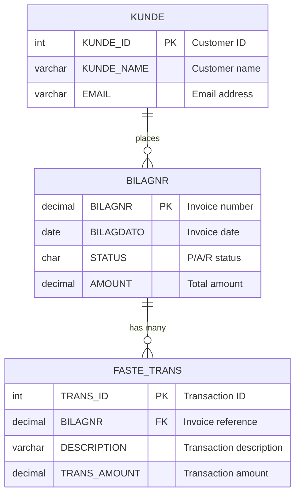

# AI Export & User Preferences Specification

**Date**: December 14, 2025  
**Version**: 1.0  
**Status**: 📋 **SPECIFICATION** - Extension to AI Integration

---

## 🎯 Overview

Two critical enhancements to AI integration:
1. **Export AI context and responses as markdown**
2. **User preferences for external editors and font sizes**

---

## 📤 Export Functionality

### 1. Export AI Context as Markdown

**Purpose**: Save AI analysis context for documentation, sharing, version control

**Export Options**:
- 💾 **Save to File** - Export as .md file
- 📋 **Copy to Clipboard** - Paste into other apps
- 🚀 **Open in Cursor** - Direct integration
- 🚀 **Open in VS Code** - Alternative editor

---

### 2. Deep Analysis Export Format

**File**: `DeepAnalysis_INL_BILAGNR_20251214.md`

```markdown
# Deep Analysis Report: INL.BILAGNR

**Generated**: 2025-12-14 15:30:45  
**Database**: FKKTOTST (DB2 12.1)  
**Analysis Type**: Single Table Deep Analysis  
**AI Provider**: Ollama (llama3.2)

---

## Table Information

**Schema**: INL  
**Table Name**: BILAGNR  
**Type**: TABLE  
**Row Count**: 15,234  
**Table Size**: 2.4 MB

**Table Comment**:
> Master invoice table. Stores all invoice headers. Related transactions 
> are in FASTE_TRANS table. Updated daily by batch job at 02:00 AM.

---

## Column Definitions

| Column | Type | Length | Nullable | Comment |
|--------|------|--------|----------|---------|
| BILAGNR | DECIMAL | 15,0 | NO | Invoice number, unique identifier for each invoice |
| BILAGDATO | DATE | - | NO | Invoice date, when the invoice was created |
| STATUS | CHAR | 1 | NO | Invoice status: P=Pending, A=Approved, R=Rejected |
| AMOUNT | DECIMAL | 15,2 | YES | Invoice total amount in NOK |
| CREATED_BY | VARCHAR | 50 | YES | User who created the invoice |

---

## Data Profile

### BILAGNR (Invoice Number)
- **Distinct Values**: 15,234 (100% unique)
- **NULL Count**: 0 (0%)
- **Range**: 100001 to 115234
- **Pattern**: Sequential IDs
- **Data Quality**: ✅ Excellent

### STATUS (Invoice Status)
- **Distinct Values**: 3
- **NULL Count**: 0 (0%)
- **Value Distribution**:
  - P (Pending): 9,140 rows (60.0%)
  - A (Approved): 5,332 rows (35.0%)
  - R (Rejected): 762 rows (5.0%)
- **Pattern**: Enum-like with 3 valid values
- **Data Quality**: ✅ Good
- **Recommendation**: Add CHECK constraint

### BILAGDATO (Invoice Date)
- **Distinct Values**: 365
- **NULL Count**: 0 (0%)
- **Range**: 2024-01-01 to 2025-12-14
- **Pattern**: Recent dates (last 2 years)
- **Data Quality**: ✅ Excellent

---

## Sample Data (First 10 Rows)

| BILAGNR | BILAGDATO | STATUS | AMOUNT | CREATED_BY |
|---------|-----------|--------|--------|------------|
| 100001 | 2024-01-01 | A | 1250.00 | JSMITH |
| 100002 | 2024-01-02 | A | 875.50 | JDOE |
| 100003 | 2024-01-03 | P | 2340.00 | JSMITH |
| 100004 | 2024-01-03 | P | 450.00 | MJONES |
| 100005 | 2024-01-05 | R | 1100.00 | JDOE |
| ... | ... | ... | ... | ... |

---

## Relationships

### Primary Key
- BILAGNR

### Foreign Keys (Outgoing)
*None*

### Referenced By (Incoming)
1. **INL.FASTE_TRANS** (Fixed Transactions)
   - Column: BILAGNR → BILAGNR
   - Relationship: 1:N (One invoice, many transactions)
   - Purpose: Transaction line items for this invoice

2. **INL.INVOICE_PAYMENTS** (Invoice Payments)
   - Column: INVOICE_NR → BILAGNR
   - Relationship: 1:N (One invoice, multiple payments)
   - Purpose: Payment records for this invoice

### Used By Packages
- INL.INVOICE_PROCESSING (15 statements)
- INL.MONTHLY_REPORT (3 statements)

---

## Indexes

| Index Name | Type | Columns | Unique |
|------------|------|---------|--------|
| PK_BILAGNR | Primary Key | BILAGNR | Yes |
| IX_BILAGNR_DATE | Index | BILAGDATO | No |
| IX_BILAGNR_STATUS | Index | STATUS | No |

---

## 🤖 AI Analysis

### Business Purpose
This table serves as the master invoice registry for the billing system. 
Each row represents a unique invoice with its creation date and current 
workflow status. The sequential BILAGNR values indicate automatic ID 
assignment, likely from a sequence or identity column.

### Data Patterns & Insights
1. **Workflow Active**: 60% of invoices are in Pending status, suggesting 
   an active approval process with regular throughput.

2. **Sequential Processing**: Invoice numbers increment daily, aligned with 
   the BILAGDATO pattern. This indicates daily batch processing at 02:00 AM 
   per the table comment.

3. **Rejection Rate**: 5% rejection rate is relatively low, indicating good 
   data quality at invoice creation stage.

4. **Date Range**: 2-year data retention suggests a retention policy or 
   regular archival process.

### Recommendations
1. **Add CHECK Constraint**: 
   ```sql
   ALTER TABLE INL.BILAGNR 
   ADD CONSTRAINT CHK_STATUS 
   CHECK (STATUS IN ('P', 'A', 'R'));
   ```
   This enforces data integrity and prevents invalid status values.

2. **Consider Partitioning**: With 15K+ rows and daily growth, consider 
   date-based partitioning for better query performance:
   ```sql
   -- Partition by year
   CREATE TABLE INL.BILAGNR_2025 ...
   ```

3. **Index on CREATED_BY**: If filtering by user is common, add index:
   ```sql
   CREATE INDEX IX_BILAGNR_USER ON INL.BILAGNR(CREATED_BY);
   ```

### Typical Usage Patterns
```sql
-- 1. Get pending invoices
SELECT * FROM INL.BILAGNR 
WHERE STATUS = 'P' 
ORDER BY BILAGDATO DESC;

-- 2. Invoice with all transactions
SELECT b.*, t.*
FROM INL.BILAGNR b
LEFT JOIN INL.FASTE_TRANS t ON b.BILAGNR = t.BILAGNR
WHERE b.BILAGNR = ?;

-- 3. Daily invoice summary
SELECT BILAGDATO, 
       COUNT(*) AS InvoiceCount,
       SUM(AMOUNT) AS TotalAmount,
       SUM(CASE WHEN STATUS = 'A' THEN 1 ELSE 0 END) AS ApprovedCount
FROM INL.BILAGNR
GROUP BY BILAGDATO
ORDER BY BILAGDATO DESC;
```

---

## 📊 Export Metadata

**Export Settings Used**:
- Sample Size: 20 rows
- Profile Columns: Yes
- Mask Sensitive Data: Yes
- Include Sample Data: Yes

**Analysis Duration**: 12.3 seconds  
**Columns Profiled**: 5 of 5  
**Relationships Found**: 2 incoming, 0 outgoing  
**Quality Issues**: 0

---

*Generated by WindowsDb2Editor AI Deep Analysis*  
*Report saved to: C:\opt\data\WindowsDb2Editor\AI_Reports\DeepAnalysis_INL_BILAGNR_20251214.md*
```

**Estimated Export File Size**: 2-5 KB per table (markdown text)

---

### 3. Mermaid Designer Export Format

**File**: `MermaidERD_INL_Schema_20251214.md`

```markdown
# Mermaid ERD Analysis: INL Schema

**Generated**: 2025-12-14 15:45:30  
**Database**: FKKTOTST (DB2 12.1)  
**Schema**: INL  
**Tables**: 3 (BILAGNR, FASTE_TRANS, KUNDE)  
**AI Provider**: Ollama (llama3.2)

---

## Entity Relationship Diagram



---

## 🤖 AI Relationship Analysis

### Overall System Purpose
This is a classic **Invoice Management System** with three core entities:
- **KUNDE** (Customers) - Who places orders
- **BILAGNR** (Invoices) - Master invoice records
- **FASTE_TRANS** (Transactions) - Line items per invoice

### Relationship: BILAGNR → FASTE_TRANS

**Type**: One-to-Many (1:N)

**Business Logic**:
Each invoice (BILAGNR) can have multiple transaction lines (FASTE_TRANS). 
This allows invoices to contain multiple items or charges.

**Foreign Key**: `FASTE_TRANS.BILAGNR → BILAGNR.BILAGNR`

**Data Flow**:
1. Invoice created in BILAGNR (assigned unique invoice number)
2. Transaction lines added to FASTE_TRANS (referencing invoice number)
3. Transaction amounts can be summed for invoice total

**Common Query Pattern**:
```sql
-- Get invoice with all line items
SELECT 
    b.BILAGNR,
    b.BILAGDATO,
    b.STATUS,
    b.AMOUNT AS InvoiceTotal,
    t.TRANS_ID,
    t.DESCRIPTION,
    t.TRANS_AMOUNT
FROM INL.BILAGNR b
LEFT JOIN INL.FASTE_TRANS t ON b.BILAGNR = t.BILAGNR
WHERE b.BILAGNR = ?
ORDER BY t.TRANS_ID;
```

**Why This Relationship Exists**:
- **Data Normalization**: Avoids repeating invoice header info for each transaction
- **Flexibility**: Variable number of transactions per invoice
- **Referential Integrity**: Ensures transactions always have valid invoice
- **Reporting**: Easy to aggregate transactions by invoice

### Relationship: KUNDE → BILAGNR

**Type**: One-to-Many (1:N)

**Business Logic**:
Each customer (KUNDE) can have multiple invoices (BILAGNR) over time. 
This tracks customer purchase history.

**Foreign Key**: `BILAGNR.KUNDE_ID → KUNDE.KUNDE_ID`

**Data Flow**:
1. Customer registered in KUNDE table
2. When customer places order, invoice created in BILAGNR
3. Invoice linked to customer for history and reporting

**Common Query Pattern**:
```sql
-- Get all invoices for a customer
SELECT 
    k.KUNDE_NAME,
    b.BILAGNR,
    b.BILAGDATO,
    b.AMOUNT,
    b.STATUS
FROM INL.KUNDE k
JOIN INL.BILAGNR b ON k.KUNDE_ID = b.KUNDE_ID
WHERE k.KUNDE_ID = ?
ORDER BY b.BILAGDATO DESC;
```

### System Data Flow

```
Customer (KUNDE)
    ↓ places order
Invoice Header (BILAGNR)
    ↓ has line items
Transaction Lines (FASTE_TRANS)
```

**Business Process**:
1. Customer creates account → Record in KUNDE
2. Customer orders → Invoice in BILAGNR with customer reference
3. Order details → Transaction lines in FASTE_TRANS with invoice reference
4. Invoice approved → STATUS changes from P to A
5. Payment processed → (likely separate PAYMENTS table)

### Recommendations

1. **Missing Customer Link**: 
   If BILAGNR doesn't have KUNDE_ID, consider adding:
   ```sql
   ALTER TABLE INL.BILAGNR ADD COLUMN KUNDE_ID INTEGER;
   ALTER TABLE INL.BILAGNR ADD CONSTRAINT FK_BILAGNR_KUNDE 
       FOREIGN KEY (KUNDE_ID) REFERENCES INL.KUNDE(KUNDE_ID);
   ```

2. **Add Invoice Total Validation**:
   ```sql
   -- Ensure invoice total matches sum of transactions
   CREATE TRIGGER TRG_VALIDATE_TOTAL
   AFTER INSERT OR UPDATE ON INL.FASTE_TRANS
   -- Logic to validate BILAGNR.AMOUNT = SUM(FASTE_TRANS.TRANS_AMOUNT)
   ```

3. **Performance Optimization**:
   Most common query joins all 3 tables. Consider materialized view:
   ```sql
   CREATE VIEW INL.INVOICE_SUMMARY AS
   SELECT 
       k.KUNDE_NAME,
       b.BILAGNR,
       b.BILAGDATO,
       b.STATUS,
       COUNT(t.TRANS_ID) AS TransactionCount,
       SUM(t.TRANS_AMOUNT) AS CalculatedTotal,
       b.AMOUNT AS InvoiceTotal
   FROM INL.KUNDE k
   JOIN INL.BILAGNR b ON k.KUNDE_ID = b.KUNDE_ID
   LEFT JOIN INL.FASTE_TRANS t ON b.BILAGNR = t.BILAGNR
   GROUP BY k.KUNDE_NAME, b.BILAGNR, b.BILAGDATO, b.STATUS, b.AMOUNT;
   ```

---

*Generated by WindowsDb2Editor Mermaid Visual Designer*  
*AI Analysis powered by Ollama (llama3.2)*
```

---

### 4. Export UI Integration

**In Every Dialog with AI Assistant Tab**:

```xml
<!-- AI Assistant Tab Footer -->
<StackPanel Orientation="Horizontal" HorizontalAlignment="Right" Margin="10,10,0,0">
    <Button Content="💾 Save as Markdown" Click="SaveAsMarkdown_Click" Margin="0,0,10,0"/>
    <Button Content="📋 Copy to Clipboard" Click="CopyToClipboard_Click" Margin="0,0,10,0"/>
    <Button Content="🚀 Open in Cursor" Click="OpenInCursor_Click" Margin="0,0,10,0"/>
    <Button Content="🚀 Open in VS Code" Click="OpenInVSCode_Click" Margin="0,0,10,0"/>
</StackPanel>
```

**Export Service Implementation**:

```csharp
public class AiExportService
{
    private readonly PreferencesService _preferences;
    
    /// <summary>
    /// Export AI context and response as markdown.
    /// </summary>
    public async Task<string> ExportAsMarkdownAsync(
        DeepAnalysisContext context,
        string aiResponse)
    {
        var sb = new StringBuilder();
        
        // Header
        sb.AppendLine($"# Deep Analysis Report: {context.Schema}.{context.TableName}");
        sb.AppendLine();
        sb.AppendLine($"**Generated**: {DateTime.Now:yyyy-MM-dd HH:mm:ss}");
        sb.AppendLine($"**Database**: {context.DatabaseName} (DB2 {context.DbVersion})");
        sb.AppendLine($"**Analysis Type**: {context.AnalysisType}");
        sb.AppendLine($"**AI Provider**: {context.AiProviderName}");
        sb.AppendLine();
        sb.AppendLine("---");
        sb.AppendLine();
        
        // Table information
        sb.AppendLine("## Table Information");
        sb.AppendLine();
        sb.AppendLine($"**Schema**: {context.Schema}");
        sb.AppendLine($"**Table Name**: {context.TableName}");
        sb.AppendLine($"**Row Count**: {context.TotalRowCount:N0}");
        
        if (!string.IsNullOrEmpty(context.TableRemarks))
        {
            sb.AppendLine();
            sb.AppendLine("**Table Comment**:");
            sb.AppendLine($"> {context.TableRemarks}");
        }
        
        sb.AppendLine();
        sb.AppendLine("---");
        sb.AppendLine();
        
        // Columns with comments
        sb.AppendLine("## Column Definitions");
        sb.AppendLine();
        sb.AppendLine("| Column | Type | Length | Nullable | Comment |");
        sb.AppendLine("|--------|------|--------|----------|---------|");
        
        foreach (var col in context.Columns)
        {
            var comment = context.ColumnRemarks.GetValueOrDefault(col.Name, "-");
            sb.AppendLine($"| {col.Name} | {col.DataType} | {col.Length} | " +
                         $"{(col.IsNullable ? "YES" : "NO")} | {comment} |");
        }
        
        sb.AppendLine();
        sb.AppendLine("---");
        sb.AppendLine();
        
        // Data profiles
        sb.AppendLine("## Data Profile");
        sb.AppendLine();
        
        foreach (var kvp in context.ColumnProfiles)
        {
            var profile = kvp.Value;
            sb.AppendLine($"### {profile.ColumnName}");
            sb.AppendLine($"- **Distinct Values**: {profile.DistinctCount:N0}");
            sb.AppendLine($"- **NULL Count**: {profile.NullCount:N0} ({profile.NullPercentage:F1}%)");
            
            if (profile.MinValue != null && profile.MaxValue != null)
            {
                sb.AppendLine($"- **Range**: {profile.MinValue} to {profile.MaxValue}");
            }
            
            if (profile.TopValues?.Count > 0)
            {
                sb.AppendLine($"- **Value Distribution**:");
                foreach (var val in profile.TopValues.Take(5))
                {
                    sb.AppendLine($"  - {val.Value}: {val.Count:N0} rows ({val.Percentage:F1}%)");
                }
            }
            
            sb.AppendLine($"- **Pattern**: {profile.DataPattern}");
            
            if (profile.HasQualityIssues)
            {
                sb.AppendLine($"- **⚠️ Quality Issues**: {string.Join(", ", profile.QualityIssues)}");
            }
            
            sb.AppendLine();
        }
        
        // Sample data table
        if (context.SampleData != null && context.SampleData.Rows.Count > 0)
        {
            sb.AppendLine("## Sample Data");
            sb.AppendLine();
            sb.AppendLine(FormatDataTableAsMarkdown(context.SampleData, 10));
            sb.AppendLine();
        }
        
        // AI response
        sb.AppendLine("---");
        sb.AppendLine();
        sb.AppendLine("## 🤖 AI Analysis");
        sb.AppendLine();
        sb.AppendLine(aiResponse);
        
        return sb.ToString();
    }
    
    /// <summary>
    /// Export Mermaid ERD with AI analysis as markdown.
    /// </summary>
    public string ExportMermaidAsMarkdown(
        string mermaidCode,
        List<string> tableNames,
        string aiRelationshipAnalysis)
    {
        var sb = new StringBuilder();
        
        // Header
        sb.AppendLine($"# Mermaid ERD Analysis: {GetSchemaFromMermaid(mermaidCode)}");
        sb.AppendLine();
        sb.AppendLine($"**Generated**: {DateTime.Now:yyyy-MM-dd HH:mm:ss}");
        sb.AppendLine($"**Tables**: {tableNames.Count} ({string.Join(", ", tableNames)})");
        sb.AppendLine();
        sb.AppendLine("---");
        sb.AppendLine();
        
        // Mermaid diagram
        sb.AppendLine("## Entity Relationship Diagram");
        sb.AppendLine();
        sb.AppendLine("```mermaid");
        sb.AppendLine(mermaidCode);
        sb.AppendLine("```");
        sb.AppendLine();
        sb.AppendLine("---");
        sb.AppendLine();
        
        // AI analysis
        sb.AppendLine("## 🤖 AI Relationship Analysis");
        sb.AppendLine();
        sb.AppendLine(aiRelationshipAnalysis);
        sb.AppendLine();
        
        return sb.ToString();
    }
    
    /// <summary>
    /// Save markdown to file.
    /// </summary>
    public async Task<string> SaveMarkdownAsync(string markdown, string suggestedFileName)
    {
        var saveDialog = new Microsoft.Win32.SaveFileDialog
        {
            Filter = "Markdown Files (*.md)|*.md|All Files (*.*)|*.*",
            FileName = suggestedFileName,
            DefaultExt = ".md",
            InitialDirectory = _preferences.Preferences.DefaultExportPath ?? 
                              Path.Combine(Environment.GetFolderPath(Environment.SpecialFolder.MyDocuments), 
                                          "WindowsDb2Editor", "AI_Reports")
        };
        
        if (saveDialog.ShowDialog() == true)
        {
            await File.WriteAllTextAsync(saveDialog.FileName, markdown);
            Logger.Info("Exported markdown to: {File}", saveDialog.FileName);
            return saveDialog.FileName;
        }
        
        return string.Empty;
    }
    
    /// <summary>
    /// Copy markdown to clipboard.
    /// </summary>
    public void CopyToClipboard(string markdown)
    {
        Clipboard.SetText(markdown);
        Logger.Debug("Copied {Length} characters to clipboard", markdown.Length);
    }
    
    /// <summary>
    /// Open markdown in external editor (Cursor or VS Code).
    /// </summary>
    public async Task OpenInExternalEditorAsync(string markdown, string suggestedFileName)
    {
        // Save to temp file first
        var tempDir = Path.Combine(Path.GetTempPath(), "WindowsDb2Editor", "AI_Reports");
        Directory.CreateDirectory(tempDir);
        
        var tempFile = Path.Combine(tempDir, suggestedFileName);
        await File.WriteAllTextAsync(tempFile, markdown);
        
        // Get preferred editor from settings
        var editor = _preferences.Preferences.PreferredExternalEditor; // "Cursor" or "VSCode"
        
        var editorPath = editor switch
        {
            "Cursor" => FindCursorExecutable(),
            "VSCode" => FindVSCodeExecutable(),
            _ => null
        };
        
        if (editorPath != null && File.Exists(editorPath))
        {
            // Open file in editor
            var process = new Process
            {
                StartInfo = new ProcessStartInfo
                {
                    FileName = editorPath,
                    Arguments = $"\"{tempFile}\"",
                    UseShellExecute = true
                }
            };
            
            process.Start();
            Logger.Info("Opened markdown in {Editor}: {File}", editor, tempFile);
        }
        else
        {
            // Fallback to default markdown editor
            Process.Start(new ProcessStartInfo
            {
                FileName = tempFile,
                UseShellExecute = true
            });
            
            Logger.Info("Opened markdown in default app: {File}", tempFile);
        }
    }
    
    private string? FindCursorExecutable()
    {
        // Common Cursor installation paths
        var paths = new[]
        {
            Path.Combine(Environment.GetFolderPath(Environment.SpecialFolder.LocalApplicationData), 
                        "Programs", "cursor", "Cursor.exe"),
            Path.Combine(Environment.GetFolderPath(Environment.SpecialFolder.ProgramFiles), 
                        "Cursor", "Cursor.exe"),
            @"C:\Users\{username}\AppData\Local\Programs\cursor\Cursor.exe"
        };
        
        return paths.FirstOrDefault(File.Exists);
    }
    
    private string? FindVSCodeExecutable()
    {
        // Common VS Code installation paths
        var paths = new[]
        {
            Path.Combine(Environment.GetFolderPath(Environment.SpecialFolder.LocalApplicationData), 
                        "Programs", "Microsoft VS Code", "Code.exe"),
            Path.Combine(Environment.GetFolderPath(Environment.SpecialFolder.ProgramFiles), 
                        "Microsoft VS Code", "Code.exe"),
            @"C:\Program Files\Microsoft VS Code\Code.exe"
        };
        
        return paths.FirstOrDefault(File.Exists);
    }
}
```

---

## ⚙️ User Preferences - Complete Specification

### Settings Dialog Enhancement

**Location**: Settings → General Tab

```xml
<GroupBox Header="External Editor" Margin="0,10,0,0">
    <StackPanel Margin="10">
        <TextBlock Text="Preferred Editor for Markdown/SQL Files:" FontWeight="SemiBold"/>
        
        <RadioButton Content="🚀 Cursor" GroupName="Editor" IsChecked="True" Margin="0,5"/>
        <TextBox Text="{Binding CursorPath}" Margin="20,2,0,5" IsReadOnly="True"/>
        <Button Content="Browse..." Click="BrowseCursor_Click" Width="100" 
                HorizontalAlignment="Left" Margin="20,0,0,5"/>
        
        <RadioButton Content="📝 VS Code" GroupName="Editor" Margin="0,10,0,0"/>
        <TextBox Text="{Binding VSCodePath}" Margin="20,2,0,5" IsReadOnly="True"/>
        <Button Content="Browse..." Click="BrowseVSCode_Click" Width="100" 
                HorizontalAlignment="Left" Margin="20,0,0,5"/>
        
        <RadioButton Content="🖥️ System Default" GroupName="Editor" Margin="0,10,0,0"/>
        
        <Button Content="Auto-Detect Editors" Click="AutoDetect_Click" 
                Margin="0,10,0,0" Width="150" HorizontalAlignment="Left"/>
    </StackPanel>
</GroupBox>

<Separator Margin="0,20"/>

<GroupBox Header="Font Sizes" Margin="0,10,0,0">
    <Grid Margin="10">
        <Grid.ColumnDefinitions>
            <ColumnDefinition Width="200"/>
            <ColumnDefinition Width="100"/>
            <ColumnDefinition Width="*"/>
        </Grid.ColumnDefinitions>
        <Grid.RowDefinitions>
            <RowDefinition Height="Auto"/>
            <RowDefinition Height="Auto"/>
            <RowDefinition Height="Auto"/>
            <RowDefinition Height="Auto"/>
            <RowDefinition Height="Auto"/>
            <RowDefinition Height="Auto"/>
            <RowDefinition Height="Auto"/>
            <RowDefinition Height="Auto"/>
        </Grid.RowDefinitions>
        
        <!-- SQL Editor -->
        <TextBlock Grid.Row="0" Grid.Column="0" Text="SQL Editor:" Margin="0,5"/>
        <TextBox Grid.Row="0" Grid.Column="1" x:Name="SqlEditorFontSize" 
                 Text="14" Width="60" HorizontalAlignment="Left" Margin="5"/>
        <TextBlock Grid.Row="0" Grid.Column="2" Text="pt (default: 14)" 
                   FontSize="10" Foreground="Gray" Margin="10,5,0,0"/>
        
        <!-- Object Browser -->
        <TextBlock Grid.Row="1" Grid.Column="0" Text="Object Browser:" Margin="0,5"/>
        <TextBox Grid.Row="1" Grid.Column="1" x:Name="ObjectBrowserFontSize" 
                 Text="11" Width="60" HorizontalAlignment="Left" Margin="5"/>
        <TextBlock Grid.Row="1" Grid.Column="2" Text="pt (default: 11, smaller = more visible)" 
                   FontSize="10" Foreground="Gray" Margin="10,5,0,0"/>
        
        <!-- Query History -->
        <TextBlock Grid.Row="2" Grid.Column="0" Text="Query History:" Margin="0,5"/>
        <TextBox Grid.Row="2" Grid.Column="1" x:Name="QueryHistoryFontSize" 
                 Text="11" Width="60" HorizontalAlignment="Left" Margin="5"/>
        <TextBlock Grid.Row="2" Grid.Column="2" Text="pt (default: 11)" 
                   FontSize="10" Foreground="Gray" Margin="10,5,0,0"/>
        
        <!-- Results Grid -->
        <TextBlock Grid.Row="3" Grid.Column="0" Text="Results Grid:" Margin="0,5"/>
        <TextBox Grid.Row="3" Grid.Column="1" x:Name="ResultsGridFontSize" 
                 Text="12" Width="60" HorizontalAlignment="Left" Margin="5"/>
        <TextBlock Grid.Row="3" Grid.Column="2" Text="pt (default: 12)" 
                   FontSize="10" Foreground="Gray" Margin="10,5,0,0"/>
        
        <!-- Property Dialogs -->
        <TextBlock Grid.Row="4" Grid.Column="0" Text="Property Dialogs:" Margin="0,5"/>
        <TextBox Grid.Row="4" Grid.Column="1" x:Name="PropertyDialogFontSize" 
                 Text="12" Width="60" HorizontalAlignment="Left" Margin="5"/>
        <TextBlock Grid.Row="4" Grid.Column="2" Text="pt (default: 12)" 
                   FontSize="10" Foreground="Gray" Margin="10,5,0,0"/>
        
        <!-- AI Assistant Text -->
        <TextBlock Grid.Row="5" Grid.Column="0" Text="AI Assistant Response:" Margin="0,5"/>
        <TextBox Grid.Row="5" Grid.Column="1" x:Name="AiResponseFontSize" 
                 Text="13" Width="60" HorizontalAlignment="Left" Margin="5"/>
        <TextBlock Grid.Row="5" Grid.Column="2" Text="pt (default: 13, larger = more readable)" 
                   FontSize="10" Foreground="Gray" Margin="10,5,0,0"/>
        
        <!-- Menu Font -->
        <TextBlock Grid.Row="6" Grid.Column="0" Text="Menus & Buttons:" Margin="0,5"/>
        <TextBox Grid.Row="6" Grid.Column="1" x:Name="MenuFontSize" 
                 Text="12" Width="60" HorizontalAlignment="Left" Margin="5"/>
        <TextBlock Grid.Row="6" Grid.Column="2" Text="pt (default: 12)" 
                   FontSize="10" Foreground="Gray" Margin="10,5,0,0"/>
        
        <!-- Status Bar -->
        <TextBlock Grid.Row="7" Grid.Column="0" Text="Status Bar:" Margin="0,5"/>
        <TextBox Grid.Row="7" Grid.Column="1" x:Name="StatusBarFontSize" 
                 Text="11" Width="60" HorizontalAlignment="Left" Margin="5"/>
        <TextBlock Grid.Row="7" Grid.Column="2" Text="pt (default: 11)" 
                   FontSize="10" Foreground="Gray" Margin="10,5,0,0"/>
    </Grid>
</GroupBox>

<StackPanel Orientation="Horizontal" HorizontalAlignment="Right" Margin="0,15,0,0">
    <Button Content="↺ Reset to Defaults" Click="ResetFonts_Click" Margin="0,0,10,0"/>
    <Button Content="Apply" Click="ApplySettings_Click"/>
</StackPanel>
```

---

### Preferences Data Model

```csharp
public class UserPreferences
{
    // External Editor
    public string PreferredExternalEditor { get; set; } = "Cursor"; // "Cursor", "VSCode", "SystemDefault"
    public string? CursorExecutablePath { get; set; }
    public string? VSCodeExecutablePath { get; set; }
    public bool AutoDetectEditors { get; set; } = true;
    
    // Font Sizes
    public int SqlEditorFontSize { get; set; } = 14;
    public int ObjectBrowserFontSize { get; set; } = 11;
    public int QueryHistoryFontSize { get; set; } = 11;
    public int ResultsGridFontSize { get; set; } = 12;
    public int PropertyDialogFontSize { get; set; } = 12;
    public int AiResponseFontSize { get; set; } = 13;
    public int MenuFontSize { get; set; } = 12;
    public int StatusBarFontSize { get; set; } = 11;
    
    // AI Export Settings
    public string DefaultExportPath { get; set; } = 
        Path.Combine(Environment.GetFolderPath(Environment.SpecialFolder.MyDocuments), 
                     "WindowsDb2Editor", "AI_Reports");
    public bool AutoOpenAfterExport { get; set; } = true;
    public bool IncludeSampleDataInExport { get; set; } = true;
    public bool IncludeDataProfileInExport { get; set; } = true;
}
```

### Applying Font Size Preferences

**Dynamic Font Size Binding**:

```csharp
public class FontSizeManager
{
    private readonly UserPreferences _preferences;
    
    public void ApplyFontSizes(Window window)
    {
        // Find all controls and apply font sizes
        ApplyFontToControlType<TreeView>(window, _preferences.ObjectBrowserFontSize);
        ApplyFontToControlType<DataGrid>(window, _preferences.ResultsGridFontSize);
        ApplyFontToControlType<StatusBar>(window, _preferences.StatusBarFontSize);
        // etc.
    }
    
    private void ApplyFontToControlType<T>(DependencyObject parent, double fontSize) 
        where T : Control
    {
        for (int i = 0; i < VisualTreeHelper.GetChildrenCount(parent); i++)
        {
            var child = VisualTreeHelper.GetChild(parent, i);
            
            if (child is T control)
            {
                control.FontSize = fontSize;
            }
            
            ApplyFontToControlType<T>(child, fontSize);
        }
    }
}
```

**Or Using Styles** (Better Approach):

```xml
<!-- App.xaml -->
<Application.Resources>
    <ResourceDictionary>
        <!-- Dynamic font sizes from preferences -->
        <system:Double x:Key="SqlEditorFontSize">14</system:Double>
        <system:Double x:Key="ObjectBrowserFontSize">11</system:Double>
        <system:Double x:Key="ResultsGridFontSize">12</system:Double>
        
        <Style TargetType="TreeView" x:Key="ObjectBrowserStyle">
            <Setter Property="FontSize" Value="{StaticResource ObjectBrowserFontSize}"/>
        </Style>
    </ResourceDictionary>
</Application.Resources>
```

---

## 📊 Export File Examples

### Single Table Export
```
DeepAnalysis_INL_BILAGNR_20251214_153045.md (3-5 KB)
```

### Group Analysis Export
```
GroupAnalysis_INL_3Tables_20251214_154523.md (8-15 KB)
```

### Mermaid ERD Export
```
MermaidERD_INL_Schema_20251214_160112.md (2-4 KB)
  - Includes .mmd code in markdown code block
  - Includes AI relationship analysis
  - Can be opened in Cursor/VS Code with Mermaid preview
```

### Package Documentation Export
```
PackageDoc_INL_INVOICE_PKG_20251214_161534.md (5-10 KB)
```

---

## 🎯 User Workflow Examples

### Workflow 1: Document Unknown Table
```
1. Right-click INL.BILAGNR → 🔬 Deep Analysis
2. Wait 10-15 seconds (profiling data)
3. Read AI analysis in dialog
4. Click "💾 Save as Markdown"
5. Click "🚀 Open in Cursor"
6. Cursor opens with complete markdown documentation
7. Add to project wiki or share with team
```

### Workflow 2: Understand ERD Relationships
```
1. View → Mermaid Visual Designer
2. Load from DB → Select INL schema → Select 3 tables
3. ERD diagram appears with relationships
4. Click "🤖 Explain Relationships"
5. AI analyzes and explains business logic
6. Click "💾 Save as Markdown"
7. Markdown includes both .mmd code AND AI explanation
8. Click "🚀 Open in Cursor"
9. Cursor shows ERD preview + AI analysis side-by-side
```

### Workflow 3: Quick Question About Package
```
1. Right-click package → Properties
2. Go to "🤖 AI Assistant" tab
3. Type: "What does statement 5 do?"
4. AI responds with explanation
5. Click "📋 Copy to Clipboard"
6. Paste into email/Slack/documentation
```

---

## 🔧 Implementation Requirements

### Services Needed

1. **AiExportService.cs** (300 lines)
   - Export as markdown
   - Format data tables as markdown
   - Save to file
   - Copy to clipboard
   - Open in external editor

2. **ExternalEditorService.cs** (150 lines)
   - Auto-detect Cursor installation
   - Auto-detect VS Code installation
   - Launch editor with file
   - Handle fallback to system default

3. **FontSizeManager.cs** (100 lines)
   - Apply font sizes from preferences
   - Update all controls dynamically
   - Reset to defaults

### UI Enhancements

1. **Settings Dialog** - Add:
   - External Editor selection
   - Font size controls (8 components)
   - Auto-detect button

2. **All AI Dialogs** - Add:
   - Export button bar (Save, Copy, Open in Cursor, Open in VS Code)
   - Status feedback ("Exported to..." / "Copied!" / "Opened in Cursor")

3. **Mermaid Designer** - Enhance:
   - Export includes .mmd code in markdown code block
   - Export includes AI relationship analysis
   - Both Save and Open in Editor options

---

## 📝 Updated appsettings.json

```json
{
  "UserPreferences": {
    "ExternalEditor": {
      "Preferred": "Cursor",
      "CursorPath": "C:\\Users\\{user}\\AppData\\Local\\Programs\\cursor\\Cursor.exe",
      "VSCodePath": "C:\\Program Files\\Microsoft VS Code\\Code.exe",
      "AutoDetect": true
    },
    "FontSizes": {
      "SqlEditor": 14,
      "ObjectBrowser": 11,
      "QueryHistory": 11,
      "ResultsGrid": 12,
      "PropertyDialogs": 12,
      "AiResponse": 13,
      "Menus": 12,
      "StatusBar": 11
    },
    "AiExport": {
      "DefaultPath": "C:\\Users\\{user}\\Documents\\WindowsDb2Editor\\AI_Reports",
      "AutoOpenAfterExport": true,
      "IncludeSampleData": true,
      "IncludeDataProfile": true,
      "FileNamePattern": "{AnalysisType}_{Schema}_{Table}_{Timestamp}.md"
    }
  }
}
```

---

## ✅ Benefits

### For Documentation
✅ **Instant markdown** - AI context + analysis in one file  
✅ **Share easily** - Send .md files to team  
✅ **Version control** - Commit to git for history  
✅ **Wiki integration** - Paste into Confluence/Notion  

### For Mermaid
✅ **Complete package** - ERD + explanation in one file  
✅ **Preview in Cursor/VS Code** - Mermaid renders automatically  
✅ **Editable** - Modify .mmd code in editor, reimport  
✅ **Shareable** - Send to stakeholders for review  

### For Preferences
✅ **Customizable UI** - Font sizes for accessibility  
✅ **Editor integration** - Works with your preferred tool  
✅ **Consistent** - All controls respect preferences  
✅ **Accessible** - Larger fonts for readability  

---

## 🎯 Implementation Additions

Add to existing AI Integration timeline:

| Phase | Feature | Hours |
|-------|---------|-------|
| **NEW** | **Export Service** | 4-6 |
| **NEW** | **External Editor Integration** | 2-3 |
| **NEW** | **Font Size Preferences** | 2-3 |
| **NEW** | **Mermaid Export Enhancement** | 2-3 |

**Additional Effort**: +10-15 hours  
**New Total**: **42-61 hours**

---

## 📚 Summary

All AI features now support:
- ✅ **Export as markdown** with complete formatting
- ✅ **Mermaid .mmd code** embedded in exports
- ✅ **Open in Cursor** or **VS Code** directly
- ✅ **User-configurable font sizes** for all UI components
- ✅ **External editor detection** and integration

**Complete AI + Export + Preferences system specification ready!** 🚀

---

*Last Updated: December 14, 2025*  
*Status: Ready for implementation*

