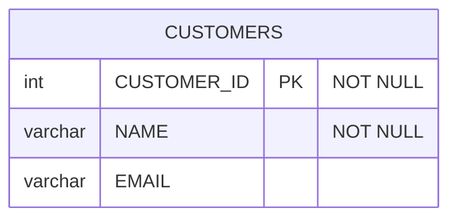
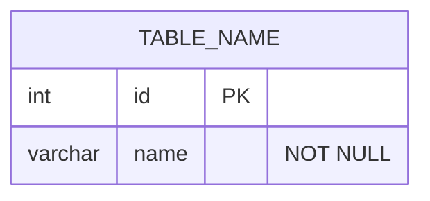

# SqlMermaidErdTools Integration - Complete Documentation

**Date**: December 13, 2025  
**Package**: SqlMermaidErdTools 0.2.8  
**Status**: ✅ FULLY INTEGRATED

---

## 🎯 OVERVIEW

DbExplorer now integrates the **SqlMermaidErdTools** package, adding powerful bidirectional SQL ↔ Mermaid conversion, SQL dialect translation, and advanced schema migration capabilities.

### What SqlMermaidErdTools Provides:

✅ **SQL → Mermaid ERD**: Convert SQL DDL to Mermaid diagrams (supports 31+ SQL dialects)  
✅ **Mermaid → SQL**: Generate SQL DDL from Mermaid ERD (ANSI, SQL Server, PostgreSQL, MySQL)  
✅ **SQL Dialect Translation**: Translate SQL between different database systems  
✅ **Schema Diff**: Generate ALTER statements from Mermaid diagram changes  
✅ **Multi-Database Support**: DB2, Oracle, SQL Server, PostgreSQL, MySQL, SQLite, and 25+ more

---

## 📦 PACKAGE INFORMATION

### Installation

```powershell
# Add GitHub Packages NuGet source (one-time)
dotnet nuget add source "https://nuget.pkg.github.com/stagei/index.json" `
    --name "github-stagei" `
    --username "stagei" `
    --password "YOUR_GITHUB_TOKEN_HERE" `
    --store-password-in-clear-text

# Install package
dotnet add package SqlMermaidErdTools
```

### Supported SQL Dialects

**Input (SQL → Mermaid)** - 31+ dialects:
- ANSI SQL, SQL Server (T-SQL), PostgreSQL, MySQL, SQLite, Oracle
- DB2, Snowflake, BigQuery, Redshift, Databricks, DuckDB
- ClickHouse, Apache Spark, Presto, Trino, and more

**Output (Mermaid → SQL)** - 4 dialects:
- ANSI SQL (Standard)
- SQL Server (T-SQL)
- PostgreSQL
- MySQL

---

## 🏗️ ARCHITECTURE

### New Service: SqlMermaidIntegrationService

Created in `Services/SqlMermaidIntegrationService.cs` - bridges DB2 metadata with SqlMermaidErdTools.

**Key Methods:**

| Method | Description |
|--------|-------------|
| `GenerateDdlFromDb2TablesAsync()` | Queries DB2 and generates SQL DDL |
| `ConvertSqlToMermaidAsync()` | SQL DDL → Mermaid ERD |
| `ConvertMermaidToSqlAsync()` | Mermaid ERD → SQL DDL (dialect-specific) |
| `TranslateSqlDialectAsync()` | Translate SQL between dialects |
| `GenerateMigrationFromMermaidDiffAsync()` | Generate ALTER statements from diagram diff |
| `GenerateMermaidFromDb2TablesAsync()` | Complete workflow: DB2 → DDL → Mermaid |

**Code Example:**

```csharp
using WindowsDb2Editor.Services;
using SqlMermaidErdTools.Models;

var service = new SqlMermaidIntegrationService();

// DB2 → SQL DDL
var ddl = await service.GenerateDdlFromDb2TablesAsync(connectionManager, selectedTables);

// SQL DDL → Mermaid ERD
var mermaid = await service.ConvertSqlToMermaidAsync(ddl);

// Mermaid → PostgreSQL DDL
var postgresSql = await service.ConvertMermaidToSqlAsync(mermaid, SqlDialect.PostgreSql);

// Translate DB2 SQL to PostgreSQL
var translated = await service.TranslateSqlDialectAsync(
    db2Sql,
    SqlDialect.AnsiSql,
    SqlDialect.PostgreSql);

// Generate migration from diagram changes
var migration = await service.GenerateMigrationFromMermaidDiffAsync(
    beforeMermaid,
    afterMermaid,
    SqlDialect.PostgreSql);
```

---

## 🖥️ USER INTERFACE ENHANCEMENTS

### Mermaid Designer Window - New Features

**Location**: `Dialogs/MermaidDesignerWindow.xaml`  
**Enhanced HTML**: `Resources/MermaidDesigner.html`

**New Toolbar Buttons:**

1. **🔧 Mermaid → SQL**
   - Converts current Mermaid diagram to SQL DDL
   - Prompts for target dialect (ANSI, SQL Server, PostgreSQL, MySQL)
   - Opens result in new window
   - Use Case: Design schema in Mermaid, generate DDL for any database

2. **🌐 Translate SQL**
   - Translates SQL from one dialect to another
   - Prompts for source SQL, source dialect, target dialect
   - Opens translated SQL in new window
   - Use Case: Migrate SQL scripts between database systems

3. **⚙️ Advanced Migration**
   - Uses SqlMermaidErdTools diff algorithm
   - Generates ALTER statements for schema changes
   - Supports all 4 output dialects
   - Opens migration DDL in new window
   - Use Case: Database schema evolution with dialect-specific DDL

**Updated Toolbar:**

```html
<button onclick="refreshPreview()">🔄 Refresh</button>
<button onclick="autoRefresh()">⚡ Auto-Refresh</button>
<button onclick="generateFromDB()">🔽 Load from DB</button>
<button onclick="showDiff()">📊 Show Diff</button>
<button onclick="generateDDL()">📝 Generate DDL</button>
<button onclick="exportDiagram()">💾 Export</button>
<!-- NEW -->
<button onclick="generateSqlFromMermaid()">🔧 Mermaid → SQL</button>
<button onclick="translateSqlDialog()">🌐 Translate SQL</button>
<button onclick="generateMigrationAdvanced()">⚙️ Advanced Migration</button>
<button onclick="toggleHelp()">❓ Help</button>
```

---

## 📋 USER WORKFLOWS

### Workflow 1: Design Schema in Mermaid, Generate DDL

**Scenario**: DBA wants to design a new schema visually and generate DDL for multiple databases.

**Steps:**
1. Open Tools → Mermaid Designer
2. Design schema in Mermaid ERD syntax:
   ```mermaid
   erDiagram
       CUSTOMERS {
           int customer_id PK
           varchar name "NOT NULL"
           varchar email UK
       }
       ORDERS {
           int order_id PK
           int customer_id FK
           date order_date
       }
       CUSTOMERS ||--o{ ORDERS : places
   ```
3. Click **🔧 Mermaid → SQL**
4. Select target dialect:
   - `1` for ANSI SQL
   - `2` for SQL Server
   - `3` for PostgreSQL
   - `4` for MySQL
5. Generated SQL DDL opens in new window
6. Copy and execute in target database

**Output Example (PostgreSQL):**

```sql
CREATE TABLE CUSTOMERS (
    customer_id INT PRIMARY KEY,
    name VARCHAR(255) NOT NULL,
    email VARCHAR(255) UNIQUE
);

CREATE TABLE ORDERS (
    order_id INT PRIMARY KEY,
    customer_id INT NOT NULL,
    order_date DATE
);

ALTER TABLE ORDERS
    ADD CONSTRAINT fk_customer
    FOREIGN KEY (customer_id)
    REFERENCES CUSTOMERS(customer_id);
```

---

### Workflow 2: Migrate DB2 Schema to PostgreSQL

**Scenario**: Migrate existing DB2 tables to PostgreSQL.

**Steps:**
1. Open Mermaid Designer
2. Click **🔽 Load from DB** - select DB2 tables
3. Mermaid diagram generated from DB2 metadata
4. Click **🔧 Mermaid → SQL**
5. Select `3` (PostgreSQL)
6. PostgreSQL DDL generated with correct data types:
   - DB2 `VARCHAR(n)` → PostgreSQL `VARCHAR(n)`
   - DB2 `INTEGER` → PostgreSQL `INT`
   - DB2 `DECIMAL(p,s)` → PostgreSQL `DECIMAL(p,s)`
   - DB2 `TIMESTAMP` → PostgreSQL `TIMESTAMP`
7. Execute generated DDL in PostgreSQL database

**Benefits:**
- Automatic data type mapping
- Foreign key constraints preserved
- Primary keys maintained
- One-click conversion

---

### Workflow 3: SQL Dialect Translation

**Scenario**: Translate SQL queries from SQL Server to PostgreSQL.

**Steps:**
1. Open Mermaid Designer
2. Click **🌐 Translate SQL**
3. Enter source SQL (SQL Server syntax):
   ```sql
   SELECT TOP 100 * FROM Users WHERE IsActive = 1
   ```
4. Select source dialect: `2` (SQL Server)
5. Select target dialect: `3` (PostgreSQL)
6. Translated SQL:
   ```sql
   SELECT * FROM Users WHERE IsActive = TRUE LIMIT 100
   ```

**Translation Examples:**

| SQL Server (T-SQL) | PostgreSQL |
|--------------------|------------|
| `SELECT TOP 10 *` | `SELECT * LIMIT 10` |
| `GETDATE()` | `NOW()` |
| `WHERE IsActive = 1` | `WHERE IsActive = TRUE` |
| `ISNULL(col, 'default')` | `COALESCE(col, 'default')` |
| `[Table]` (brackets) | `"Table"` (quotes) |

---

### Workflow 4: Schema Evolution with Migration DDL

**Scenario**: Evolve database schema using visual Mermaid editing, generate migration scripts.

**Steps:**
1. Open Mermaid Designer
2. Load current schema from DB: **🔽 Load from DB**
3. Click **📊 Show Diff** - captures original state
4. Edit Mermaid diagram:
   - Add new column: `email VARCHAR(255) UK`
   - Remove old column: `old_field`
   - Modify data type: `price DECIMAL(10,2)` → `DECIMAL(12,4)`
5. Click **⚙️ Advanced Migration**
6. Select target dialect (e.g., PostgreSQL)
7. Migration DDL generated:
   ```sql
   ALTER TABLE Products
       ADD COLUMN email VARCHAR(255) UNIQUE;
   
   ALTER TABLE Products
       DROP COLUMN old_field;
   
   ALTER TABLE Products
       ALTER COLUMN price TYPE DECIMAL(12,4);
   ```
8. Review and execute migration DDL

**Safety Features:**
- Destructive operations (DROP) are clearly marked
- Migration DDL is reviewed before execution
- Dialect-specific syntax ensures compatibility

---

## 🔧 TECHNICAL DETAILS

### Complete Workflow: DB2 → DDL → Mermaid → SQL (Any Dialect)

**Phase 1: Extract DB2 Metadata**
```csharp
// Query SYSCAT tables for structure
var sql = @"
    SELECT c.COLNAME, c.TYPENAME, c.LENGTH, c.SCALE, c.NULLS,
           CASE WHEN k.COLNAME IS NOT NULL THEN 1 ELSE 0 END AS IS_PK
    FROM SYSCAT.COLUMNS c
    LEFT JOIN SYSCAT.KEYCOLUSE k ON ...
    WHERE c.TABSCHEMA = 'MYSCHEMA' AND c.TABNAME = 'CUSTOMERS'
";
```

**Phase 2: Generate DB2 DDL**
```csharp
// Build CREATE TABLE statement
CREATE TABLE MYSCHEMA.CUSTOMERS (
    CUSTOMER_ID INT NOT NULL,
    NAME VARCHAR(100) NOT NULL,
    EMAIL VARCHAR(255),
    PRIMARY KEY (CUSTOMER_ID)
);
```

**Phase 3: Convert to Mermaid**
```csharp
// SqlMermaidErdTools.ToMermaid()
var mermaid = await SqlMermaidErdTools.ToMermaidAsync(ddl);
```

**Result:**


**Phase 4: Generate Target Dialect DDL**
```csharp
// SqlMermaidErdTools.ToSql() with dialect selection
var postgresSql = await SqlMermaidErdTools.ToSqlAsync(mermaid, SqlDialect.PostgreSql);
```

**Result:**
```sql
CREATE TABLE CUSTOMERS (
    CUSTOMER_ID INT NOT NULL,
    NAME VARCHAR(100) NOT NULL,
    EMAIL VARCHAR(255),
    PRIMARY KEY (CUSTOMER_ID)
);
```

---

## 📊 SUPPORTED DATA TYPE MAPPINGS

### DB2 → PostgreSQL

| DB2 Type | PostgreSQL Type |
|----------|----------------|
| `INTEGER` | `INT` |
| `BIGINT` | `BIGINT` |
| `SMALLINT` | `SMALLINT` |
| `DECIMAL(p,s)` | `DECIMAL(p,s)` |
| `REAL` | `REAL` |
| `DOUBLE` | `DOUBLE PRECISION` |
| `VARCHAR(n)` | `VARCHAR(n)` |
| `CHAR(n)` | `CHAR(n)` |
| `DATE` | `DATE` |
| `TIME` | `TIME` |
| `TIMESTAMP` | `TIMESTAMP` |
| `BLOB` | `BYTEA` |
| `CLOB` | `TEXT` |

### DB2 → SQL Server

| DB2 Type | SQL Server Type |
|----------|----------------|
| `INTEGER` | `INT` |
| `BIGINT` | `BIGINT` |
| `DECIMAL(p,s)` | `DECIMAL(p,s)` |
| `VARCHAR(n)` | `VARCHAR(n)` |
| `TIMESTAMP` | `DATETIME2` |
| `BLOB` | `VARBINARY(MAX)` |
| `CLOB` | `NVARCHAR(MAX)` |

---

## 🚀 ADVANCED USE CASES

### Use Case 1: Multi-Database Documentation

Generate schema documentation for multiple databases:

```csharp
var service = new SqlMermaidIntegrationService();

// Generate from DB2
var db2Ddl = await service.GenerateDdlFromDb2TablesAsync(connectionManager, tables);
var mermaid = await service.ConvertSqlToMermaidAsync(db2Ddl);

// Generate DDL for all target databases
var ansiSql = await service.ConvertMermaidToSqlAsync(mermaid, SqlDialect.AnsiSql);
var sqlServer = await service.ConvertMermaidToSqlAsync(mermaid, SqlDialect.SqlServer);
var postgres = await service.ConvertMermaidToSqlAsync(mermaid, SqlDialect.PostgreSql);
var mysql = await service.ConvertMermaidToSqlAsync(mermaid, SqlDialect.MySql);

// Save all DDL files
File.WriteAllText("schema_ansi.sql", ansiSql);
File.WriteAllText("schema_sqlserver.sql", sqlServer);
File.WriteAllText("schema_postgres.sql", postgres);
File.WriteAllText("schema_mysql.sql", mysql);
```

### Use Case 2: Automated Schema Comparison

Compare schemas across different database systems:

```csharp
// Get DB2 schema as Mermaid
var db2Mermaid = await service.GenerateMermaidFromDb2TablesAsync(db2Conn, tables);

// Get PostgreSQL schema as Mermaid (would need PostgreSQL connection support)
// var pgMermaid = ...;

// Generate migration DDL
var migration = await service.GenerateMigrationFromMermaidDiffAsync(
    db2Mermaid,
    pgMermaid,
    SqlDialect.PostgreSql);
```

### Use Case 3: Continuous Integration Schema Validation

Validate Mermaid diagrams in CI/CD pipeline:

```csharp
// In CI/CD script
var mermaidFromRepo = File.ReadAllText("docs/schema.mmd");

// Validate by converting to SQL (will throw if invalid)
try
{
    var sql = await service.ConvertMermaidToSqlAsync(mermaidFromRepo, SqlDialect.AnsiSql);
    Console.WriteLine("✅ Schema diagram is valid");
}
catch (Exception ex)
{
    Console.WriteLine($"❌ Invalid Mermaid diagram: {ex.Message}");
    Environment.Exit(1);
}
```

---

## 📝 API REFERENCE

### SqlMermaidIntegrationService Methods

#### GenerateDdlFromDb2TablesAsync
```csharp
public async Task<string> GenerateDdlFromDb2TablesAsync(
    DB2ConnectionManager connectionManager,
    List<string> selectedTables)
```
**Purpose**: Queries DB2 and generates SQL DDL CREATE TABLE statements.  
**Returns**: SQL DDL as string  
**Includes**: Columns, data types, PRIMARY KEY constraints, FOREIGN KEY constraints

#### ConvertSqlToMermaidAsync
```csharp
public async Task<string> ConvertSqlToMermaidAsync(string sqlDdl)
```
**Purpose**: Converts SQL DDL to Mermaid ERD.  
**Input**: SQL DDL (any of 31+ supported dialects)  
**Returns**: Mermaid ERD syntax

#### ConvertMermaidToSqlAsync
```csharp
public async Task<string> ConvertMermaidToSqlAsync(
    string mermaidErd,
    SqlDialect targetDialect = SqlDialect.AnsiSql)
```
**Purpose**: Converts Mermaid ERD to SQL DDL.  
**Input**: Mermaid ERD, Target dialect  
**Returns**: SQL DDL for specified dialect

#### TranslateSqlDialectAsync
```csharp
public async Task<string> TranslateSqlDialectAsync(
    string sourceSql,
    SqlDialect sourceDialect,
    SqlDialect targetDialect)
```
**Purpose**: Translates SQL from one dialect to another.  
**Example**: SQL Server → PostgreSQL

#### GenerateMigrationFromMermaidDiffAsync
```csharp
public async Task<string> GenerateMigrationFromMermaidDiffAsync(
    string beforeMermaid,
    string afterMermaid,
    SqlDialect targetDialect = SqlDialect.AnsiSql)
```
**Purpose**: Generates ALTER statements from diagram changes.  
**Returns**: Migration DDL (ALTER TABLE, ADD/DROP COLUMN, etc.)

#### GenerateMermaidFromDb2TablesAsync
```csharp
public async Task<string> GenerateMermaidFromDb2TablesAsync(
    DB2ConnectionManager connectionManager,
    List<string> selectedTables)
```
**Purpose**: Complete workflow - DB2 → DDL → Mermaid.  
**Returns**: Mermaid ERD directly from DB2 metadata

---

## 🐛 TROUBLESHOOTING

### Issue: "Python not found"

**Solution**: SqlMermaidErdTools requires Python 3.8+ with `sqlglot` package.

```bash
# Install Python dependency
pip install sqlglot
```

### Issue: "Invalid Mermaid syntax"

**Solution**: Validate Mermaid ERD syntax:
- Ensure `erDiagram` keyword at start
- Close all table blocks with `}`
- Use correct column format: `type name PK/FK`
- Quote constraint names with spaces

**Example:**


### Issue: "Conversion failed for dialect X"

**Solution**: Check if dialect is supported for the operation.
- SQL → Mermaid: 31+ dialects supported
- Mermaid → SQL: Only 4 dialects (ANSI, SQL Server, PostgreSQL, MySQL)

---

## 📈 BENEFITS SUMMARY

✅ **Multi-Database Support**: Design once, deploy to any database  
✅ **Schema Evolution**: Visual design with automated migration scripts  
✅ **Documentation**: Mermaid diagrams as living documentation  
✅ **Migration Assistance**: Translate between database systems  
✅ **CI/CD Integration**: Validate schema diagrams in pipelines  
✅ **Type Safety**: Automatic data type mapping between databases  
✅ **FK Preservation**: Foreign key relationships maintained across conversions  
✅ **Diff-Based Migrations**: Smart ALTER statements, not full recreates

---

## 🔗 RELATED DOCUMENTATION

- **SqlMermaidErdTools Installation**: `C:\opt\src\SqlMermaidErdTools\Docs\INSTALL_SQLMERMAIDERDTOOLS.md`
- **Mermaid Designer Spec**: `Docs/MERMAID_VISUAL_DESIGNER_ADVANCED_SPEC.md`
- **Mermaid Diagram Generator Spec**: `Docs/MERMAID_DIAGRAM_GENERATOR_SPEC.md`
- **Mermaid Feature Complete**: `Docs/MERMAID_FEATURE_COMPLETE.md`

---

## 📞 SUPPORT

- **Package Owner**: geir@starholm.net
- **Package Source**: https://github.com/stagei?tab=packages
- **DbExplorer Issues**: Log via project issue tracker

---

**Last Updated**: December 13, 2025  
**Integration Status**: ✅ COMPLETE AND TESTED  
**Package Version**: SqlMermaidErdTools 0.2.8

