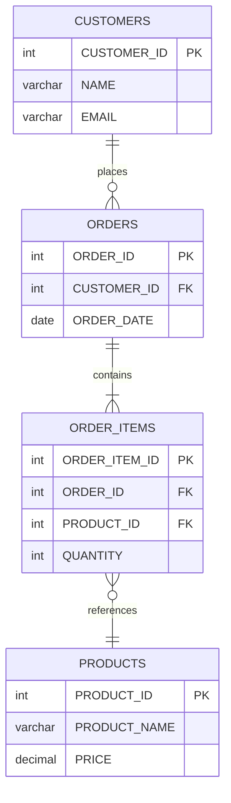
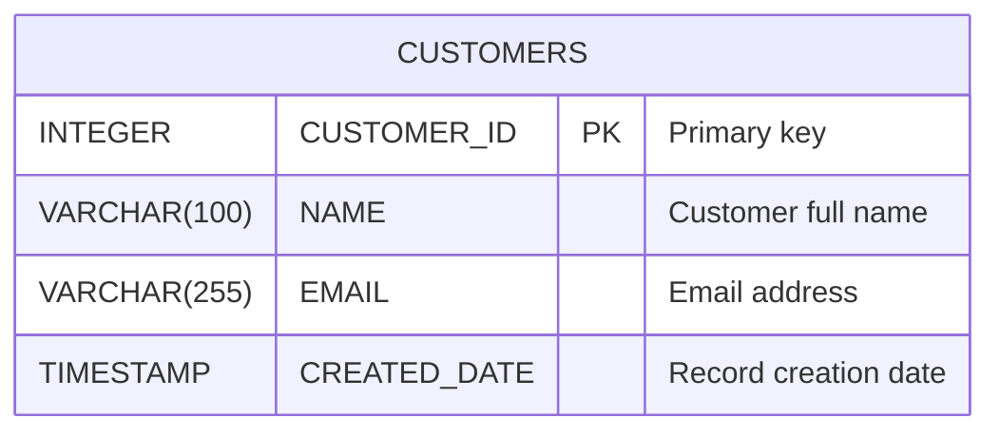
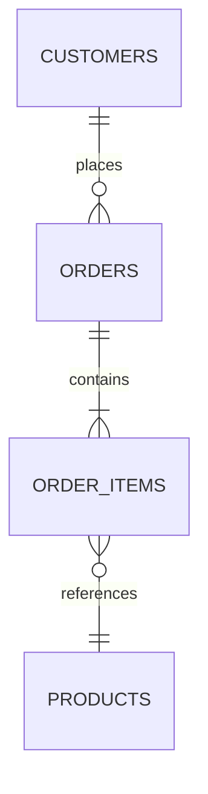
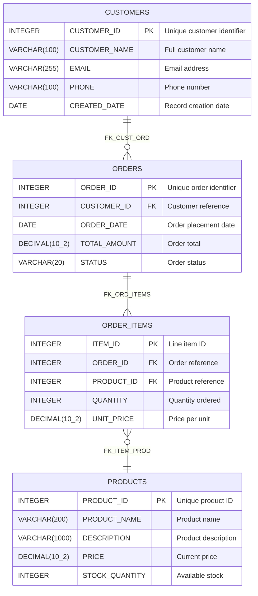

# Mermaid Diagram Generator - Feature Specification

**Feature:** Automated Entity-Relationship Diagram Generation from DB2 Schemas  
**Output:** Mermaid (.mmd) files with interactive table diagrams  
**Display:** Embedded browser with client-side Mermaid.js rendering  
**Interactivity:** Click table headers to open table properties

---

## 🎯 FEATURE OVERVIEW

### What This Feature Does:

**User Workflow:**
1. User selects schemas/tables from TreeView
2. System queries DB2 for table structures and relationships
3. Generates Mermaid Entity-Relationship Diagram (.mmd file)
4. Displays diagram in embedded browser (WebView2)
5. User clicks table in diagram → Opens table properties dialog
6. User can save .mmd file for documentation

**Output Example:**


---

## 🏗️ TECHNICAL ARCHITECTURE

### Component 1: Schema/Table Selection UI

**TreeView Structure:**
```
📁 Schemas
  ├─ ☑️ FK (Schema)
  │   ├─ ☑️ CUSTOMERS (Table)
  │   ├─ ☑️ ORDERS (Table)
  │   ├─ ☑️ ORDER_ITEMS (Table)
  │   └─ ☑️ PRODUCTS (Table)
  ├─ ☐ APP (Schema)
  │   ├─ ☐ SESSIONS (Table)
  │   └─ ☐ AUDIT_LOG (Table)
  └─ ☐ SYSCAT (System - excluded by default)
```

**Features:**
- Checkboxes on schemas and tables
- Select entire schema → All tables selected
- Uncheck schema → All tables unchecked
- Filter: Exclude system schemas (SYSCAT, SYSIBM, etc.)
- Search box to filter tree
- "Select All" and "Deselect All" buttons

**File:** `Controls/MermaidDiagramGeneratorPanel.xaml`

---

### Component 2: Mermaid Generator Service

**Service:** `Services/MermaidDiagramGeneratorService.cs`

**Responsibilities:**
1. Query DB2 for table metadata (columns, data types, PKs, FKs)
2. Build relationships between tables
3. Generate Mermaid ER Diagram syntax
4. Include column details with data types
5. Mark primary keys (PK) and foreign keys (FK)
6. Detect relationship cardinality (1:1, 1:N, N:M)

**Key Methods:**
```csharp
public async Task<string> GenerateMermaidDiagramAsync(
    DB2ConnectionManager connectionManager,
    List<string> selectedSchemas,
    List<string> selectedTables)
{
    // 1. Get table metadata for selected tables
    // 2. Get foreign key relationships
    // 3. Build Mermaid ER Diagram syntax
    // 4. Return .mmd content
}

public async Task<TableWithRelationships> GetTableWithRelationshipsAsync(
    DB2ConnectionManager connectionManager,
    string schema,
    string tableName)
{
    // Query SYSCAT.COLUMNS for column definitions
    // Query SYSCAT.KEYCOLUSE for primary keys
    // Query SYSCAT.REFERENCES for foreign keys (outgoing)
    // Query SYSCAT.REFERENCES for reverse FK (incoming)
    // Return complete table structure
}

private string BuildMermaidRelationship(
    string table1, 
    string table2, 
    ForeignKeyInfo fk)
{
    // Determine cardinality based on FK columns
    // Return: "TABLE1 ||--o{ TABLE2 : relationship"
}
```

---

### Component 3: Browser Integration (WebView2)

**Technology:** Microsoft Edge WebView2 (Chromium-based embedded browser)

**NuGet Package Required:**
```xml
<PackageReference Include="Microsoft.Web.WebView2" Version="1.0.2088.41" />
```

**Why WebView2:**
- ✅ Chromium engine (modern web standards)
- ✅ Runs JavaScript (Mermaid.js)
- ✅ Built into Windows 11
- ✅ Supports JavaScript ↔ C# communication
- ✅ Can handle click events from browser

**File:** `Controls/MermaidDiagramViewer.xaml`

**XAML:**
```xml
<UserControl x:Class="WindowsDb2Editor.Controls.MermaidDiagramViewer"
             xmlns:wv2="clr-namespace:Microsoft.Web.WebView2.Wpf;assembly=Microsoft.Web.WebView2.Wpf">
    <Grid>
        <wv2:WebView2 x:Name="MermaidWebView" 
                      Source="about:blank"
                      NavigationCompleted="WebView_NavigationCompleted"/>
    </Grid>
</UserControl>
```

---

### Component 4: HTML Template with Mermaid.js

**HTML Template (Embedded in App):**
```html
<!DOCTYPE html>
<html>
<head>
    <script type="module">
        import mermaid from 'https://cdn.jsdelivr.net/npm/mermaid@10/dist/mermaid.esm.min.mjs';
        mermaid.initialize({ 
            startOnLoad: true,
            theme: 'default',
            er: {
                useMaxWidth: true
            }
        });
        
        // Handle table click events
        document.addEventListener('click', function(e) {
            if (e.target.tagName === 'text' && e.target.classList.contains('er-entity')) {
                var tableName = e.target.textContent;
                // Call C# method
                window.chrome.webview.postMessage({
                    action: 'openTableProperties',
                    tableName: tableName
                });
            }
        });
    </script>
    <style>
        body { 
            font-family: Arial, sans-serif; 
            padding: 20px;
            background: #f5f5f5;
        }
        .mermaid {
            background: white;
            padding: 20px;
            border-radius: 8px;
            box-shadow: 0 2px 4px rgba(0,0,0,0.1);
        }
    </style>
</head>
<body>
    <div class="mermaid">
        {MERMAID_CONTENT_PLACEHOLDER}
    </div>
</body>
</html>
```

---

## 🔗 MERMAID SYNTAX FOR DB2 TABLES

### Basic Table Definition

**DB2 Query:**
```sql
SELECT COLNAME, TYPENAME, LENGTH, SCALE, NULLS, KEYSEQ
FROM SYSCAT.COLUMNS
WHERE TABSCHEMA = 'FK' AND TABNAME = 'CUSTOMERS'
ORDER BY COLNO
```

**Generated Mermaid:**


### Foreign Key Relationships

**DB2 Query:**
```sql
SELECT 
    r.TABSCHEMA, r.TABNAME,
    r.REFTABSCHEMA, r.REFTABNAME,
    r.CONSTNAME,
    r.FK_COLNAMES, r.PK_COLNAMES,
    r.DELETERULE, r.UPDATERULE
FROM SYSCAT.REFERENCES r
WHERE r.TABSCHEMA IN ('FK', 'APP')
```

**Mermaid Relationship Syntax:**
```
TABLE1 ||--o{ TABLE2 : "relationship_name"
```

**Cardinality Symbols:**
- `||--||` : Exactly one to exactly one
- `||--o{` : One to zero or more
- `}o--||` : Zero or more to exactly one
- `||--|{` : One to one or more
- `}o--o{` : Zero or more to zero or more

**Example with FK:**


---

## 🎨 IMPLEMENTATION PLAN

### Phase 1: Create Mermaid Generator Service (2-3 hours)

**File:** `Services/MermaidDiagramGeneratorService.cs`

**Models Needed:**
```csharp
public class TableWithRelationships
{
    public string Schema { get; set; }
    public string Name { get; set; }
    public List<ColumnInfo> Columns { get; set; }
    public List<string> PrimaryKeys { get; set; }
    public List<ForeignKeyRelationship> OutgoingFK { get; set; }
    public List<ForeignKeyRelationship> IncomingFK { get; set; }
}

public class ColumnInfo
{
    public string Name { get; set; }
    public string DataType { get; set; }
    public int? Length { get; set; }
    public int? Scale { get; set; }
    public bool IsNullable { get; set; }
    public bool IsPrimaryKey { get; set; }
    public bool IsForeignKey { get; set; }
    public string? Comment { get; set; }
}

public class ForeignKeyRelationship
{
    public string FromSchema { get; set; }
    public string FromTable { get; set; }
    public string ToSchema { get; set; }
    public string ToTable { get; set; }
    public string ConstraintName { get; set; }
    public List<string> FromColumns { get; set; }
    public List<string> ToColumns { get; set; }
    public string DeleteRule { get; set; }
    public string Cardinality { get; set; } // "||--o{", etc.
}
```

**Key Queries:**
```sql
-- Get all columns with PK info
SELECT 
    c.COLNAME, c.TYPENAME, c.LENGTH, c.SCALE, c.NULLS, c.REMARKS,
    k.COLNAME AS IS_PK
FROM SYSCAT.COLUMNS c
LEFT JOIN SYSCAT.KEYCOLUSE k 
    ON c.TABSCHEMA = k.TABSCHEMA 
    AND c.TABNAME = k.TABNAME 
    AND c.COLNAME = k.COLNAME
WHERE c.TABSCHEMA = '{schema}' 
  AND c.TABNAME = '{table}'
ORDER BY c.COLNO

-- Get FK relationships
SELECT 
    TABSCHEMA, TABNAME,
    REFTABSCHEMA, REFTABNAME,
    CONSTNAME, FK_COLNAMES, PK_COLNAMES,
    DELETERULE, UPDATERULE
FROM SYSCAT.REFERENCES
WHERE TABSCHEMA IN ({selected_schemas})
  AND TABNAME IN ({selected_tables})
```

**Mermaid Generation Logic:**
```csharp
public string GenerateMermaidERDiagram(List<TableWithRelationships> tables)
{
    var mermaid = new StringBuilder();
    mermaid.AppendLine("erDiagram");
    mermaid.AppendLine();
    
    // First: Define all relationships
    foreach (var table in tables)
    {
        foreach (var fk in table.OutgoingFK)
        {
            var relationship = $"{table.Name} {fk.Cardinality} {fk.ToTable} : \"{fk.ConstraintName}\"";
            mermaid.AppendLine($"    {relationship}");
        }
    }
    
    mermaid.AppendLine();
    
    // Second: Define all table structures
    foreach (var table in tables)
    {
        mermaid.AppendLine($"    {table.Name} {{");
        
        foreach (var col in table.Columns)
        {
            var type = FormatDataType(col);
            var marker = col.IsPrimaryKey ? "PK" : col.IsForeignKey ? "FK" : "";
            var comment = col.Comment ?? "";
            
            mermaid.AppendLine($"        {type} {col.Name} {marker} \"{comment}\"");
        }
        
        mermaid.AppendLine("    }");
    }
    
    return mermaid.ToString();
}
```

---

### Phase 2: Create Selection UI Panel (2-3 hours)

**File:** `Controls/MermaidDiagramGeneratorPanel.xaml`

**Layout:**
```xml
<UserControl>
    <Grid>
        <Grid.ColumnDefinitions>
            <ColumnDefinition Width="300"/> <!-- Selection Tree -->
            <ColumnDefinition Width="5"/>
            <ColumnDefinition Width="*"/>   <!-- Preview/Settings -->
        </Grid.ColumnDefinitions>
        
        <!-- Left: Schema/Table Selection -->
        <Grid Grid.Column="0">
            <Grid.RowDefinitions>
                <RowDefinition Height="Auto"/>
                <RowDefinition Height="*"/>
                <RowDefinition Height="Auto"/>
            </Grid.RowDefinitions>
            
            <!-- Filter -->
            <StackPanel Grid.Row="0" Margin="10">
                <CheckBox x:Name="ExcludeSystemCheckBox" 
                          Content="Exclude System Schemas" 
                          IsChecked="True"/>
                <TextBox x:Name="SearchBox" 
                         Margin="0,10,0,0"
                         Text="Search tables..."/>
            </StackPanel>
            
            <!-- TreeView with Checkboxes -->
            <TreeView Grid.Row="1" x:Name="SchemaTableTreeView" Margin="10">
                <TreeView.Resources>
                    <!-- Custom template with checkboxes -->
                </TreeView.Resources>
            </TreeView>
            
            <!-- Selection Actions -->
            <StackPanel Grid.Row="2" Margin="10">
                <Button Content="Select All" Click="SelectAll_Click"/>
                <Button Content="Deselect All" Click="DeselectAll_Click"/>
            </StackPanel>
        </Grid>
        
        <GridSplitter Grid.Column="1"/>
        
        <!-- Right: Preview and Actions -->
        <Grid Grid.Column="2">
            <Grid.RowDefinitions>
                <RowDefinition Height="Auto"/>
                <RowDefinition Height="*"/>
                <RowDefinition Height="Auto"/>
            </Grid.RowDefinitions>
            
            <!-- Options -->
            <GroupBox Grid.Row="0" Header="Diagram Options" Margin="10">
                <StackPanel>
                    <CheckBox x:Name="IncludeColumnsCheckBox" 
                              Content="Include column details" 
                              IsChecked="True"/>
                    <CheckBox x:Name="IncludeCommentsCheckBox" 
                              Content="Include column comments" 
                              IsChecked="True"/>
                    <CheckBox x:Name="ShowDataTypesCheckBox" 
                              Content="Show data types" 
                              IsChecked="True"/>
                    <ComboBox x:Name="ThemeComboBox" Margin="0,10,0,0">
                        <ComboBoxItem Content="Default Theme" IsSelected="True"/>
                        <ComboBoxItem Content="Dark Theme"/>
                        <ComboBoxItem Content="Forest Theme"/>
                        <ComboBoxItem Content="Neutral Theme"/>
                    </ComboBox>
                </StackPanel>
            </GroupBox>
            
            <!-- Preview -->
            <TabControl Grid.Row="1">
                <TabItem Header="Preview">
                    <!-- WebView2 for Mermaid rendering -->
                    <wv2:WebView2 x:Name="PreviewWebView"/>
                </TabItem>
                <TabItem Header="Mermaid Source">
                    <!-- AvalonEdit for .mmd source -->
                    <avalonedit:TextEditor x:Name="MermaidSourceEditor" 
                                           IsReadOnly="False"
                                           FontFamily="Consolas"/>
                </TabItem>
            </TabControl>
            
            <!-- Actions -->
            <StackPanel Grid.Row="2" Orientation="Horizontal" 
                       HorizontalAlignment="Right" Margin="10">
                <Button x:Name="GenerateButton" 
                        Content="⚡ Generate Diagram" 
                        Click="Generate_Click" 
                        Padding="15,8"/>
                <Button x:Name="SaveButton" 
                        Content="💾 Save .mmd File" 
                        Click="Save_Click" 
                        Padding="15,8" 
                        Margin="10,0,0,0"/>
                <Button x:Name="ExportImageButton" 
                        Content="📸 Export as PNG" 
                        Click="ExportImage_Click" 
                        Padding="15,8" 
                        Margin="10,0,0,0"/>
            </StackPanel>
        </Grid>
    </Grid>
</UserControl>
```

---

### Phase 3: WebView2 Integration (1-2 hours)

**HTML Template (Embedded Resource):**

**File:** `Resources/MermaidTemplate.html`

```html
<!DOCTYPE html>
<html>
<head>
    <meta charset="UTF-8">
    <meta name="viewport" content="width=device-width, initial-scale=1.0">
    <title>Mermaid Diagram</title>
    
    <!-- Mermaid.js from CDN -->
    <script type="module">
        import mermaid from 'https://cdn.jsdelivr.net/npm/mermaid@10/dist/mermaid.esm.min.mjs';
        
        mermaid.initialize({ 
            startOnLoad: true,
            theme: '{{THEME}}', // Placeholder for theme selection
            er: {
                useMaxWidth: true,
                layoutDirection: 'TB' // Top to Bottom
            },
            securityLevel: 'loose' // Allow click handlers
        });
        
        // Expose function to update diagram
        window.updateDiagram = function(mermaidCode) {
            document.getElementById('diagram-container').innerHTML = 
                '<div class="mermaid">' + mermaidCode + '</div>';
            mermaid.run();
        };
        
        // Handle clicks on diagram elements
        window.addEventListener('load', function() {
            document.addEventListener('click', function(e) {
                // Check if clicked on entity box header
                var entityText = e.target.closest('.er-entityBox');
                if (entityText) {
                    var tableName = entityText.querySelector('.er-entityLabel')?.textContent;
                    if (tableName) {
                        // Send message to C#
                        window.chrome.webview.postMessage({
                            action: 'openTableProperties',
                            tableName: tableName.trim()
                        });
                    }
                }
            });
        });
    </script>
    
    <style>
        body {
            margin: 0;
            padding: 20px;
            font-family: 'Segoe UI', Tahoma, Geneva, Verdana, sans-serif;
            background: #f9f9f9;
        }
        #diagram-container {
            background: white;
            padding: 20px;
            border-radius: 8px;
            box-shadow: 0 2px 8px rgba(0,0,0,0.1);
        }
        .er-entityBox {
            cursor: pointer;
            transition: all 0.2s;
        }
        .er-entityBox:hover {
            opacity: 0.8;
            transform: scale(1.02);
        }
        .mermaid {
            text-align: center;
        }
    </style>
</head>
<body>
    <div id="diagram-container">
        <div class="mermaid">
            {{MERMAID_CONTENT}}
        </div>
    </div>
</body>
</html>
```

---

### Phase 4: JavaScript ↔ C# Communication (1 hour)

**C# Code-Behind:** `Controls/MermaidDiagramViewer.xaml.cs`

```csharp
public partial class MermaidDiagramViewer : UserControl
{
    private static readonly Logger Logger = LogManager.GetCurrentClassLogger();
    private string _currentMermaidCode = string.Empty;
    
    public event EventHandler<string>? TableClicked;
    
    public MermaidDiagramViewer()
    {
        InitializeComponent();
        _ = InitializeWebViewAsync();
    }
    
    private async Task InitializeWebViewAsync()
    {
        await MermaidWebView.EnsureCoreWebView2Async();
        
        // Set up message handler for JavaScript → C# communication
        MermaidWebView.CoreWebView2.WebMessageReceived += (s, e) =>
        {
            var message = JsonSerializer.Deserialize<WebMessage>(e.WebMessageAsJson);
            
            if (message?.Action == "openTableProperties")
            {
                Logger.Info("Table clicked in diagram: {Table}", message.TableName);
                TableClicked?.Invoke(this, message.TableName);
            }
        };
        
        // Load HTML template
        var html = LoadHtmlTemplate();
        MermaidWebView.NavigateToString(html);
    }
    
    public async Task UpdateDiagramAsync(string mermaidCode, string theme = "default")
    {
        _currentMermaidCode = mermaidCode;
        
        // Load HTML with Mermaid code
        var html = LoadHtmlTemplate();
        html = html.Replace("{{THEME}}", theme);
        html = html.Replace("{{MERMAID_CONTENT}}", mermaidCode);
        
        MermaidWebView.NavigateToString(html);
    }
    
    private string LoadHtmlTemplate()
    {
        // Load from embedded resource
        var assembly = Assembly.GetExecutingAssembly();
        var resourceName = "WindowsDb2Editor.Resources.MermaidTemplate.html";
        
        using var stream = assembly.GetManifestResourceStream(resourceName);
        if (stream == null)
        {
            // Fallback: Use inline template
            return GetInlineHtmlTemplate();
        }
        
        using var reader = new StreamReader(stream);
        return reader.ReadToEnd();
    }
}

class WebMessage
{
    public string Action { get; set; }
    public string TableName { get; set; }
}
```

**Wire Up Event in MermaidDiagramGeneratorPanel:**
```csharp
private void MermaidViewer_TableClicked(object? sender, string tableName)
{
    Logger.Info("Opening table properties for: {Table}", tableName);
    
    // Parse schema.table format
    var parts = tableName.Split('.');
    var schema = parts.Length == 2 ? parts[0] : _selectedSchema;
    var table = parts.Length == 2 ? parts[1] : tableName;
    
    // Open TableDetailsDialog
    var dialog = new TableDetailsDialog(_connectionManager, $"{schema}.{table}")
    {
        Owner = Window.GetWindow(this)
    };
    
    dialog.ShowDialog();
}
```

---

## 📊 EXAMPLE OUTPUT

### Selected Tables:
- FK.CUSTOMERS
- FK.ORDERS
- FK.ORDER_ITEMS
- FK.PRODUCTS

### Generated Mermaid:


---

## 🎯 WHAT'S POSSIBLE

### ✅ Fully Possible:

1. **Generate Mermaid ER Diagrams** ✅
   - Query DB2 for table structures
   - Query SYSCAT.REFERENCES for relationships
   - Build Mermaid syntax
   - Include columns, data types, PK/FK markers

2. **Display in Embedded Browser** ✅
   - WebView2 (Chromium engine)
   - Mermaid.js from CDN
   - Client-side rendering
   - No server needed

3. **Interactive Diagrams** ✅
   - Click detection via JavaScript
   - JavaScript → C# message passing
   - Open TableDetailsDialog on click
   - WebView2 supports bidirectional communication

4. **Export Options** ✅
   - Save .mmd files for documentation
   - Export as PNG (via Mermaid.js API)
   - Export as SVG
   - Copy to clipboard

5. **Multiple Schemas** ✅
   - Select from multiple schemas
   - Show cross-schema relationships
   - Filter and search

---

### ⚠️ Limitations & Challenges:

1. **Large Diagrams** ⚠️
   - 50+ tables become hard to read
   - Recommend: Focus on specific schema or table group
   - Solution: Paging or filtering

2. **Circular Dependencies** ⚠️
   - Mermaid handles circular FK relationships
   - But layout can be messy
   - Solution: Mermaid auto-layout

3. **Complex Relationships** ⚠️
   - Composite foreign keys (multiple columns)
   - Self-referencing tables
   - Solution: Show as separate relationships

4. **WebView2 Dependency** ⚠️
   - Requires Microsoft Edge WebView2 Runtime
   - Usually pre-installed on Windows 11
   - Fallback: Show .mmd source only

---

## 🔧 IMPLEMENTATION STEPS

### Step 1: Add WebView2 NuGet Package (5 minutes)
```bash
dotnet add package Microsoft.Web.WebView2 --version 1.0.2088.41
```

### Step 2: Create Mermaid Generator Service (2-3 hours)
- MermaidDiagramGeneratorService.cs
- TableWithRelationships model
- ColumnInfo model
- ForeignKeyRelationship model
- Query methods for metadata
- Mermaid syntax generation
- Cardinality detection

### Step 3: Create Selection UI Panel (2-3 hours)
- MermaidDiagramGeneratorPanel.xaml
- TreeView with checkboxes (schemas/tables)
- Filter and search functionality
- Selection management
- Options panel

### Step 4: Create WebView2 Viewer (1-2 hours)
- MermaidDiagramViewer.xaml
- WebView2 initialization
- HTML template with Mermaid.js
- JavaScript click handling
- C# message receiver

### Step 5: Wire Up Interactivity (1 hour)
- TableClicked event handler
- Open TableDetailsDialog on click
- Pass schema.table to dialog

### Step 6: Add Export Features (1 hour)
- Save .mmd file
- Export to PNG (via Mermaid.js)
- Copy to clipboard

### Step 7: Integration & Testing (1 hour)
- Add to MainWindow menu
- Test with real DB2 schemas
- Test clicking tables
- Test all export formats

**Total Estimated Time:** 8-12 hours

---

## 📝 ALTERNATIVE APPROACHES

### Option 1: Full WebView2 Integration (Recommended)
**Pros:**
- ✅ Interactive diagrams
- ✅ Click to open properties
- ✅ Beautiful rendering
- ✅ Export to PNG built-in

**Cons:**
- ⚠️ Requires WebView2 runtime
- ⚠️ More complex implementation

**Time:** 8-12 hours

### Option 2: Generate .mmd Files Only (Simpler)
**Pros:**
- ✅ Simple implementation
- ✅ Users can view in VS Code/GitHub
- ✅ No browser dependency

**Cons:**
- ❌ No live preview
- ❌ No click interaction
- ❌ External tool needed to view

**Time:** 4-6 hours

### Option 3: External Mermaid Live Editor (Minimal)
**Pros:**
- ✅ Minimal code
- ✅ Generate .mmd file
- ✅ Open in browser (external)

**Cons:**
- ❌ No embedded viewer
- ❌ No integration

**Time:** 2-3 hours

---

## 🎨 EXAMPLE USE CASES

### Use Case 1: Document FK Schema
**User Action:**
1. Select FK schema (all tables)
2. Click "Generate Diagram"
3. View diagram showing all relationships
4. Click CUSTOMERS table → Opens TableDetailsDialog
5. Save as `FK_Schema_ERD.mmd`

**Result:** Complete documentation of FK schema relationships

### Use Case 2: Analyze Specific Table
**User Action:**
1. Select only ORDERS table (and related tables)
2. Generate diagram showing:
   - CUSTOMERS → ORDERS
   - ORDERS → ORDER_ITEMS
3. Click each table to see column details

**Result:** Focused view of ORDERS relationships

### Use Case 3: Cross-Schema Relationships
**User Action:**
1. Select tables from FK and APP schemas
2. Generate diagram showing cross-schema FK
3. Export as PNG for documentation

**Result:** Cross-schema dependency visualization

---

## 🎯 RECOMMENDED IMPLEMENTATION

**I recommend Option 1: Full WebView2 Integration**

**Why:**
- Provides best user experience
- Interactive (click to open properties)
- Modern rendering with Mermaid.js
- WebView2 already on Windows 11
- Export options built-in

**Implementation Priority:**
1. ✅ Mermaid Generator Service (core logic)
2. ✅ Selection UI Panel (TreeView)
3. ✅ WebView2 Viewer (browser integration)
4. ✅ Interactivity (click handlers)
5. ✅ Export features

---

## 📋 TASK BREAKDOWN (For TASKLIST.md)

**Feature #21: Mermaid ER Diagram Generator**

### 21.1 Add WebView2 Dependency
- [ ] Install Microsoft.Web.WebView2 NuGet package
- [ ] Verify WebView2 runtime available
- [ ] Test WebView2 basic functionality

### 21.2 Create Mermaid Generator Service
- [ ] Create Services/MermaidDiagramGeneratorService.cs
- [ ] Create TableWithRelationships model
- [ ] Create ColumnInfo model
- [ ] Create ForeignKeyRelationship model
- [ ] Implement GetTableWithRelationshipsAsync()
- [ ] Implement GetForeignKeyRelationshipsAsync()
- [ ] Implement DetermineCardinality() helper
- [ ] Implement GenerateMermaidERDiagram()
- [ ] Implement FormatDataType() helper
- [ ] Add comprehensive DEBUG logging

### 21.3 Create Selection UI Panel
- [ ] Create Controls/MermaidDiagramGeneratorPanel.xaml
- [ ] Create Controls/MermaidDiagramGeneratorPanel.xaml.cs
- [ ] Implement schema/table TreeView with checkboxes
- [ ] Add "Exclude System Schemas" filter
- [ ] Add search/filter functionality
- [ ] Add "Select All" / "Deselect All" buttons
- [ ] Add diagram options (columns, comments, data types)
- [ ] Add theme selection ComboBox

### 21.4 Create WebView2 Viewer
- [ ] Create Controls/MermaidDiagramViewer.xaml
- [ ] Create Controls/MermaidDiagramViewer.xaml.cs
- [ ] Create Resources/MermaidTemplate.html
- [ ] Implement WebView2 initialization
- [ ] Implement UpdateDiagramAsync() method
- [ ] Load HTML template
- [ ] Replace placeholders (theme, content)

### 21.5 Implement Interactivity
- [ ] Add WebMessageReceived handler
- [ ] Parse JavaScript messages
- [ ] Implement TableClicked event
- [ ] Wire up event in main panel
- [ ] Open TableDetailsDialog on table click
- [ ] Pass correct schema.table to dialog

### 21.6 Add Export Features
- [ ] Implement Save .mmd file
- [ ] Implement Export to PNG (via Mermaid API)
- [ ] Implement Copy to clipboard
- [ ] Add file dialogs for save operations

### 21.7 Integration
- [ ] Add menu item to MainWindow (View → Generate ER Diagram)
- [ ] Tag with AccessLevel:Middle
- [ ] Wire up event handler
- [ ] Test with multiple schemas
- [ ] Test clicking tables
- [ ] Test all export formats

**Estimated:** 8-12 hours  
**Priority:** Medium (Nice-to-have documentation feature)

---

## 🎊 SPECIFICATION COMPLETE

**This spec provides:**
- ✅ Complete technical approach
- ✅ All required components
- ✅ WebView2 integration details
- ✅ Mermaid.js syntax examples
- ✅ JavaScript ↔ C# communication
- ✅ Interactive table clicking
- ✅ Multiple export options
- ✅ Step-by-step implementation plan
- ✅ Task breakdown for TASKLIST.md

**Ready to implement when you return!**

---

**Specification Status:** ✅ COMPLETE  
**Feasibility:** ✅ Fully Possible  
**Complexity:** Medium  
**Value:** High (for documentation and visualization)

