# WindowsDb2Editor - Application Architecture

## Overview

WindowsDb2Editor is a **provider-agnostic database editor** for Windows, built with WPF/.NET 10. The architecture emphasizes:
- **Provider Independence**: Support for multiple databases (DB2, PostgreSQL, Oracle, SQL Server)
- **Factory Pattern**: All provider-specific code isolated to factories
- **Configuration-Driven**: SQL statements and metadata in JSON files
- **Modular Design**: Clear separation between UI, Services, and Data layers

## High-Level Architecture

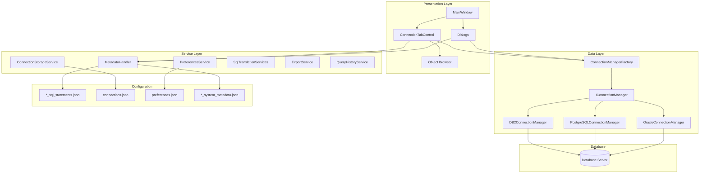

## Core Design Patterns

### Factory Pattern (MANDATORY)

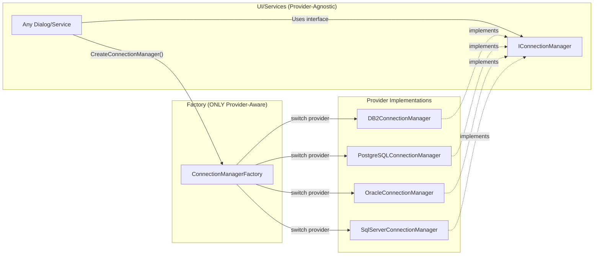

### SQL Abstraction Pattern

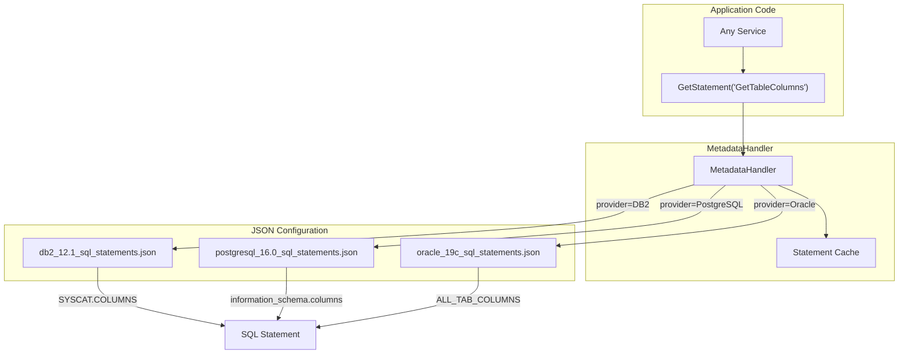

## Folder Structure

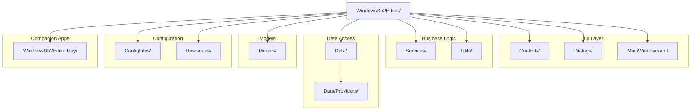

## Connection Flow

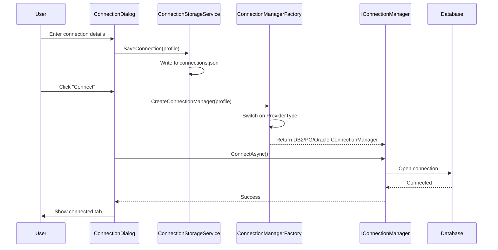

## Query Execution Flow

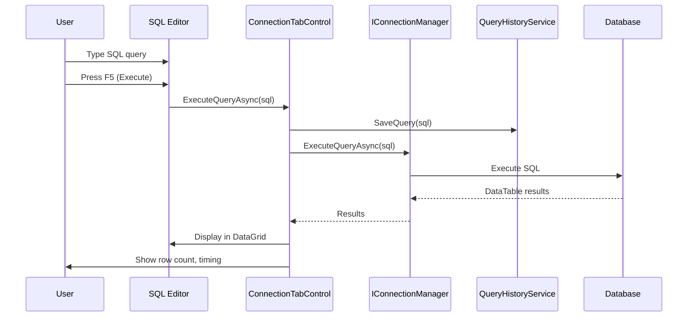

## Object Browser Architecture

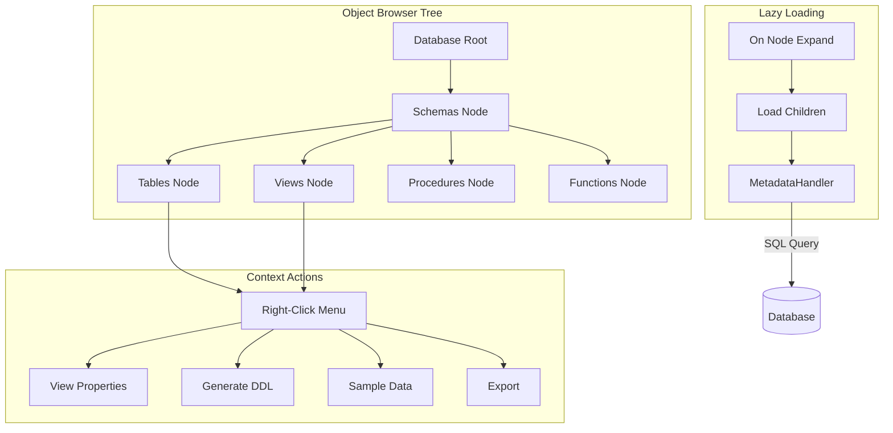

## Tray Application Architecture

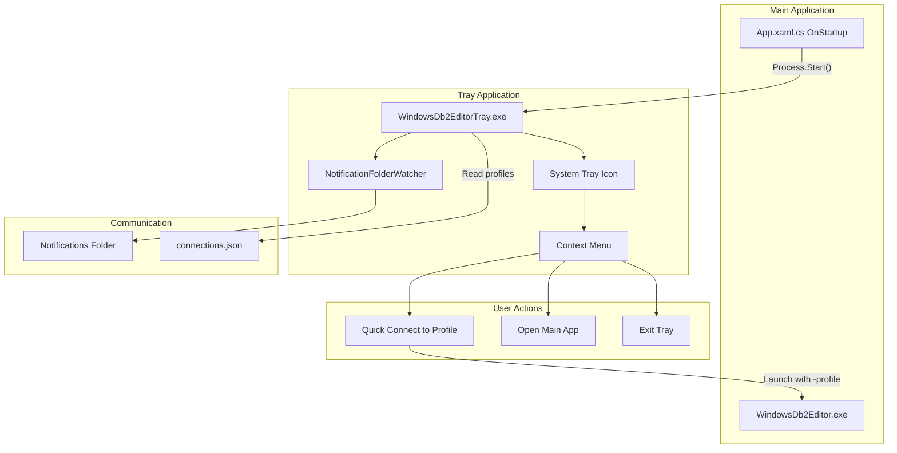

## CLI Architecture

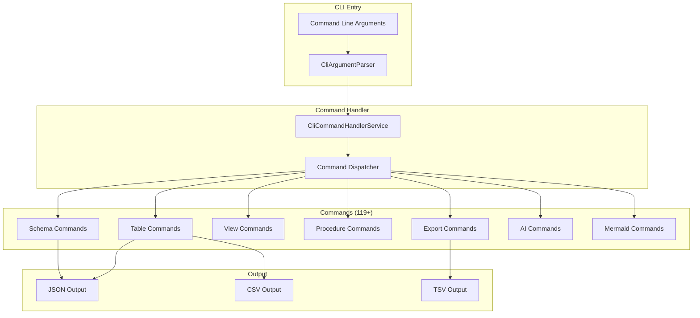

## Configuration Files Architecture

The application uses a **configuration-driven** approach where SQL queries, UI text, IntelliSense data, and provider metadata are all stored in JSON files. This enables:
- Adding new database providers without code changes
- Multi-language support (localization)
- Version-specific SQL for different database versions
- Easy updates and customization

### Configuration File Flow

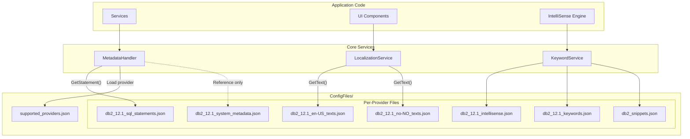

### ConfigFiles/ Directory Structure

```
ConfigFiles/
├── supported_providers.json           # Master list of database providers
│
├── db2_12.1_sql_statements.json       # All SQL queries for DB2 12.1
├── db2_12.1_sql_statements.json.backup # Backup before major changes
├── db2_12.1_sql_statements.json.temp   # Temp file during updates
│
├── db2_12.1_system_metadata.json      # DB2 catalog reference (dev only)
├── db2_12.1_intellisense.json         # IntelliSense: keywords, types, functions
├── db2_12.1_keywords.json             # SQL keywords for syntax highlighting
│
├── db2_12.1_en-US_texts.json          # English UI translations
├── db2_12.1_no-NO_texts.json          # Norwegian UI translations
│
└── db2_snippets.json                  # Code snippet templates
```

### Detailed File Descriptions

#### 1. `supported_providers.json` - Provider Registry

**Purpose**: Master list of all supported database providers with connection details.

**Used by**: `ConnectionManagerFactory`, `ConnectionDialog`, `MetadataHandler`

```json
{
  "providers": [
    {
      "provider_code": "DB2",
      "display_name": "IBM DB2 Database",
      "supported_versions": ["12.1", "11.5", "11.1"],
      "default_port": 50000,
      "connection_string_template": "Server={host}:{port};Database={database};...",
      "system_catalog_schema": "SYSCAT"
    }
  ]
}
```

**How it links**: When connecting, the app reads this file to determine which connection manager to create and what default settings to use.

---

#### 2. `db2_12.1_sql_statements.json` - SQL Query Repository

**Purpose**: ALL SQL queries used by the application for DB2 12.1. No hardcoded SQL in C# code.

**Used by**: `MetadataHandler.GetStatement()` → All services

```json
{
  "statements": {
    "GetTablesForSchema": {
      "sql": "SELECT TRIM(TABNAME) AS TABNAME... FROM SYSCAT.TABLES WHERE TRIM(TABSCHEMA) = ?",
      "description": "Get all tables in a schema",
      "parameters": ["TABSCHEMA"]
    }
  }
}
```

**How it links**:
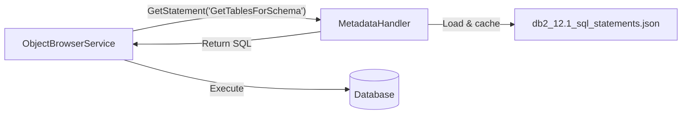

---

#### 3. `db2_12.1_system_metadata.json` - Developer Reference

**Purpose**: Documentation of DB2 system catalog structure. **NOT loaded at runtime** - used by developers/AI to understand the database schema when writing SQL statements.

**Used by**: Developers, AI assistants (reference only)

```json
{
  "purpose": "Reference file for building SQL statements - NOT loaded by app",
  "catalog_tables": {
    "SYSCAT.TABLES": {
      "columns": {
        "TABSCHEMA": { "type": "VARCHAR(128)", "description": "Schema name" },
        "TABNAME": { "type": "VARCHAR(128)", "description": "Table name" }
      }
    }
  }
}
```

**How it links**: When creating new SQL in `db2_12.1_sql_statements.json`, developers consult this file to verify column names and data types.

---

#### 4. `db2_12.1_intellisense.json` - IntelliSense Data

**Purpose**: Comprehensive keyword/function/datatype information for IntelliSense autocomplete.

**Used by**: `IntelliSenseService`, `CompletionProvider`

```json
{
  "keywords": {
    "statements": ["SELECT", "INSERT", "UPDATE", "DELETE"],
    "clauses": ["FROM", "WHERE", "GROUP BY", "ORDER BY"],
    "operators": ["AND", "OR", "NOT", "IN", "EXISTS"]
  },
  "dataTypes": {
    "numeric": ["INTEGER", "SMALLINT", "DECIMAL"],
    "string": ["VARCHAR", "CHAR", "CLOB"]
  },
  "functions": {
    "aggregate": ["COUNT", "SUM", "AVG", "MIN", "MAX"],
    "string": ["SUBSTR", "TRIM", "UPPER", "LOWER"]
  }
}
```

**How it links**:
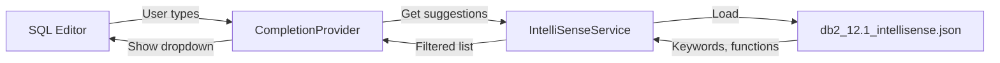

---

#### 5. `db2_12.1_keywords.json` - Syntax Highlighting

**Purpose**: SQL keywords for syntax highlighting in the editor.

**Used by**: `DB2SQL.xshd` (AvalonEdit syntax definition), `KeywordService`

```json
{
  "keywords": {
    "statements": ["SELECT", "INSERT", "UPDATE", "DELETE"],
    "datatypes": ["INTEGER", "VARCHAR", "TIMESTAMP"],
    "functions": ["COUNT", "SUM", "SUBSTR", "TRIM"]
  }
}
```

**How it links**: The syntax highlighter uses these keywords to color SQL code appropriately.

---

#### 6. `db2_12.1_en-US_texts.json` - English Localization

**Purpose**: All UI text in English for internationalization support.

**Used by**: `LocalizationService.GetText()`

```json
{
  "language": "en-US",
  "texts": {
    "ui.menu.file": "File",
    "ui.menu.file.new_connection": "New Connection...",
    "ui.toolbar.execute_tooltip": "Execute query (F5)",
    "errors.connection_failed": "Connection failed: {0}"
  }
}
```

---

#### 7. `db2_12.1_no-NO_texts.json` - Norwegian Localization

**Purpose**: Norwegian translation of all UI text.

**Used by**: `LocalizationService.GetText()` when language is set to Norwegian

```json
{
  "language": "no-NO",
  "ui": {
    "common": {
      "ok": "OK",
      "cancel": "Avbryt",
      "connect": "Koble til",
      "execute": "Kjør"
    }
  }
}
```

**How it links**:
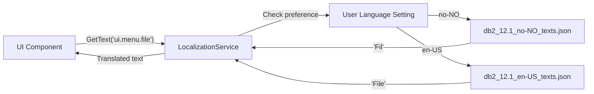

---

#### 8. `db2_snippets.json` - Code Snippets

**Purpose**: SQL snippet templates for quick code insertion.

**Used by**: `SnippetService`, SQL Editor

```json
{
  "snippets": [
    {
      "trigger": "seltop",
      "name": "SELECT TOP N",
      "template": "SELECT * FROM ${1:table} FETCH FIRST ${2:100} ROWS ONLY",
      "description": "Select top N rows from table"
    },
    {
      "trigger": "cte",
      "name": "Common Table Expression",
      "template": "WITH ${1:cte_name} AS (\n\tSELECT ${2:*}\n\tFROM ${3:table}\n)\nSELECT * FROM ${1:cte_name}"
    }
  ]
}
```

**How it links**: When user types a trigger (e.g., "seltop" + Tab), the snippet expands to the full template.

---

### File Naming Convention

```
<provider>_<version>_<type>.json
```

| Component | Values | Example |
|-----------|--------|---------|
| provider | `db2`, `postgresql`, `oracle`, `sqlserver` | `db2` |
| version | `12.1`, `16.0`, `19c`, `2022` | `12.1` |
| type | `sql_statements`, `system_metadata`, `intellisense`, `keywords`, `<lang>_texts` | `sql_statements` |

**Examples**:
- `db2_12.1_sql_statements.json`
- `postgresql_16.0_sql_statements.json`
- `oracle_19c_en-US_texts.json`

---

### Adding a New Database Provider

To add PostgreSQL support, create these files:

1. `postgresql_16.0_sql_statements.json` - All SQL queries
2. `postgresql_16.0_system_metadata.json` - Catalog reference
3. `postgresql_16.0_intellisense.json` - IntelliSense data
4. `postgresql_16.0_keywords.json` - Syntax highlighting
5. `postgresql_16.0_en-US_texts.json` - Localized text
6. Update `supported_providers.json` with new provider entry

**No C# code changes required** - the application automatically picks up new providers from configuration.

---

### User Data Files (Separate from ConfigFiles/)

| File | Location | Purpose |
|------|----------|---------|
| `connections.json` | User Documents | Saved connection profiles |
| `preferences.json` | User Documents | User preferences (theme, fonts, language) |
| `query-history.json` | User Documents | Recent query history |
| `nlog.config` | App Root | Logging configuration |
| `appsettings.json` | App Root | Application settings |

## User Data Folder Structure

```
C:\Users\<user>\Documents\WindowsDb2Editor\
├── connections.json              (saved profiles)
├── preferences.json              (user settings)
├── query-history.json            (query history)
├── missing-fk-search-history.json
├── missing-fk-ignore-history.json
└── MissingFK\
    ├── running_job.json          (PID tracking)
    ├── IgnorePatterns\           (ignore pattern files)
    │   └── *.json
    └── Projects\                 (job outputs)
        └── 20260129_143052_SCHEMA_TABLE1_TABLE2\
            ├── missing_fk_input.json
            ├── missing_fk_results.json
            └── job_*.log
```

## Key Interfaces

### IConnectionManager

```csharp
public interface IConnectionManager
{
    // Connection
    Task<bool> ConnectAsync();
    Task DisconnectAsync();
    bool IsConnected { get; }
    
    // Query Execution
    Task<DataTable> ExecuteQueryAsync(string sql, params object[] parameters);
    Task<int> ExecuteNonQueryAsync(string sql, params object[] parameters);
    Task<object?> ExecuteScalarAsync(string sql, params object[] parameters);
    
    // Connection Info
    IConnectionInfo ConnectionInfo { get; }
}
```

### IConnectionInfo

```csharp
public interface IConnectionInfo
{
    string? Server { get; }
    int Port { get; }
    string? Database { get; }
    string? Username { get; }
    string? ProviderType { get; }
    string ProfileName { get; }
}
```

## Provider Support Matrix

| Feature | DB2 12.1 | PostgreSQL | Oracle | SQL Server |
|---------|----------|------------|--------|------------|
| Connection | ✅ | 🔲 Planned | 🔲 Planned | 🔲 Planned |
| Object Browser | ✅ | 🔲 | 🔲 | 🔲 |
| Query Execution | ✅ | 🔲 | 🔲 | 🔲 |
| DDL Generation | ✅ | 🔲 | 🔲 | 🔲 |
| IntelliSense | ✅ | 🔲 | 🔲 | 🔲 |
| Export (CSV/JSON) | ✅ | 🔲 | 🔲 | 🔲 |
| Mermaid ERD | ✅ | 🔲 | 🔲 | 🔲 |
| Missing FK Discovery | ✅ | 🔲 | 🔲 | 🔲 |

## Adding a New Database Provider

To add support for a new database (e.g., PostgreSQL):

1. **Create Connection Manager**: `Data/Providers/PostgreSQL/PostgreSQLConnectionManager.cs`
2. **Create SQL Statements**: `ConfigFiles/postgresql_16.0_sql_statements.json`
3. **Create System Metadata**: `ConfigFiles/postgresql_16.0_system_metadata.json`
4. **Create Syntax Highlighting**: `Resources/SyntaxHighlighting/PostgreSQLSQL.xshd`
5. **Update Factory**: Add case in `ConnectionManagerFactory.cs`
6. **Update Supported Providers**: Add to `supported_providers.json`

**No changes needed to**: UI code, dialogs, services, or other components.

## Technology Stack

| Component | Technology |
|-----------|------------|
| Framework | .NET 10 (net10.0-windows) |
| UI Framework | WPF |
| Theme | ModernWpfUI |
| SQL Editor | AvalonEdit |
| SQL Formatter | PoorMansTSqlFormatter |
| DB2 Driver | IBM.Data.Db2 (9.0.0.400) |
| Logging | NLog |
| Serialization | System.Text.Json |

## Summary

The WindowsDb2Editor architecture is designed for:

1. **Extensibility**: Add new database providers via configuration
2. **Maintainability**: Single source of truth for SQL and UI text
3. **Testability**: Interface-based design enables mocking
4. **User Experience**: Professional UI with dark/light themes
5. **Automation**: Full CLI support for scripting
