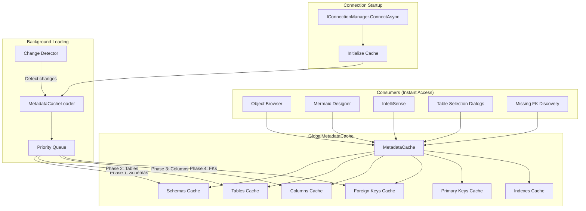
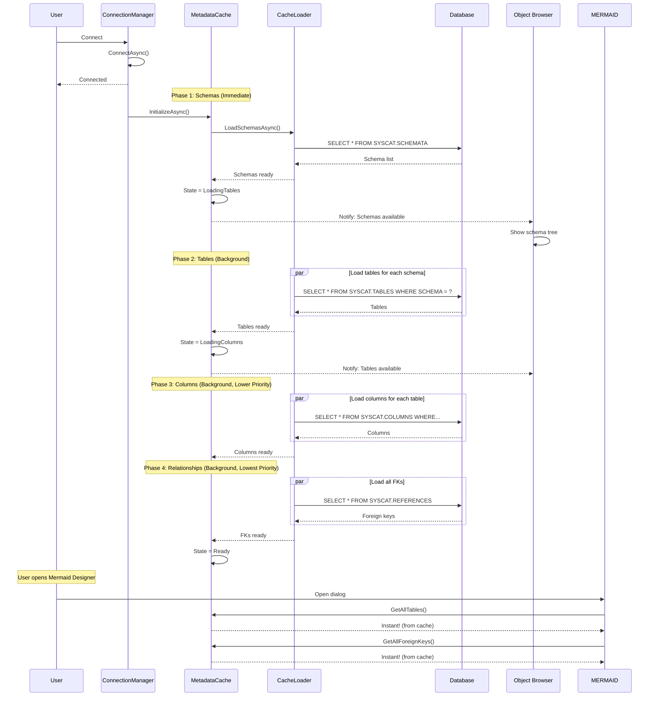
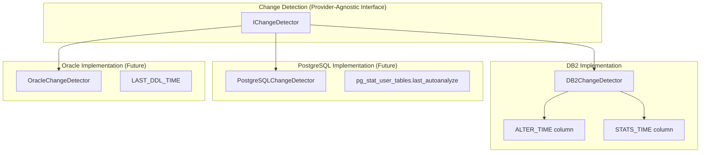
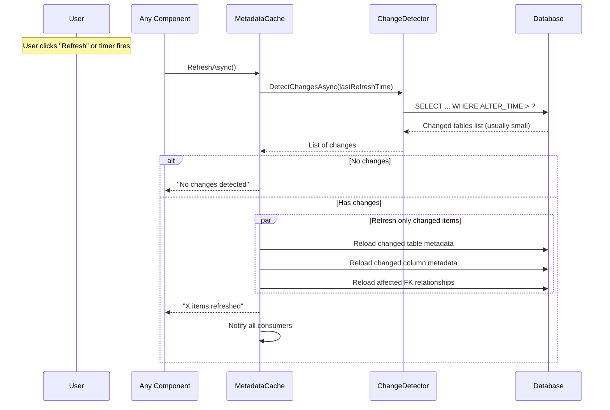

# Global Metadata Cache Specification

## Problem Statement

Currently, each component (Object Browser, Mermaid Designer, Table Selection dialogs, IntelliSense) independently queries the database for metadata:
- Schemas list
- Tables per schema
- Columns per table
- Foreign key relationships
- Primary keys, indexes, etc.

This causes:
1. **Redundant queries** - Same data fetched multiple times
2. **Slow UI** - Each dialog waits for its own metadata load
3. **Inconsistent state** - Different components may have different views of the database
4. **Poor user experience** - Spinners everywhere (as seen in Mermaid Table Selection)

## Proposed Solution: Global Metadata Cache

A **centralized, provider-agnostic metadata cache** that:
- Loads asynchronously at connection startup
- Prioritizes data needed for Object Browser (immediate user visibility)
- Provides instant access to all components
- Supports incremental refresh using provider-specific change detection
- Is fully database-agnostic in design

## Architecture Overview



## Data Model

### Core Interfaces (Provider-Agnostic)

```csharp
/// <summary>
/// Global metadata cache - singleton per connection
/// </summary>
public interface IMetadataCache
{
    // Cache state
    CacheState State { get; }
    event EventHandler<CacheStateChangedEventArgs> StateChanged;
    
    // Schema access
    IReadOnlyList<SchemaInfo> Schemas { get; }
    Task<IReadOnlyList<SchemaInfo>> GetSchemasAsync();
    
    // Table access
    IReadOnlyList<TableInfo> GetTablesForSchema(string schema);
    Task<IReadOnlyList<TableInfo>> GetTablesForSchemaAsync(string schema);
    IReadOnlyList<TableInfo> AllTables { get; }
    
    // Column access
    IReadOnlyList<ColumnInfo> GetColumnsForTable(string schema, string table);
    Task<IReadOnlyList<ColumnInfo>> GetColumnsForTableAsync(string schema, string table);
    
    // Relationship access
    IReadOnlyList<ForeignKeyInfo> GetForeignKeysForTable(string schema, string table);
    IReadOnlyList<ForeignKeyInfo> GetIncomingForeignKeysForTable(string schema, string table);
    IReadOnlyList<ForeignKeyInfo> AllForeignKeys { get; }
    
    // Primary keys
    IReadOnlyList<PrimaryKeyInfo> GetPrimaryKeyForTable(string schema, string table);
    
    // Refresh
    Task RefreshAsync(RefreshScope scope = RefreshScope.All);
    Task RefreshSchemaAsync(string schema);
    Task RefreshTableAsync(string schema, string table);
    
    // Change detection
    bool HasChanges(string schema);
    bool HasChanges(string schema, string table);
    DateTime? GetLastModified(string schema, string table);
}

public enum CacheState
{
    NotInitialized,
    LoadingSchemas,      // Phase 1
    LoadingTables,       // Phase 2
    LoadingColumns,      // Phase 3
    LoadingRelationships, // Phase 4
    Ready,
    Refreshing,
    Error
}

public enum RefreshScope
{
    All,
    SchemasOnly,
    TablesOnly,
    RelationshipsOnly
}
```

### Data Models (Provider-Agnostic)

```csharp
public class SchemaInfo
{
    public string Name { get; set; }
    public string? Owner { get; set; }
    public DateTime? CreatedAt { get; set; }
    public string? Remarks { get; set; }
    public int TableCount { get; set; }
    public int ViewCount { get; set; }
}

public class TableInfo
{
    public string Schema { get; set; }
    public string Name { get; set; }
    public string FullName => $"{Schema}.{Name}";
    public TableType Type { get; set; }  // Table, View, MQT, etc.
    public string? Owner { get; set; }
    public DateTime? CreatedAt { get; set; }
    public DateTime? LastModified { get; set; }  // ALTER_TIME for DB2
    public long? RowCount { get; set; }
    public string? Remarks { get; set; }
    public int ColumnCount { get; set; }
    
    // Lazy-loaded from cache
    public int OutgoingFKCount { get; set; }
    public int IncomingFKCount { get; set; }
}

public class ColumnInfo
{
    public string Schema { get; set; }
    public string TableName { get; set; }
    public string Name { get; set; }
    public string DataType { get; set; }
    public int? Length { get; set; }
    public int? Precision { get; set; }
    public int? Scale { get; set; }
    public bool IsNullable { get; set; }
    public bool IsPrimaryKey { get; set; }
    public bool IsForeignKey { get; set; }
    public string? DefaultValue { get; set; }
    public int OrdinalPosition { get; set; }
}

public class ForeignKeyInfo
{
    public string Name { get; set; }
    
    // Source (child) table
    public string SourceSchema { get; set; }
    public string SourceTable { get; set; }
    public List<string> SourceColumns { get; set; }
    
    // Target (parent) table
    public string TargetSchema { get; set; }
    public string TargetTable { get; set; }
    public List<string> TargetColumns { get; set; }
    
    // Referential actions
    public string? OnDelete { get; set; }
    public string? OnUpdate { get; set; }
}
```

## Loading Strategy

### Phase-Based Loading with Prioritization



### Priority Levels

| Phase | Data | Priority | Rationale |
|-------|------|----------|-----------|
| 1 | Schemas | Highest | Needed immediately for Object Browser root |
| 2 | Tables (names only) | High | Object Browser tree expansion |
| 3 | Table row counts | Medium | Nice to have in browser |
| 4 | Columns | Medium | IntelliSense, property dialogs |
| 5 | Primary Keys | Medium | Mermaid, DDL generation |
| 6 | Foreign Keys | Lower | Mermaid, FK discovery |
| 7 | Indexes | Lowest | Property dialogs only |

## Incremental Refresh Strategy

### Provider-Specific Change Detection



### DB2-Specific Change Detection

```csharp
/// <summary>
/// DB2-specific implementation using ALTER_TIME and STATS_TIME
/// </summary>
public class DB2ChangeDetector : IChangeDetector
{
    public async Task<IEnumerable<ChangedObject>> DetectChangesAsync(
        IMetadataCache cache, 
        CancellationToken ct = default)
    {
        var changes = new List<ChangedObject>();
        
        // Query only ALTER_TIME for all tables - very fast single query
        var sql = @"
            SELECT TRIM(TABSCHEMA) AS TABSCHEMA, 
                   TRIM(TABNAME) AS TABNAME, 
                   ALTER_TIME,
                   STATS_TIME
            FROM SYSCAT.TABLES 
            WHERE TYPE IN ('T', 'V')
              AND ALTER_TIME > ?";
        
        var lastCheck = cache.LastRefreshTime;
        var results = await _connectionManager.ExecuteQueryAsync(sql, lastCheck);
        
        foreach (DataRow row in results.Rows)
        {
            changes.Add(new ChangedObject
            {
                Schema = row["TABSCHEMA"].ToString(),
                Name = row["TABNAME"].ToString(),
                ChangeType = ChangeType.Modified,
                ChangedAt = (DateTime)row["ALTER_TIME"]
            });
        }
        
        return changes;
    }
}
```

### Refresh Flow



## Consumer Integration

### Object Browser

```csharp
public class ObjectBrowserService
{
    private readonly IMetadataCache _cache;
    
    public async Task LoadTreeAsync()
    {
        // Instant if cache is ready, otherwise waits for Phase 1
        var schemas = await _cache.GetSchemasAsync();
        
        // Subscribe to updates
        _cache.StateChanged += OnCacheStateChanged;
    }
    
    private void OnCacheStateChanged(object sender, CacheStateChangedEventArgs e)
    {
        if (e.NewState == CacheState.Ready)
        {
            // Full data available
            RefreshTree();
        }
    }
    
    public async Task<List<TableInfo>> GetTablesForSchemaAsync(string schema)
    {
        // Instant from cache - no DB query
        return _cache.GetTablesForSchema(schema).ToList();
    }
}
```

### Mermaid Designer Table Selection

```csharp
public class MermaidTableSelectionDialog
{
    private readonly IMetadataCache _cache;
    
    private async void Dialog_Loaded(object sender, EventArgs e)
    {
        // Instant population from cache - no spinner needed!
        var tables = _cache.AllTables;
        TableListBox.ItemsSource = tables;
        
        // FK relationships also instant
        var fks = _cache.AllForeignKeys;
        UpdateFKCounts(tables, fks);
        
        // No more "Analyzing foreign key relationships..." spinner!
    }
}
```

### IntelliSense

```csharp
public class IntelliSenseService
{
    private readonly IMetadataCache _cache;
    
    public IEnumerable<CompletionItem> GetTableCompletions(string prefix)
    {
        // Instant lookup from cache
        return _cache.AllTables
            .Where(t => t.Name.StartsWith(prefix, StringComparison.OrdinalIgnoreCase))
            .Select(t => new CompletionItem(t.FullName, CompletionType.Table));
    }
    
    public IEnumerable<CompletionItem> GetColumnCompletions(string schema, string table)
    {
        // Instant lookup from cache
        return _cache.GetColumnsForTable(schema, table)
            .Select(c => new CompletionItem(c.Name, CompletionType.Column));
    }
}
```

### Missing FK Discovery

```csharp
public class MissingFKDiscoveryDialog
{
    private readonly IMetadataCache _cache;
    
    private async void LoadTables()
    {
        // Instant from cache
        var tables = _cache.GetTablesForSchema(_selectedSchema);
        TableListBox.ItemsSource = tables;
        
        // FK info already available
        foreach (var table in tables)
        {
            table.OutgoingFKCount = _cache.GetForeignKeysForTable(table.Schema, table.Name).Count;
            table.IncomingFKCount = _cache.GetIncomingForeignKeysForTable(table.Schema, table.Name).Count;
        }
    }
}
```

## Implementation Plan

### Phase 1: Core Cache Infrastructure

1. Create `IMetadataCache` interface
2. Create `MetadataCache` implementation
3. Create `MetadataCacheLoader` with priority loading
4. Create data models (`SchemaInfo`, `TableInfo`, etc.)
5. Integrate with `IConnectionManager`

### Phase 2: Provider-Specific Loaders

1. Create `IMetadataCacheLoader` interface
2. Implement `DB2MetadataCacheLoader`
3. Implement `IChangeDetector` for DB2 using `ALTER_TIME`
4. Add SQL statements to `db2_12.1_sql_statements.json`

### Phase 3: Consumer Migration

1. Update `ObjectBrowserService` to use cache
2. Update `MermaidTableSelectionDialog` to use cache
3. Update `IntelliSenseService` to use cache
4. Update `MissingFKDiscoveryDialog` to use cache

### Phase 4: UI Integration

1. Add cache status indicator to status bar
2. Add "Refresh Metadata" menu item
3. Show loading progress during initial cache population
4. Add settings for auto-refresh interval

## File Structure

```
Services/
├── Cache/
│   ├── IMetadataCache.cs              # Core interface
│   ├── MetadataCache.cs               # Implementation
│   ├── MetadataCacheLoader.cs         # Background loader
│   ├── IChangeDetector.cs             # Change detection interface
│   └── Providers/
│       ├── DB2MetadataCacheLoader.cs  # DB2-specific loader
│       ├── DB2ChangeDetector.cs       # DB2 ALTER_TIME detection
│       └── PostgreSQLMetadataCacheLoader.cs  # Future
│
Models/
├── Cache/
│   ├── SchemaInfo.cs
│   ├── TableInfo.cs
│   ├── ColumnInfo.cs
│   ├── ForeignKeyInfo.cs
│   ├── PrimaryKeyInfo.cs
│   └── CacheState.cs
```

## SQL Statements Required

Add to `db2_12.1_sql_statements.json`:

```json
{
  "Cache_GetAllSchemas": {
    "sql": "SELECT TRIM(SCHEMANAME), TRIM(OWNER), CREATE_TIME, TRIM(REMARKS) FROM SYSCAT.SCHEMATA ORDER BY SCHEMANAME",
    "description": "Get all schemas for cache initialization"
  },
  "Cache_GetAllTables": {
    "sql": "SELECT TRIM(TABSCHEMA), TRIM(TABNAME), TYPE, TRIM(OWNER), CREATE_TIME, ALTER_TIME, CARD, COLCOUNT, TRIM(REMARKS) FROM SYSCAT.TABLES WHERE TYPE IN ('T', 'V', 'S') ORDER BY TABSCHEMA, TABNAME",
    "description": "Get all tables/views for cache initialization"
  },
  "Cache_GetAllColumns": {
    "sql": "SELECT TRIM(TABSCHEMA), TRIM(TABNAME), TRIM(COLNAME), TRIM(TYPENAME), LENGTH, SCALE, NULLS, DEFAULT, COLNO FROM SYSCAT.COLUMNS ORDER BY TABSCHEMA, TABNAME, COLNO",
    "description": "Get all columns for cache initialization"
  },
  "Cache_GetAllForeignKeys": {
    "sql": "SELECT TRIM(TABSCHEMA), TRIM(TABNAME), TRIM(CONSTNAME), TRIM(REFTABSCHEMA), TRIM(REFTABNAME), TRIM(FK_COLNAMES), TRIM(PK_COLNAMES), DELETERULE, UPDATERULE FROM SYSCAT.REFERENCES ORDER BY TABSCHEMA, TABNAME",
    "description": "Get all foreign keys for cache initialization"
  },
  "Cache_GetChangedTables": {
    "sql": "SELECT TRIM(TABSCHEMA), TRIM(TABNAME), ALTER_TIME FROM SYSCAT.TABLES WHERE ALTER_TIME > ? ORDER BY ALTER_TIME",
    "description": "Get tables modified since last cache refresh"
  }
}
```

## Benefits Summary

| Before (Current) | After (With Cache) |
|------------------|-------------------|
| Each dialog queries DB | Instant access from cache |
| 3-5 second load per dialog | < 100ms response |
| Redundant queries | Single load, shared data |
| Inconsistent data | Single source of truth |
| No change detection | Smart incremental refresh |
| Provider-specific code everywhere | Clean provider-agnostic interface |

## Performance Expectations

| Database Size | Initial Load | Incremental Refresh |
|---------------|--------------|---------------------|
| Small (< 100 tables) | < 2 seconds | < 200ms |
| Medium (100-1000 tables) | 5-15 seconds | < 500ms |
| Large (1000-5000 tables) | 30-60 seconds | < 1 second |
| Very Large (5000+ tables) | 1-3 minutes | < 2 seconds |

**Note**: User can interact with Object Browser immediately after Phase 1 (schemas) completes, typically < 1 second.

## Configuration Options

```json
{
  "MetadataCache": {
    "Enabled": true,
    "AutoRefreshEnabled": true,
    "AutoRefreshIntervalMinutes": 15,
    "MaxCacheAge": "01:00:00",
    "PreloadColumns": true,
    "PreloadRelationships": true,
    "ChangeDetectionEnabled": true
  }
}
```

## Summary

The Global Metadata Cache transforms the application from a "query on demand" model to a "cache and share" model, dramatically improving:

1. **User Experience** - No more waiting spinners
2. **Performance** - Single load, instant access
3. **Consistency** - All components see same data
4. **Efficiency** - Smart incremental refresh
5. **Maintainability** - Provider-agnostic design

The implementation follows the existing factory pattern and provider-agnostic architecture, ensuring future database support requires only new loader implementations.
