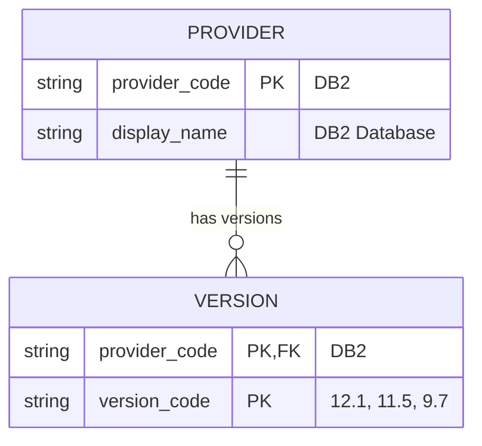
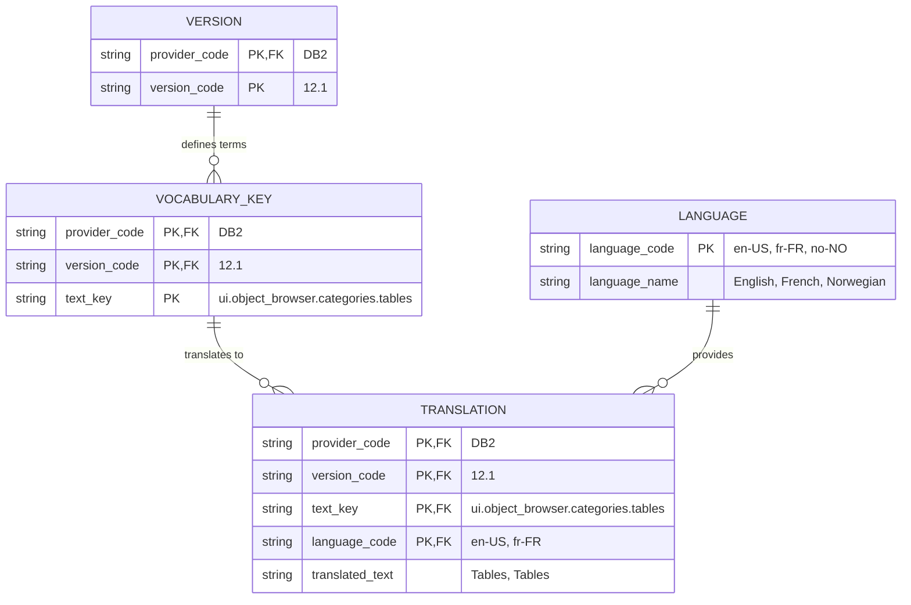
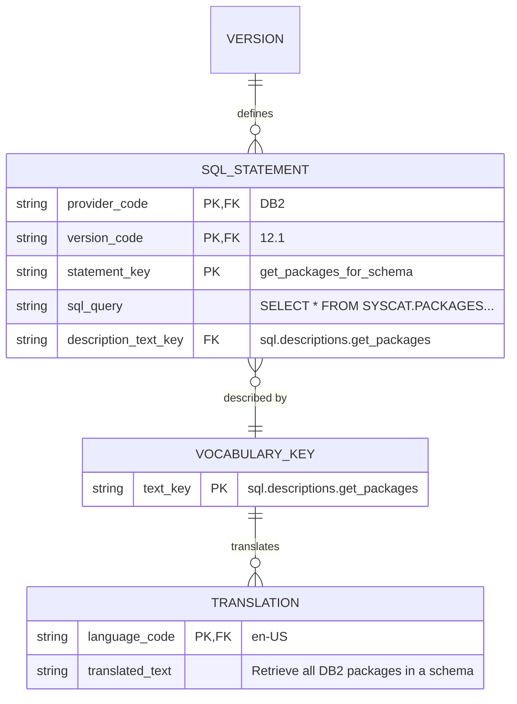
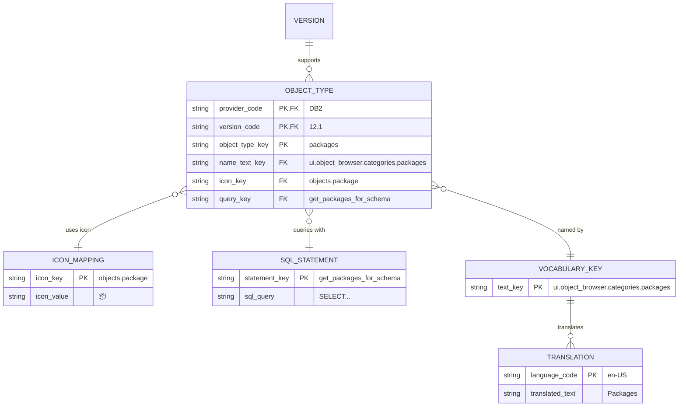
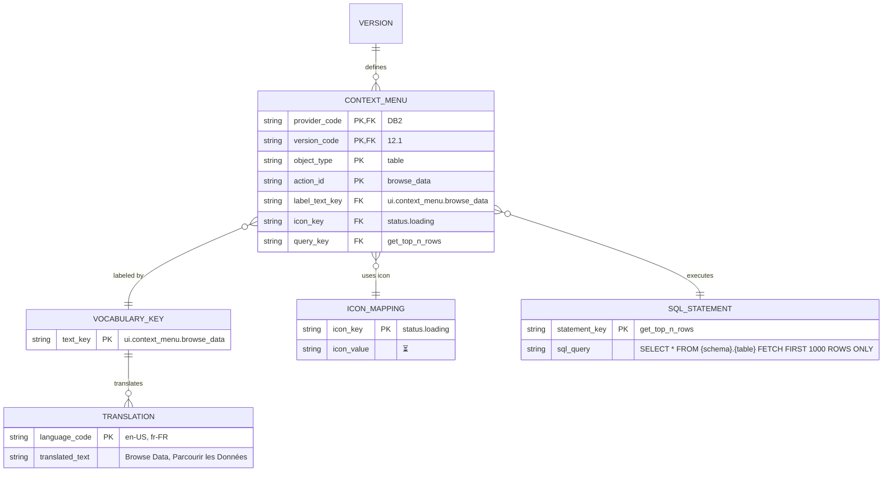
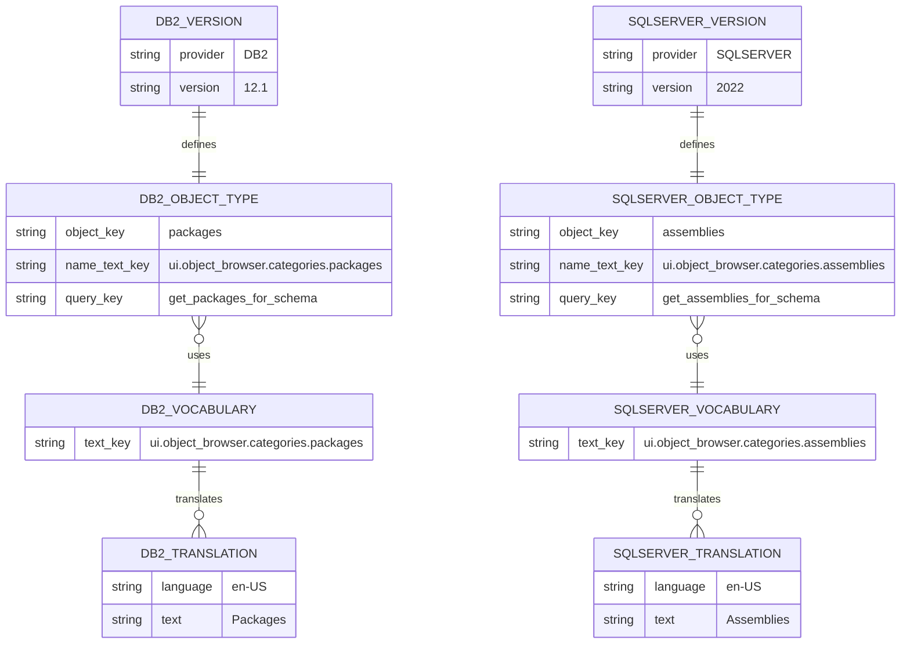

# JSON Configuration Entity-Relationship Diagram

**Purpose:** Visual representation of relationships between all JSON configuration files  
**Date:** November 20, 2025  
**Format:** Mermaid ER Diagrams with explanations

---

## 🎯 CORE CONCEPT: MULTI-DIMENSIONAL KEYS

All text and vocabulary are identified by **FOUR dimensions:**

1. **Provider** - Database provider (DB2, SQLSERVER, POSTGRESQL, etc.)
2. **Version** - Provider version (12.1, 11.5, 2022, etc.)
3. **TextKey** - Logical identifier (ui.menu.file, messages.errors.connection_failed)
4. **Language** - Language code (en-US, fr-FR, no-NO, etc.)

**Format:** `{provider}.{version}.{textKey} → {language} → {actualText}`

**Example:**
```
Provider: DB2
Version: 12.1
TextKey: ui.object_browser.categories.tables
Language: en-US
ActualText: "Tables"

Provider: DB2
Version: 12.1
TextKey: ui.object_browser.categories.tables
Language: fr-FR
ActualText: "Tables" (same in French)
```

---

## 📊 UPDATED MASTER ENTITY-RELATIONSHIP DIAGRAM

```mermaid
erDiagram
    PROVIDER ||--o{ VERSION : "has multiple"
    VERSION ||--o{ SYSTEM_METADATA : "documents"
    VERSION ||--o{ SQL_STATEMENT : "defines"
    VERSION ||--o{ UI_FEATURE : "enables"
    VERSION ||--o{ OBJECT_TYPE : "supports"
    VERSION ||--o{ CONTEXT_MENU : "configures"
    VERSION ||--o{ INTELLISENSE_RULE : "configures"
    VERSION ||--o{ ICON_MAPPING : "defines"
    VERSION ||--o{ LAYOUT_CONFIG : "defines"
    VERSION ||--o{ PERFORMANCE_CONFIG : "defines"
    VERSION ||--o{ KEYBOARD_SHORTCUT : "defines"
    VERSION ||--o{ SQL_TEMPLATE : "provides"
    VERSION ||--o{ TEXT_KEY : "defines"
    
    SYSTEM_METADATA ||--o{ SYSTEM_TABLE : "contains"
    SYSTEM_TABLE ||--o{ TABLE_RELATIONSHIP : "participates in"
    
    TEXT_KEY ||--o{ TRANSLATION : "translates to"
    LANGUAGE ||--o{ TRANSLATION : "provides"
    
    SQL_STATEMENT }o--|| TEXT_KEY : "described by"
    UI_FEATURE }o--|| TEXT_KEY : "named by"
    OBJECT_TYPE }o--|| TEXT_KEY : "named by"
    CONTEXT_MENU }o--|| TEXT_KEY : "labeled by"
    ICON_MAPPING }o--|| TEXT_KEY : "described by"
    SYSTEM_TABLE }o--|| TEXT_KEY : "described by"
    
    PROVIDER {
        string provider_code PK "DB2, SQLSERVER, POSTGRESQL"
        string display_name "DB2 Database, SQL Server, PostgreSQL"
        string icon "🗄️, 💾, 🐘"
        string vendor "IBM, Microsoft, PostgreSQL Global Development Group"
    }
    
    VERSION {
        string provider_code PK,FK
        string version_code PK "12.1, 11.5, 2022, 16.0"
        string release_date "2020-05-15"
        string support_status "Supported, Deprecated, EOL"
    }
    
    SQL_STATEMENT {
        string provider_code PK,FK
        string version_code PK,FK
        string statement_key PK "get_views_for_schema"
        string sql_query "SELECT TRIM(V.VIEWNAME)..."
        string description "Plain English description for translators"
        string[] parameters "TABSCHEMA"
        string returns_description "List of views with metadata"
        string source_reference "Db2CreateDBQA_NonRelated.sql:544-558"
        string[] notes "CRITICAL: Start from SYSCAT.TABLES"
    }
    
    SYSTEM_METADATA {
        string provider_code PK,FK
        string version_code PK,FK
        date collected_at "When metadata was collected"
        string description_text_key FK "text_key.text_key"
    }
    
    SYSTEM_TABLE {
        string provider_code PK,FK
        string version_code PK,FK
        string schema_name PK "SYSCAT, INFORMATION_SCHEMA"
        string table_name PK "TABLES, COLUMNS, INDEXES"
        string description_text_key FK "text_key.text_key"
        string[] key_columns "Primary key columns"
        string[] important_columns "Important columns to query"
    }
    
    TABLE_RELATIONSHIP {
        string provider_code PK,FK
        string version_code PK,FK
        string relationship_id PK "AUTO_INCREMENT"
        string from_schema FK "system_table.schema_name"
        string from_table FK "system_table.table_name"
        string to_schema FK "system_table.schema_name"
        string to_table FK "system_table.table_name"
        string join_condition "TABLES.TABSCHEMA = COLUMNS.TABSCHEMA AND..."
        string cardinality "1:N, N:1, 1:1, N:M"
        string description_text_key FK "text_key.text_key"
    }
    
    TEXT_KEY {
        string provider_code PK,FK
        string version_code PK,FK
        string text_key PK "ui.menu.file, messages.errors.connection_failed"
        string category "ui, messages, common, sql"
        string subcategory "menu, errors, buttons, descriptions"
        string context "Where this text is used"
        string placeholder_format "Parameters: {database}, {timeout}"
    }
    
    TRANSLATION {
        string provider_code PK,FK
        string version_code PK,FK
        string text_key PK,FK
        string language_code PK,FK "en-US, fr-FR, no-NO"
        string translated_text "Actual text in this language"
        string translator "Name of translator"
        date last_updated "2025-11-20"
        string review_status "Draft, Reviewed, Approved"
    }
    
    LANGUAGE {
        string language_code PK "en-US, fr-FR, no-NO"
        string language_name "English (United States)"
        string native_name "English (United States)"
        string direction "ltr, rtl"
        string locale_code "en-US"
    }
    
    UI_FEATURE {
        string provider_code PK,FK
        string version_code PK,FK
        string feature_key PK "packages, materialized_views"
        boolean enabled "true, false"
        string name_text_key FK "vocabulary_key.text_key"
        string description_text_key FK "vocabulary_key.text_key"
        string min_access_level "Standard, Advanced, DBA"
    }
    
    OBJECT_TYPE {
        string provider_code PK,FK
        string version_code PK,FK
        string object_type_key PK "tables, views, procedures"
        string name_text_key FK "vocabulary_key.text_key"
        string icon_key FK "icon_mapping.icon_key"
        string query_key FK "sql_statement.statement_key"
        string min_access_level "Standard, Advanced, DBA"
    }
    
    CONTEXT_MENU {
        string provider_code PK,FK
        string version_code PK,FK
        string object_type PK,FK "table, view, procedure"
        string action_id PK "browse_data, count_rows"
        string label_text_key FK "vocabulary_key.text_key"
        string icon_key FK "icon_mapping.icon_key"
        string query_key FK "sql_statement.statement_key"
        string min_access_level "Standard, Advanced, DBA"
        int display_order "1, 2, 3"
    }
    
    INTELLISENSE_RULE {
        string provider_code PK,FK
        string version_code PK,FK
        string context_key PK "after_select, after_from"
        string[] suggestion_types "column_names, functions, keywords"
        string query_key FK "sql_statement.statement_key"
        boolean enabled "true, false"
    }
    
    ICON_MAPPING {
        string provider_code PK,FK
        string version_code PK,FK
        string icon_key PK "objects.table, status.loading"
        string icon_value "📄, ⏳, 🗄️"
        string category "objects, status, security"
        string description_text_key FK "vocabulary_key.text_key"
    }
    
    LAYOUT_CONFIG {
        string provider_code PK,FK
        string version_code PK,FK
        string layout_key PK "toolbar.min_height, button.height"
        int layout_value "48, 32"
        string unit "pixels, percent"
        string dpi_scaling "auto, fixed"
    }
    
    PERFORMANCE_CONFIG {
        string provider_code PK,FK
        string version_code PK,FK
        string setting_key PK "connection.timeout_seconds"
        int setting_value "30, 300"
        string unit "seconds, milliseconds"
        string description_text_key FK "vocabulary_key.text_key"
    }
    
    KEYBOARD_SHORTCUT {
        string provider_code PK,FK
        string version_code PK,FK
        string action_key PK "execute_query, format_sql"
        string shortcut_value "F5, Ctrl+Shift+F"
        string category "editor, tabs, file"
        boolean user_customizable "true, false"
    }
    
    SQL_TEMPLATE {
        string provider_code PK,FK
        string version_code PK,FK
        string template_key PK "select_top_n, count_rows"
        string template_sql "SELECT * FROM {schema}.{table} FETCH FIRST {n} ROWS ONLY"
        string description_text_key FK "vocabulary_key.text_key"
        string[] placeholders "schema, table, n"
    }
```



---

## 🔑 KEY RELATIONSHIPS EXPLAINED

### 1. Provider → Version (One-to-Many)


**Example:**
```json
Provider: DB2
  └─► Version: 12.1
  └─► Version: 11.5
  └─► Version: 9.7

Provider: SQLSERVER
  └─► Version: 2022
  └─► Version: 2019
  └─► Version: 2017
```

---

### 2. Version → Vocabulary Key → Translation (Provider-Version-Language Hierarchy)


**Example - DB2 calls it "PACKAGES", SQL Server calls it "ASSEMBLIES":**

```json
// DB2 12.1
Provider: DB2
Version: 12.1
VocabularyKey: ui.object_browser.categories.packages
  └─► Translation (en-US): "Packages"
  └─► Translation (fr-FR): "Paquets"
  └─► Translation (no-NO): "Pakker"

// SQL Server 2022 - DIFFERENT TERM for similar concept
Provider: SQLSERVER
Version: 2022
VocabularyKey: ui.object_browser.categories.assemblies
  └─► Translation (en-US): "Assemblies"
  └─► Translation (fr-FR): "Assemblages"
  └─► Translation (no-NO): "Sammenstillinger"
```

---

### 3. SQL Statement References Vocabulary (Provider-Specific Terminology)


**Example:**
```json
// DB2 - Uses SYSCAT.PACKAGES
{
  "provider": "DB2",
  "version": "12.1",
  "sql_statements": {
    "get_packages_for_schema": {
      "sql": "SELECT * FROM SYSCAT.PACKAGES WHERE PKGSCHEMA = ?",
      "description_text_key": "sql.descriptions.get_packages"
    }
  },
  "vocabulary": {
    "sql.descriptions.get_packages": {
      "en-US": "Retrieve all DB2 packages in a schema",
      "fr-FR": "Récupérer tous les paquets DB2 dans un schéma"
    }
  }
}

// SQL Server - Uses sys.assemblies (DIFFERENT SYSTEM TABLE)
{
  "provider": "SQLSERVER",
  "version": "2022",
  "sql_statements": {
    "get_assemblies_for_schema": {
      "sql": "SELECT * FROM sys.assemblies WHERE principal_id = ?",
      "description_text_key": "sql.descriptions.get_assemblies"
    }
  },
  "vocabulary": {
    "sql.descriptions.get_assemblies": {
      "en-US": "Retrieve all SQL Server assemblies for a schema",
      "fr-FR": "Récupérer tous les assemblages SQL Server d'un schéma"
    }
  }
}
```

---

### 4. Object Type References Icon, SQL, and Vocabulary


**Example - Complete resolution:**
```json
// User expands "Packages" node in Object Browser

Step 1: Get ObjectType config
{
  "provider": "DB2",
  "version": "12.1",
  "object_type_key": "packages",
  "name_text_key": "ui.object_browser.categories.packages",
  "icon_key": "objects.package",
  "query_key": "get_packages_for_schema"
}

Step 2: Resolve name (vocabulary → translation)
{
  "text_key": "ui.object_browser.categories.packages",
  "language": "fr-FR",
  "translated_text": "Paquets"
}

Step 3: Resolve icon
{
  "icon_key": "objects.package",
  "icon_value": "📦"
}

Step 4: Resolve SQL query
{
  "statement_key": "get_packages_for_schema",
  "sql": "SELECT * FROM SYSCAT.PACKAGES WHERE PKGSCHEMA = ?"
}

Step 5: Execute and render
TreeViewItem {
  Icon: 📦
  Text: "Paquets"
  Query: "SELECT * FROM SYSCAT.PACKAGES..."
}
```

---

### 5. Context Menu Resolution Chain


---

## 📂 UPDATED FILE STRUCTURE (Project ConfigFiles)

**CRITICAL CHANGE:** All metadata files are now **part of the project** in `./ConfigFiles/` directory (not in user's AppData). This makes them version-controlled and deployed with the application.

```
WindowsDb2Editor/
├── ConfigFiles/                           # All metadata (part of project)
│   │
│   ├── supported_providers.json           # Master list of all providers
│   │   [
│   │     {
│   │       "provider_code": "DB2",
│   │       "display_name": "IBM DB2 Database",
│   │       "icon": "🗄️",
│   │       "vendor": "IBM",
│   │       "supported_versions": ["12.1", "11.5", "10.5"]
│   │     },
│   │     {
│   │       "provider_code": "POSTGRESQL",
│   │       "display_name": "PostgreSQL",
│   │       "icon": "🐘",
│   │       "vendor": "PostgreSQL Global Development Group",
│   │       "supported_versions": ["16.0", "15.0", "14.0"]
│   │     }
│   │   ]
│   │
│   ├── db2_12.1_system_metadata.json      # SYSTEM_METADATA entity
│   │   {
│   │     "provider": "DB2",
│   │     "version": "12.1",
│   │     "collected_at": "2025-11-20T10:00:00Z",
│   │     "system_tables": [
│   │       {
│   │         "schema": "SYSCAT",
│   │         "table_name": "TABLES",
│   │         "description": "Catalog information for tables and views",
│   │         "key_columns": ["TABSCHEMA", "TABNAME"],
│   │         "important_columns": ["TYPE", "OWNER", "CREATED", "DATACAPTURE"]
│   │       },
│   │       {
│   │         "schema": "SYSCAT",
│   │         "table_name": "COLUMNS",
│   │         "description": "Column information for all tables",
│   │         "key_columns": ["TABSCHEMA", "TABNAME", "COLNAME"],
│   │         "important_columns": ["TYPENAME", "LENGTH", "SCALE", "NULLS"]
│   │       }
│   │     ],
│   │     "relationships": [
│   │       {
│   │         "from_table": "SYSCAT.TABLES",
│   │         "to_table": "SYSCAT.COLUMNS",
│   │         "join_condition": "TABLES.TABSCHEMA = COLUMNS.TABSCHEMA AND TABLES.TABNAME = COLUMNS.TABNAME",
│   │         "cardinality": "1:N",
│   │         "description": "Each table has multiple columns"
│   │       },
│   │       {
│   │         "from_table": "SYSCAT.TABLES",
│   │         "to_table": "SYSCAT.INDEXES",
│   │         "join_condition": "TABLES.TABSCHEMA = INDEXES.TABSCHEMA AND TABLES.TABNAME = INDEXES.TABNAME",
│   │         "cardinality": "1:N",
│   │         "description": "Each table can have multiple indexes"
│   │       }
│   │     ]
│   │   }
│   │
│   ├── db2_12.1_sql_statements.json       # SQL_STATEMENT entity
│   │   {
│   │     "provider": "DB2",
│   │     "version": "12.1",
│   │     "statements": {
│   │       "AllTablesStatement": {
│   │         "sql": "SELECT * FROM SYSCAT.TABLES WHERE TYPE = 'T' ORDER BY TABSCHEMA, TABNAME",
│   │         "description": "Retrieve all user tables in the database. Returns all columns from SYSCAT.TABLES where TYPE='T' (table).",
│   │         "parameters": [],
│   │         "returns": "All user tables in the database"
│   │       },
│   │       "GetViewsForSchema": {
│   │         "sql": "SELECT TRIM(V.VIEWNAME) AS VIEWNAME, TRIM(V.DEFINER) AS DEFINER, TRIM(T.REMARKS) AS REMARKS FROM SYSCAT.TABLES T JOIN SYSCAT.VIEWS V ON T.TABSCHEMA = V.VIEWSCHEMA AND T.TABNAME = V.VIEWNAME WHERE T.TYPE = 'V' AND T.TABSCHEMA = ? ORDER BY V.VIEWNAME",
│   │         "description": "Get all views in a specific schema. CRITICAL: Start from SYSCAT.TABLES and join to SYSCAT.VIEWS. REMARKS comes from TABLES, not VIEWS.",
│   │         "parameters": ["TABSCHEMA"],
│   │         "returns": "List of views in specified schema",
│   │         "source": "Db2CreateDBQA_NonRelated.sql:544-558"
│   │       }
│   │     }
│   │   }
│   │
│   ├── db2_12.1_en-US_texts.json          # TRANSLATION entity (DB2 12.1 English)
│   │   {
│   │     "provider": "DB2",
│   │     "version": "12.1",
│   │     "language": "en-US",
│   │     "texts": {
│   │       "MainFormTitle": "DB2 Database Editor",
│   │       "ui.menu.file": "File",
│   │       "ui.menu.edit": "Edit",
│   │       "ui.object_browser.categories.tables": "Tables",
│   │       "ui.object_browser.categories.views": "Views",
│   │       "ui.object_browser.categories.packages": "Packages",
│   │       "sql.descriptions.all_tables": "Retrieve all user tables",
│   │       "sql.descriptions.get_views_for_schema": "Get all views in a schema",
│   │       "messages.errors.connection_failed": "Failed to connect to {database}. Please check your connection settings."
│   │     }
│   │   }
│   │
│   ├── db2_12.1_fr-FR_texts.json          # TRANSLATION entity (DB2 12.1 French)
│   │   {
│   │     "provider": "DB2",
│   │     "version": "12.1",
│   │     "language": "fr-FR",
│   │     "texts": {
│   │       "MainFormTitle": "Éditeur de Base de Données DB2",
│   │       "ui.menu.file": "Fichier",
│   │       "ui.menu.edit": "Édition",
│   │       "ui.object_browser.categories.tables": "Tables",
│   │       "ui.object_browser.categories.views": "Vues",
│   │       "ui.object_browser.categories.packages": "Paquets",
│   │       "sql.descriptions.all_tables": "Récupérer toutes les tables utilisateur",
│   │       "sql.descriptions.get_views_for_schema": "Obtenir toutes les vues dans un schéma",
│   │       "messages.errors.connection_failed": "Échec de la connexion à {database}. Veuillez vérifier vos paramètres."
│   │     }
│   │   }
│   │
│   ├── db2_12.1_no-NO_texts.json          # TRANSLATION entity (DB2 12.1 Norwegian)
│   ├── db2_11.5_system_metadata.json      # System metadata for DB2 11.5
│   ├── db2_11.5_sql_statements.json       # SQL statements for DB2 11.5
│   ├── db2_11.5_en-US_texts.json          # Texts for DB2 11.5 English
│   ├── db2_11.5_fr-FR_texts.json          # Texts for DB2 11.5 French
│   │
│   ├── postgresql_16.0_system_metadata.json    # PostgreSQL 16.0 system metadata
│   ├── postgresql_16.0_sql_statements.json     # PostgreSQL 16.0 SQL statements
│   ├── postgresql_16.0_en-US_texts.json        # PostgreSQL 16.0 English texts
│   └── postgresql_16.0_fr-FR_texts.json        # PostgreSQL 16.0 French texts
│
└── (rest of project files)
```

### File Naming Convention Rules

| File Type | Pattern | Example | Description |
|-----------|---------|---------|-------------|
| **Providers List** | `supported_providers.json` | `supported_providers.json` | Master list of all providers |
| **System Metadata** | `<provider>_<version>_system_metadata.json` | `db2_12.1_system_metadata.json` | System tables and relationships |
| **SQL Statements** | `<provider>_<version>_sql_statements.json` | `db2_12.1_sql_statements.json` | All SQL queries for this provider/version |
| **Texts/Translations** | `<provider>_<version>_<language>_texts.json` | `db2_12.1_en-US_texts.json` | Translated text for provider/version/language |

### Naming Rules:
1. **Provider code:** UPPERCASE, no spaces (DB2, POSTGRESQL, SQLSERVER, ORACLE)
2. **Version:** Dotted notation (12.1, 11.5, 16.0, 2022)
3. **Language code:** Standard locale format (en-US, fr-FR, no-NO, de-DE)
4. **All files:** snake_case for readability

---

## 📂 OLD FILE STRUCTURE (DEPRECATED)

```
/Metadata/
├── providers.json                  # PROVIDER entity
│   [
│     { "provider_code": "DB2", "display_name": "DB2 Database", ... },
│     { "provider_code": "SQLSERVER", "display_name": "SQL Server", ... }
│   ]
│
├── DB2/
│   ├── versions.json               # VERSION entity (for DB2)
│   │   [
│   │     { "version_code": "12.1", "release_date": "2020-05-15", ... },
│   │     { "version_code": "11.5", "release_date": "2015-06-12", ... }
│   │   ]
│   │
│   ├── 12.1/
│   │   ├── sql_statements.json     # SQL_STATEMENT entity
│   │   │   {
│   │   │     "provider": "DB2",
│   │   │     "version": "12.1",
│   │   │     "statements": {
│   │   │       "get_packages_for_schema": {
│   │   │         "sql": "SELECT...",
│   │   │         "description_text_key": "sql.descriptions.get_packages"
│   │   │       }
│   │   │     }
│   │   │   }
│   │   │
│   │   ├── vocabulary_keys.json    # VOCABULARY_KEY entity
│   │   │   {
│   │   │     "provider": "DB2",
│   │   │     "version": "12.1",
│   │   │     "vocabulary": {
│   │   │       "ui.object_browser.categories.packages": {
│   │   │         "category": "ui",
│   │   │         "subcategory": "object_browser",
│   │   │         "context": "Object Browser category label"
│   │   │       }
│   │   │     }
│   │   │   }
│   │   │
│   │   ├── object_types.json       # OBJECT_TYPE entity
│   │   │   {
│   │   │     "provider": "DB2",
│   │   │     "version": "12.1",
│   │   │     "object_types": {
│   │   │       "packages": {
│   │   │         "name_text_key": "ui.object_browser.categories.packages",
│   │   │         "icon_key": "objects.package",
│   │   │         "query_key": "get_packages_for_schema"
│   │   │       }
│   │   │     }
│   │   │   }
│   │   │
│   │   ├── context_menus.json      # CONTEXT_MENU entity
│   │   ├── icons.json              # ICON_MAPPING entity
│   │   ├── ui_features.json        # UI_FEATURE entity
│   │   ├── intellisense.json       # INTELLISENSE_RULE entity
│   │   ├── layouts.json            # LAYOUT_CONFIG entity
│   │   ├── performance.json        # PERFORMANCE_CONFIG entity
│   │   ├── keyboard_shortcuts.json # KEYBOARD_SHORTCUT entity
│   │   └── sql_templates.json      # SQL_TEMPLATE entity
│   │
│   └── 11.5/  (same structure)
│
└── SQLSERVER/
    ├── versions.json
    └── 2022/  (same structure, different vocabulary)

/Localization/
├── languages.json                  # LANGUAGE entity
│   [
│     { "language_code": "en-US", "language_name": "English (US)", ... },
│     { "language_code": "fr-FR", "language_name": "French (France)", ... }
│   ]
│
├── DB2/
│   ├── 12.1/
│   │   ├── en-US.json              # TRANSLATION entity (DB2 12.1 English)
│   │   │   {
│   │   │     "provider": "DB2",
│   │   │     "version": "12.1",
│   │   │     "language": "en-US",
│   │   │     "translations": {
│   │   │       "ui.object_browser.categories.packages": "Packages",
│   │   │       "sql.descriptions.get_packages": "Retrieve all DB2 packages"
│   │   │     }
│   │   │   }
│   │   │
│   │   ├── fr-FR.json              # TRANSLATION entity (DB2 12.1 French)
│   │   │   {
│   │   │     "provider": "DB2",
│   │   │     "version": "12.1",
│   │   │     "language": "fr-FR",
│   │   │     "translations": {
│   │   │       "ui.object_browser.categories.packages": "Paquets",
│   │   │       "sql.descriptions.get_packages": "Récupérer tous les paquets DB2"
│   │   │     }
│   │   │   }
│   │   │
│   │   └── no-NO.json              # TRANSLATION entity (DB2 12.1 Norwegian)
│   │
│   └── 11.5/  (same structure)
│
└── SQLSERVER/
    └── 2022/
        ├── en-US.json              # TRANSLATION entity (SQL Server 2022 English)
        │   {
        │     "provider": "SQLSERVER",
        │     "version": "2022",
        │     "language": "en-US",
        │     "translations": {
        │       "ui.object_browser.categories.assemblies": "Assemblies",
        │       "sql.descriptions.get_assemblies": "Retrieve all SQL Server assemblies"
        │     }
        │   }
        │
        └── fr-FR.json              # TRANSLATION entity (SQL Server 2022 French)
```

---

## 🔄 COMPLETE RESOLUTION FLOW WITH MERMAID

### Scenario: Display "Packages" category in French for DB2 12.1

```mermaid
graph TD
    A[User expands Object Browser] --> B[ObjectBrowserService.LoadCategories]
    B --> C{Get ObjectType Config}
    
    C --> D[Load: Metadata/DB2/12.1/object_types.json]
    D --> E[Find: object_type_key = packages]
    E --> F[Extract references:<br/>name_text_key<br/>icon_key<br/>query_key]
    
    F --> G{Resolve name_text_key}
    G --> H[name_text_key = ui.object_browser.categories.packages]
    H --> I[Load: Localization/DB2/12.1/fr-FR.json]
    I --> J[Lookup: translations[name_text_key]]
    J --> K[Result: Paquets]
    
    F --> L{Resolve icon_key}
    L --> M[icon_key = objects.package]
    M --> N[Load: Metadata/DB2/12.1/icons.json]
    N --> O[Lookup: icons[icon_key]]
    O --> P[Result: 📦]
    
    F --> Q{Resolve query_key}
    Q --> R[query_key = get_packages_for_schema]
    R --> S[Load: Metadata/DB2/12.1/sql_statements.json]
    S --> T[Lookup: statements[query_key]]
    T --> U[Result: SELECT * FROM SYSCAT.PACKAGES...]
    
    K --> V[Render TreeViewItem]
    P --> V
    U --> V
    
    V --> W[Display:<br/>📦 Paquets<br/>SQL ready to execute]
```

---

## 🌍 MULTI-PROVIDER COMPARISON

### DB2 vs SQL Server - Same Concept, Different Terms



**Key Insight:** DB2 and SQL Server use DIFFERENT vocabulary keys because they are conceptually different things, even if they serve similar purposes.

---

## 📋 NORMALIZATION RULES

### 1. Provider Normalization
Each provider has its own vocabulary namespace:

```
DB2:        ui.object_browser.categories.packages
SQLSERVER:  ui.object_browser.categories.assemblies
POSTGRESQL: ui.object_browser.categories.extensions
```

### 2. Version Inheritance
Versions can inherit from previous versions:

```json
{
  "provider": "DB2",
  "version": "12.1",
  "inherits_from": "11.5",
  "overrides": {
    "sql_statements": {
      "get_packages_for_schema": {
        "sql": "SELECT * FROM SYSCAT.PACKAGES WHERE PKGSCHEMA = ? AND NEW_COLUMN_IN_12_1 IS NOT NULL"
      }
    }
  }
}
```

### 3. Translation Fallback
If translation missing in specific language, fall back:

```
1. Look for: DB2.12.1.ui.menu.file → fr-FR
2. If not found: DB2.12.1.ui.menu.file → en-US (fallback)
3. If not found: Return key itself → "[ui.menu.file]"
```

---

## 🎯 QUERY EXAMPLES

### Query 1: Get all available object types for a provider/version
```sql
SELECT 
    ot.object_type_key,
    vk.text_key AS name_key,
    t.translated_text AS display_name,
    im.icon_value AS icon,
    ss.sql_query AS query
FROM OBJECT_TYPE ot
JOIN VOCABULARY_KEY vk ON ot.name_text_key = vk.text_key
JOIN TRANSLATION t ON vk.text_key = t.text_key 
    AND t.language_code = 'fr-FR'
JOIN ICON_MAPPING im ON ot.icon_key = im.icon_key
JOIN SQL_STATEMENT ss ON ot.query_key = ss.statement_key
WHERE ot.provider_code = 'DB2'
  AND ot.version_code = '12.1'
ORDER BY ot.object_type_key;
```

### Query 2: Get all translations for a specific text key
```sql
SELECT 
    t.language_code,
    l.language_name,
    t.translated_text,
    t.translator,
    t.last_updated
FROM TRANSLATION t
JOIN LANGUAGE l ON t.language_code = l.language_code
WHERE t.provider_code = 'DB2'
  AND t.version_code = '12.1'
  AND t.text_key = 'ui.object_browser.categories.packages'
ORDER BY t.language_code;
```

### Query 3: Find all context menu actions for tables across providers
```sql
SELECT 
    cm.provider_code,
    cm.version_code,
    cm.action_id,
    vk.text_key AS label_key,
    t.translated_text AS label_text,
    ss.sql_query AS action_query
FROM CONTEXT_MENU cm
JOIN VOCABULARY_KEY vk ON cm.label_text_key = vk.text_key
JOIN TRANSLATION t ON vk.text_key = t.text_key 
    AND t.language_code = 'en-US'
JOIN SQL_STATEMENT ss ON cm.query_key = ss.statement_key
WHERE cm.object_type = 'table'
ORDER BY cm.provider_code, cm.display_order;
```

---

## 🔑 KEY TAKEAWAYS

1. **Four-Dimensional Keys:** Provider + Version + TextKey + Language
2. **Provider-Specific Vocabulary:** Each provider has its own terminology
3. **Version-Specific Features:** Different versions support different features
4. **Language-Independent Structure:** Same structure across all languages
5. **Referential Integrity:** All foreign keys validated at load time
6. **No Circular Dependencies:** Clear hierarchy prevents cycles
7. **Fallback Strategy:** English fallback if translation missing
8. **Normalization:** Separate entities for each concern

---

## 📊 CARDINALITY SUMMARY

```
PROVIDER (1) ─────── (*) VERSION
VERSION (1) ─────── (*) SQL_STATEMENT
VERSION (1) ─────── (*) VOCABULARY_KEY
VOCABULARY_KEY (1) ─ (*) TRANSLATION
LANGUAGE (1) ──────── (*) TRANSLATION
VERSION (1) ─────── (*) OBJECT_TYPE
OBJECT_TYPE (*) ──── (1) VOCABULARY_KEY (name)
OBJECT_TYPE (*) ──── (1) ICON_MAPPING
OBJECT_TYPE (*) ──── (1) SQL_STATEMENT
VERSION (1) ─────── (*) CONTEXT_MENU
CONTEXT_MENU (*) ─── (1) VOCABULARY_KEY (label)
CONTEXT_MENU (*) ─── (1) ICON_MAPPING
CONTEXT_MENU (*) ─── (1) SQL_STATEMENT
```

---

**Status:** 📊 ER DIAGRAM COMPLETE  
**Purpose:** Visual database design for JSON configuration architecture  
**Next Step:** Implement validation layer to enforce referential integrity

