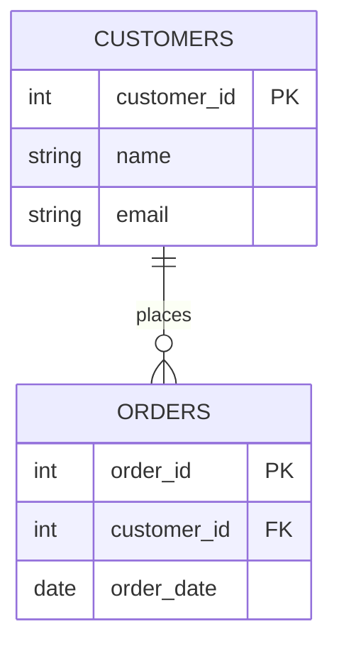
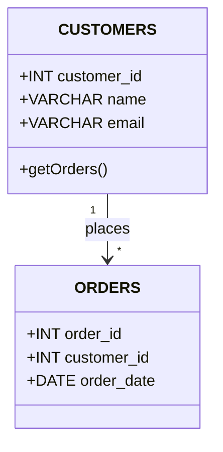

# Mermaid Dialect Selection & Integrated Help System

**Addition to Mermaid Visual Designer Specification**  
**Focus:** Dialect selection, comprehensive help, web-based UI

---

## 🎯 MERMAID DIALECT DECISION

### Available Mermaid Diagram Types:

Mermaid supports multiple database diagram syntaxes:

#### 1. ER Diagram (Entity-Relationship) - **RECOMMENDED** ✅

**Syntax:**


**Pros:**
- ✅ Native support for relationships
- ✅ Cardinality symbols (||--o{, }o--||, etc.)
- ✅ Column details with PK/FK markers
- ✅ Clean, readable syntax
- ✅ Best for database schemas
- ✅ Supports comments on columns

**Cons:**
- ⚠️ Limited to entity relationships
- ⚠️ Cannot show indexes visually
- ⚠️ No triggers/procedures shown

**Use For:** Table structures and foreign key relationships

---

#### 2. Class Diagram (UML) - Alternative

**Syntax:**


**Pros:**
- ✅ More detailed (can show methods/procedures)
- ✅ UML standard notation
- ✅ Can show triggers as methods

**Cons:**
- ❌ Less intuitive for databases
- ❌ More verbose syntax
- ❌ Designed for object-oriented, not relational

**Use For:** When showing stored procedures/triggers as methods

---

#### 3. Flowchart - NOT Suitable

**Why Not:**
- ❌ No relationship support
- ❌ No table structure
- ❌ Designed for process flow, not data structure

---

### 🎯 DECISION: Use ER Diagram Syntax

**Primary:** ER Diagram (erDiagram)  
**Why:** Purpose-built for database schemas  
**Fallback:** Class Diagram (for advanced features like procedures)

**Implementation:**
```csharp
public enum MermaidDiagramType
{
    ERDiagram,      // Primary - for table relationships
    ClassDiagram    // Advanced - includes procedures/triggers
}

public string GenerateMermaidDiagram(
    List<TableWithRelationships> tables,
    MermaidDiagramType diagramType = MermaidDiagramType.ERDiagram)
{
    return diagramType switch
    {
        MermaidDiagramType.ERDiagram => GenerateERDiagram(tables),
        MermaidDiagramType.ClassDiagram => GenerateClassDiagram(tables),
        _ => GenerateERDiagram(tables)
    };
}
```

---

## 📚 COMPREHENSIVE HELP SYSTEM

### Integrated Help File

**File:** `Resources/MermaidHelp.html`

**Structure:**
```html
<!DOCTYPE html>
<html>
<head>
    <title>Mermaid Visual Designer - Help</title>
    <style>
        body {
            font-family: 'Segoe UI', Arial, sans-serif;
            line-height: 1.6;
            max-width: 1200px;
            margin: 0 auto;
            padding: 20px;
            background: #f9f9f9;
        }
        .section {
            background: white;
            padding: 20px;
            margin: 20px 0;
            border-radius: 8px;
            box-shadow: 0 2px 4px rgba(0,0,0,0.1);
        }
        h1 { color: #2c3e50; border-bottom: 3px solid #3498db; padding-bottom: 10px; }
        h2 { color: #34495e; margin-top: 30px; }
        h3 { color: #7f8c8d; }
        code {
            background: #f4f4f4;
            padding: 2px 6px;
            border-radius: 3px;
            font-family: 'Consolas', monospace;
        }
        pre {
            background: #2c3e50;
            color: #ecf0f1;
            padding: 15px;
            border-radius: 5px;
            overflow-x: auto;
        }
        .example {
            border-left: 4px solid #3498db;
            padding-left: 15px;
            margin: 15px 0;
        }
        .warning {
            background: #fff3cd;
            border-left: 4px solid #ffc107;
            padding: 10px;
            margin: 10px 0;
        }
        .tip {
            background: #d1ecf1;
            border-left: 4px solid #17a2b8;
            padding: 10px;
            margin: 10px 0;
        }
        table {
            width: 100%;
            border-collapse: collapse;
            margin: 15px 0;
        }
        th, td {
            border: 1px solid #ddd;
            padding: 12px;
            text-align: left;
        }
        th {
            background: #3498db;
            color: white;
        }
        tr:nth-child(even) {
            background: #f9f9f9;
        }
    </style>
</head>
<body>
    <h1>🎨 Mermaid Visual Database Designer - User Guide</h1>
    
    <div class="section">
        <h2>📖 Quick Start</h2>
        <ol>
            <li><strong>Select Tables:</strong> Check schemas/tables in left tree</li>
            <li><strong>Load from DB:</strong> Click "Load from DB" to generate diagram</li>
            <li><strong>Edit:</strong> Modify Mermaid syntax in left editor</li>
            <li><strong>Preview:</strong> See changes instantly in right panel</li>
            <li><strong>Click Tables:</strong> Click any table in preview to open properties</li>
            <li><strong>Generate DDL:</strong> Click "Generate DDL Scripts" to create migration</li>
            <li><strong>Execute:</strong> Review and run scripts in SQL editor</li>
        </ol>
    </div>
    
    <div class="section">
        <h2>📊 ER Diagram Syntax Reference</h2>
        
        <h3>Basic Table Definition</h3>
        <pre>
erDiagram
    CUSTOMERS {
        INTEGER customer_id PK "Unique identifier"
        VARCHAR(100) customer_name "Full name"
        VARCHAR(255) email "Email address"
    }
        </pre>
        
        <div class="tip">
            <strong>💡 Tip:</strong> Format is <code>DATATYPE columnname MARKER "comment"</code>
        </div>
        
        <h3>Column Markers</h3>
        <table>
            <tr>
                <th>Marker</th>
                <th>Meaning</th>
                <th>Example</th>
            </tr>
            <tr>
                <td><code>PK</code></td>
                <td>Primary Key</td>
                <td><code>INTEGER customer_id PK</code></td>
            </tr>
            <tr>
                <td><code>FK</code></td>
                <td>Foreign Key</td>
                <td><code>INTEGER customer_id FK</code></td>
            </tr>
            <tr>
                <td>(none)</td>
                <td>Regular column</td>
                <td><code>VARCHAR(100) name</code></td>
            </tr>
        </table>
        
        <h3>DB2 Data Types</h3>
        <table>
            <tr>
                <th>Category</th>
                <th>Types</th>
                <th>Example</th>
            </tr>
            <tr>
                <td><strong>Numeric</strong></td>
                <td>INTEGER, SMALLINT, BIGINT, DECIMAL(p,s), NUMERIC(p,s)</td>
                <td><code>DECIMAL(10,2) price</code></td>
            </tr>
            <tr>
                <td><strong>String</strong></td>
                <td>VARCHAR(n), CHAR(n), CLOB</td>
                <td><code>VARCHAR(255) email</code></td>
            </tr>
            <tr>
                <td><strong>Date/Time</strong></td>
                <td>DATE, TIME, TIMESTAMP</td>
                <td><code>TIMESTAMP created_at</code></td>
            </tr>
            <tr>
                <td><strong>Binary</strong></td>
                <td>BLOB, VARBINARY</td>
                <td><code>BLOB image_data</code></td>
            </tr>
        </table>
        
        <h3>Relationship Syntax</h3>
        <pre>
erDiagram
    CUSTOMERS ||--o{ ORDERS : "places"
    ORDERS ||--|{ ORDER_ITEMS : "contains"
    ORDER_ITEMS }o--|| PRODUCTS : "references"
        </pre>
        
        <h3>Cardinality Symbols</h3>
        <table>
            <tr>
                <th>Symbol</th>
                <th>Left Side</th>
                <th>Right Side</th>
                <th>Meaning</th>
            </tr>
            <tr>
                <td><code>||--||</code></td>
                <td>Exactly one</td>
                <td>Exactly one</td>
                <td>One-to-one</td>
            </tr>
            <tr>
                <td><code>||--o{</code></td>
                <td>Exactly one</td>
                <td>Zero or more</td>
                <td>One-to-many</td>
            </tr>
            <tr>
                <td><code>}o--||</code></td>
                <td>Zero or more</td>
                <td>Exactly one</td>
                <td>Many-to-one</td>
            </tr>
            <tr>
                <td><code>||--|{</code></td>
                <td>Exactly one</td>
                <td>One or more</td>
                <td>One-to-many (required)</td>
            </tr>
            <tr>
                <td><code>}o--o{</code></td>
                <td>Zero or more</td>
                <td>Zero or more</td>
                <td>Many-to-many</td>
            </tr>
        </table>
        
        <div class="example">
            <strong>Example:</strong> <code>CUSTOMERS ||--o{ ORDERS : "places"</code><br>
            Reads as: "One customer places zero or more orders"
        </div>
    </div>
    
    <div class="section">
        <h2>✏️ Editing Guidelines</h2>
        
        <h3>Adding a New Column</h3>
        <pre>
CUSTOMERS {
    INTEGER customer_id PK
    VARCHAR(100) name
    VARCHAR(255) email        ← Add this line
}
        </pre>
        
        <div class="tip">
            <strong>Result:</strong> System generates <code>ALTER TABLE CUSTOMERS ADD COLUMN email VARCHAR(255)</code>
        </div>
        
        <h3>Removing a Column</h3>
        <pre>
CUSTOMERS {
    INTEGER customer_id PK
    VARCHAR(100) name
    // VARCHAR(255) email     ← Comment out or delete this line
}
        </pre>
        
        <div class="warning">
            <strong>⚠️ Warning:</strong> Dropping columns will DELETE DATA! Script will be commented out for safety.
        </div>
        
        <h3>Changing Data Type</h3>
        <pre>
CUSTOMERS {
    INTEGER customer_id PK
    VARCHAR(200) name         ← Changed from VARCHAR(100)
}
        </pre>
        
        <div class="tip">
            <strong>Result:</strong> Generates <code>ALTER TABLE CUSTOMERS ALTER COLUMN name SET DATA TYPE VARCHAR(200)</code>
        </div>
        
        <h3>Adding a Foreign Key</h3>
        <pre>
erDiagram
    CUSTOMERS ||--o{ ORDERS : "FK_CUST_ORD"    ← Add this line
    
    CUSTOMERS {
        INTEGER customer_id PK
    }
    ORDERS {
        INTEGER order_id PK
        INTEGER customer_id FK                   ← Add FK marker
    }
        </pre>
        
        <div class="tip">
            <strong>Result:</strong> Generates <code>ALTER TABLE ORDERS ADD CONSTRAINT FK_CUST_ORD FOREIGN KEY (customer_id) REFERENCES CUSTOMERS (customer_id)</code>
        </div>
    </div>
    
    <div class="section">
        <h2>🔄 Diff Detection</h2>
        
        <p>The system automatically detects changes as you type:</p>
        
        <table>
            <tr>
                <th>Change Type</th>
                <th>How Detected</th>
                <th>DDL Generated</th>
            </tr>
            <tr>
                <td>New Column</td>
                <td>Column exists in edited, not in original</td>
                <td><code>ALTER TABLE ... ADD COLUMN</code></td>
            </tr>
            <tr>
                <td>Removed Column</td>
                <td>Column exists in original, not in edited</td>
                <td><code>-- DROP COLUMN (commented)</code></td>
            </tr>
            <tr>
                <td>Type Change</td>
                <td>Data type different</td>
                <td><code>ALTER COLUMN ... SET DATA TYPE</code></td>
            </tr>
            <tr>
                <td>Nullability Change</td>
                <td>PK marker added/removed</td>
                <td><code>ALTER COLUMN ... SET/DROP NOT NULL</code></td>
            </tr>
            <tr>
                <td>New FK</td>
                <td>Relationship line added</td>
                <td><code>ADD CONSTRAINT ... FOREIGN KEY</code></td>
            </tr>
            <tr>
                <td>Removed FK</td>
                <td>Relationship line removed</td>
                <td><code>DROP CONSTRAINT</code></td>
            </tr>
            <tr>
                <td>New Table</td>
                <td>Table block added</td>
                <td><code>CREATE TABLE</code></td>
            </tr>
            <tr>
                <td>Removed Table</td>
                <td>Table block removed</td>
                <td><code>-- DROP TABLE (commented)</code></td>
            </tr>
        </table>
    </div>
    
    <div class="section">
        <h2>⚠️ Important Safety Features</h2>
        
        <h3>Dangerous Operations (Auto-Commented)</h3>
        
        <p>The following operations are <strong>commented out</strong> in generated scripts for safety:</p>
        
        <ul>
            <li><code>DROP COLUMN</code> - Data loss risk</li>
            <li><code>DROP TABLE</code> - Complete table data loss</li>
            <li><code>DROP CONSTRAINT</code> - On primary keys</li>
        </ul>
        
        <div class="warning">
            <strong>⚠️ You must manually uncomment and verify before executing!</strong>
        </div>
        
        <h3>Type Change Warnings</h3>
        
        <p>Changing data types may cause data loss or conversion errors:</p>
        
        <table>
            <tr>
                <th>Change</th>
                <th>Risk</th>
                <th>Action</th>
            </tr>
            <tr>
                <td>VARCHAR(100) → VARCHAR(50)</td>
                <td>⚠️ HIGH - Data truncation</td>
                <td>Script includes comment warning</td>
            </tr>
            <tr>
                <td>VARCHAR(100) → VARCHAR(200)</td>
                <td>✅ SAFE - Expanding size</td>
                <td>Generated normally</td>
            </tr>
            <tr>
                <td>INTEGER → VARCHAR</td>
                <td>⚠️ MEDIUM - Type mismatch</td>
                <td>Script includes warning + example CAST</td>
            </tr>
            <tr>
                <td>NOT NULL → NULLABLE</td>
                <td>✅ SAFE</td>
                <td>Generated normally</td>
            </tr>
            <tr>
                <td>NULLABLE → NOT NULL</td>
                <td>⚠️ HIGH - May fail if nulls exist</td>
                <td>Script includes check query</td>
            </tr>
        </table>
    </div>
    
    <div class="section">
        <h2>📝 Examples</h2>
        
        <h3>Example 1: Add Email Column to CUSTOMERS</h3>
        
        <p><strong>Original (from DB2):</strong></p>
        <pre>
CUSTOMERS {
    INTEGER customer_id PK
    VARCHAR(100) name
}
        </pre>
        
        <p><strong>Edit (add email):</strong></p>
        <pre>
CUSTOMERS {
    INTEGER customer_id PK
    VARCHAR(100) name
    VARCHAR(255) email "Customer email address"
}
        </pre>
        
        <p><strong>Generated DDL:</strong></p>
        <pre>
-- Add column to CUSTOMERS
ALTER TABLE FK.CUSTOMERS
  ADD COLUMN email VARCHAR(255);
  
COMMENT ON COLUMN FK.CUSTOMERS.email IS 'Customer email address';
        </pre>
        
        <h3>Example 2: Add Foreign Key Relationship</h3>
        
        <p><strong>Original:</strong></p>
        <pre>
CUSTOMERS {
    INTEGER customer_id PK
}
ORDERS {
    INTEGER order_id PK
    INTEGER customer_id
}
        </pre>
        
        <p><strong>Edit (add FK relationship):</strong></p>
        <pre>
erDiagram
    CUSTOMERS ||--o{ ORDERS : "places orders"
    
    CUSTOMERS {
        INTEGER customer_id PK
    }
    ORDERS {
        INTEGER order_id PK
        INTEGER customer_id FK
    }
        </pre>
        
        <p><strong>Generated DDL:</strong></p>
        <pre>
-- Add foreign key constraint
ALTER TABLE FK.ORDERS
  ADD CONSTRAINT FK_CUST_ORD
  FOREIGN KEY (customer_id)
  REFERENCES FK.CUSTOMERS (customer_id)
  ON DELETE CASCADE;
        </pre>
    </div>
    
    <div class="section">
        <h2>🎯 Keyboard Shortcuts</h2>
        
        <table>
            <tr>
                <th>Shortcut</th>
                <th>Action</th>
            </tr>
            <tr>
                <td><code>Ctrl+S</code></td>
                <td>Save .mmd file</td>
            </tr>
            <tr>
                <td><code>Ctrl+Z</code></td>
                <td>Undo edit</td>
            </tr>
            <tr>
                <td><code>Ctrl+Y</code></td>
                <td>Redo edit</td>
            </tr>
            <tr>
                <td><code>Ctrl+F</code></td>
                <td>Find in diagram</td>
            </tr>
            <tr>
                <td><code>F5</code></td>
                <td>Refresh preview</td>
            </tr>
            <tr>
                <td><code>Ctrl+G</code></td>
                <td>Generate DDL scripts</td>
            </tr>
        </table>
    </div>
    
    <div class="section">
        <h2>🔗 Mermaid Live Resources</h2>
        
        <ul>
            <li><a href="https://mermaid.js.org/syntax/entityRelationshipDiagram.html" target="_blank">Official Mermaid ER Diagram Documentation</a></li>
            <li><a href="https://mermaid.live" target="_blank">Mermaid Live Editor</a> - Test syntax online</li>
            <li><a href="https://github.com/mermaid-js/mermaid" target="_blank">Mermaid GitHub</a> - Examples and issues</li>
        </ul>
    </div>
    
    <div class="section">
        <h2>❓ Troubleshooting</h2>
        
        <h3>Preview Not Updating</h3>
        <p><strong>Solution:</strong> Press F5 to force refresh, or check Mermaid syntax for errors</p>
        
        <h3>DDL Button Disabled</h3>
        <p><strong>Solution:</strong> Make changes to the diagram. Button only enables when changes detected.</p>
        
        <h3>Syntax Error in Preview</h3>
        <p><strong>Solution:</strong> Check Mermaid syntax. Common errors:</p>
        <ul>
            <li>Missing opening <code>{</code> for table</li>
            <li>Missing closing <code>}</code> for table</li>
            <li>Invalid relationship symbol</li>
            <li>Missing <code>erDiagram</code> header</li>
        </ul>
        
        <h3>Generated DDL Incorrect</h3>
        <p><strong>Solution:</strong> Review diff dialog. The system compares text, so ensure:</p>
        <ul>
            <li>Column names exactly match (case-sensitive)</li>
            <li>Data types use DB2 syntax</li>
            <li>Original diagram loaded from current DB state</li>
        </ul>
    </div>
    
    <div class="section">
        <h2>💡 Best Practices</h2>
        
        <ol>
            <li><strong>Always Load from DB First:</strong> Ensures accurate baseline</li>
            <li><strong>Make Small Changes:</strong> Easier to review DDL</li>
            <li><strong>Review Diff Before Generating:</strong> Click "Show Diff" to see changes</li>
            <li><strong>Test Scripts on Dev First:</strong> Never run ALTER on production without testing</li>
            <li><strong>Backup Before Altering:</strong> Always backup tables before structural changes</li>
            <li><strong>Save .mmd Files:</strong> Keep history of your database design iterations</li>
        </ol>
    </div>
</body>
</html>
```

---

## 🌐 WEB-BASED UI APPROACH

### Option A: Entire Feature as Web Application

**Concept:** Single-page web app within WindowsDb2Editor

**Architecture:**
```
┌─────────────────────────────────────────────────────────┐
│ WindowsDb2Editor Main Window                           │
├─────────────────────────────────────────────────────────┤
│ View → Mermaid Visual Designer (Web-Based)             │
│                                                         │
│ ┌───────────────────────────────────────────────────┐ │
│ │ WebView2 (Full-Window)                            │ │
│ │                                                   │ │
│ │ ┌─────────────┬─────────────┬─────────────┐     │ │
│ │ │ Tree        │ Editor      │ Preview     │     │ │
│ │ │ Select      │ Edit        │ Live        │     │ │
│ │ │ Tables      │ Mermaid     │ Render      │     │ │
│ │ │ (HTML)      │ (Monaco)    │ (Mermaid)   │     │ │
│ │ └─────────────┴─────────────┴─────────────┘     │ │
│ │                                                   │ │
│ │ [All UI implemented in HTML/CSS/JavaScript]      │ │
│ │ Communicates with C# backend via messages        │ │
│ └───────────────────────────────────────────────────┘ │
└─────────────────────────────────────────────────────────┘
```

**Implementation:**

**Single HTML File:** `Resources/MermaidDesigner.html`

```html
<!DOCTYPE html>
<html>
<head>
    <title>Mermaid Visual Designer</title>
    
    <!-- Monaco Editor for code editing -->
    <script src="https://cdn.jsdelivr.net/npm/monaco-editor@0.45.0/min/vs/loader.js"></script>
    
    <!-- Mermaid.js for rendering -->
    <script type="module">
        import mermaid from 'https://cdn.jsdelivr.net/npm/mermaid@10/dist/mermaid.esm.min.mjs';
        mermaid.initialize({ startOnLoad: true });
    </script>
    
    <!-- Diff library for comparison -->
    <script src="https://cdn.jsdelivr.net/npm/diff@5.1.0/dist/diff.min.js"></script>
    
    <style>
        * { margin: 0; padding: 0; box-sizing: border-box; }
        
        body {
            font-family: 'Segoe UI', Arial, sans-serif;
            height: 100vh;
            display: flex;
            flex-direction: column;
        }
        
        #app-container {
            display: grid;
            grid-template-columns: 250px 1fr 1fr;
            grid-template-rows: 50px 1fr 60px;
            height: 100vh;
            gap: 5px;
            padding: 5px;
        }
        
        #toolbar {
            grid-column: 1 / -1;
            background: #2c3e50;
            color: white;
            padding: 10px;
            display: flex;
            align-items: center;
            gap: 10px;
        }
        
        #tree-panel {
            grid-row: 2;
            border: 1px solid #ddd;
            overflow-y: auto;
            background: white;
        }
        
        #editor-panel {
            grid-row: 2;
            border: 1px solid #ddd;
            position: relative;
        }
        
        #preview-panel {
            grid-row: 2;
            border: 1px solid #ddd;
            overflow: auto;
            background: white;
            padding: 20px;
        }
        
        #status-bar {
            grid-column: 1 / -1;
            background: #ecf0f1;
            padding: 10px;
            display: flex;
            justify-content: space-between;
            align-items: center;
        }
        
        .btn {
            padding: 8px 15px;
            background: #3498db;
            color: white;
            border: none;
            border-radius: 4px;
            cursor: pointer;
        }
        .btn:hover { background: #2980b9; }
        .btn:disabled { background: #95a5a6; cursor: not-allowed; }
        
        #diff-status {
            font-weight: bold;
            color: #7f8c8d;
        }
        #diff-status.has-changes {
            color: #e67e22;
        }
    </style>
</head>
<body>
    <div id="app-container">
        <!-- Toolbar -->
        <div id="toolbar">
            <button class="btn" onclick="loadFromDatabase()">📥 Load from DB</button>
            <button class="btn" onclick="revertChanges()">↩️ Revert</button>
            <button class="btn" onclick="showHelp()">❓ Help</button>
            <div style="flex: 1"></div>
            <select id="theme-select" onchange="changeTheme()">
                <option value="default">Default Theme</option>
                <option value="dark">Dark Theme</option>
                <option value="forest">Forest Theme</option>
            </select>
        </div>
        
        <!-- Tree Panel (Schema/Table Selection) -->
        <div id="tree-panel">
            <div style="padding: 10px;">
                <input type="text" id="search-box" 
                       placeholder="Search tables..." 
                       style="width: 100%; padding: 5px;">
                <div style="margin: 10px 0;">
                    <label>
                        <input type="checkbox" id="exclude-system" checked> 
                        Exclude System Schemas
                    </label>
                </div>
                <button class="btn" style="width: 100%; margin: 5px 0;" 
                        onclick="selectAll()">Select All</button>
                <button class="btn" style="width: 100%;" 
                        onclick="deselectAll()">Deselect All</button>
            </div>
            <div id="tree-container"></div>
        </div>
        
        <!-- Editor Panel (Monaco Editor) -->
        <div id="editor-panel"></div>
        
        <!-- Preview Panel (Mermaid Render) -->
        <div id="preview-panel">
            <div id="mermaid-preview" class="mermaid"></div>
        </div>
        
        <!-- Status Bar -->
        <div id="status-bar">
            <span id="diff-status">No changes detected</span>
            <div>
                <button class="btn" onclick="showDiffDialog()" 
                        id="show-diff-btn" style="display: none;">
                    📊 Show Diff
                </button>
                <button class="btn" onclick="generateDDL()" 
                        id="generate-ddl-btn" disabled>
                    ⚡ Generate DDL Scripts
                </button>
                <button class="btn" onclick="saveMermaid()">
                    💾 Save .mmd
                </button>
                <button class="btn" onclick="exportPNG()">
                    📸 Export PNG
                </button>
            </div>
        </div>
    </div>
    
    <script>
        let editor;
        let originalMermaid = '';
        let currentDiff = null;
        
        // Initialize Monaco Editor
        require.config({ paths: { vs: 'https://cdn.jsdelivr.net/npm/monaco-editor@0.45.0/min/vs' } });
        require(['vs/editor/editor.main'], function () {
            editor = monaco.editor.create(document.getElementById('editor-panel'), {
                value: '// Click "Load from DB" to start',
                language: 'markdown',
                theme: 'vs',
                automaticLayout: true,
                minimap: { enabled: false }
            });
            
            // Live update on change
            editor.onDidChangeModelContent(debounce(() => {
                updatePreview();
                detectChanges();
            }, 500));
        });
        
        // Load schemas and tables from DB2
        function loadFromDatabase() {
            // Get selected tables from tree
            var selectedTables = getSelectedTables();
            
            // Call C# backend
            window.chrome.webview.postMessage({
                action: 'loadFromDatabase',
                tables: selectedTables
            });
        }
        
        // Update preview
        function updatePreview() {
            var code = editor.getValue();
            document.getElementById('mermaid-preview').innerHTML = code;
            mermaid.run();
        }
        
        // Detect changes
        function detectChanges() {
            var currentCode = editor.getValue();
            
            if (currentCode === originalMermaid) {
                document.getElementById('diff-status').textContent = 'No changes detected';
                document.getElementById('diff-status').classList.remove('has-changes');
                document.getElementById('generate-ddl-btn').disabled = true;
                document.getElementById('show-diff-btn').style.display = 'none';
                return;
            }
            
            // Call C# backend to analyze diff
            window.chrome.webview.postMessage({
                action: 'analyzeDiff',
                original: originalMermaid,
                edited: currentCode
            });
        }
        
        // Generate DDL
        function generateDDL() {
            window.chrome.webview.postMessage({
                action: 'generateDDL',
                diff: currentDiff
            });
        }
        
        // Handle clicks on diagram tables
        document.addEventListener('click', function(e) {
            if (e.target.closest('.er-entityBox')) {
                var tableName = e.target.closest('.er-entityBox')
                    .querySelector('.er-entityLabel')?.textContent;
                
                if (tableName) {
                    window.chrome.webview.postMessage({
                        action: 'openTableProperties',
                        tableName: tableName.trim()
                    });
                }
            }
        });
        
        // Receive messages from C#
        window.chrome.webview.addEventListener('message', function(e) {
            var data = e.data;
            
            switch(data.action) {
                case 'setMermaidCode':
                    editor.setValue(data.code);
                    originalMermaid = data.code;
                    updatePreview();
                    break;
                    
                case 'diffResult':
                    currentDiff = data.diff;
                    updateDiffStatus(data.diff);
                    break;
                    
                case 'populateTree':
                    buildSchemaTree(data.schemas);
                    break;
            }
        });
        
        function updateDiffStatus(diff) {
            if (!diff || !diff.hasChanges) return;
            
            var summary = `🔄 Changes: ${diff.totalChanges} modifications in ${diff.tableCount} tables`;
            document.getElementById('diff-status').textContent = summary;
            document.getElementById('diff-status').classList.add('has-changes');
            document.getElementById('generate-ddl-btn').disabled = false;
            document.getElementById('show-diff-btn').style.display = 'inline-block';
        }
        
        function debounce(func, wait) {
            let timeout;
            return function() {
                clearTimeout(timeout);
                timeout = setTimeout(() => func.apply(this, arguments), wait);
            };
        }
    </script>
</body>
</html>
```

---

## 🎯 IMPLEMENTATION COMPARISON

### Approach A: Native WPF UI (Originally Specified)

**Pros:**
- ✅ Consistent with rest of application
- ✅ Full WPF control
- ✅ Easy C# integration

**Cons:**
- ⚠️ More code (separate XAML + C#)
- ⚠️ WebView2 only for preview
- ⚠️ Need custom TreeView with checkboxes

**Components:**
- MermaidVisualDesignerPanel.xaml (WPF)
- AvalonEdit for Mermaid editing
- WebView2 for preview only
- C# diff detection

---

### Approach B: Full Web-Based UI (Recommended) ✅

**Pros:**
- ✅ Single HTML file
- ✅ Monaco Editor (VS Code editor component)
- ✅ Mermaid.js native
- ✅ Diff.js for comparison
- ✅ Rich JavaScript libraries available
- ✅ Less C# code
- ✅ Easier to maintain

**Cons:**
- ⚠️ Requires WebView2
- ⚠️ JavaScript ↔ C# messaging
- ⚠️ Different from WPF UI

**Components:**
- Single HTML page
- Monaco Editor (code editing)
- Mermaid.js (preview)
- JavaScript tree component
- C# backend (DB2 queries, DDL generation)

---

## 🏗️ RECOMMENDED ARCHITECTURE

**Use Hybrid Approach:**

**Web-Based:**
- UI (tree, editor, preview, help)
- Mermaid rendering
- Diff visualization
- Interactive editing

**C# Backend:**
- DB2 queries (metadata)
- Mermaid generation from DB2
- Diff analysis (compare structures)
- DDL script generation
- Save/load .mmd files
- Integration with SQL editor

**Communication:**
```
JavaScript → C#: postMessage()
- loadFromDatabase(selectedTables)
- analyzeDiff(original, edited)
- generateDDL(diff)
- openTableProperties(tableName)
- saveMermaid(content)

C# → JavaScript: ExecuteScriptAsync()
- setMermaidCode(code)
- diffResult(diff)
- populateTree(schemas)
- showError(message)
```

---

## 📂 FILE STRUCTURE

**C# Components:**
```
Services/
  ├─ MermaidDiagramGeneratorService.cs    (Generate from DB2)
  ├─ SchemaDiffAnalyzerService.cs         (Compare diagrams)
  └─ DiffBasedDdlGeneratorService.cs      (Generate ALTER scripts)

Controls/
  └─ MermaidVisualDesignerWindow.xaml     (Just WebView2 wrapper)

Resources/
  ├─ MermaidDesigner.html                 (Main web app)
  ├─ MermaidHelp.html                     (Help documentation)
  └─ mermaid-app.js                       (Optional: separate JS)
```

**HTML Application Components:**
- Monaco Editor (code editing)
- Mermaid.js (diagram rendering)
- Custom tree component (schema/table selection)
- Diff.js (text comparison)
- Help system (embedded documentation)

---

## 🎯 UPDATED SPECIFICATION

**Primary UI:** Web-based (HTML/JavaScript in WebView2)  
**Mermaid Dialect:** ER Diagram (erDiagram)  
**Editor:** Monaco Editor (same as VS Code)  
**Help System:** Integrated HTML help page  
**Communication:** Bidirectional JavaScript ↔ C# messaging

**Benefits:**
- ✅ Rich editing experience (Monaco)
- ✅ Native Mermaid rendering
- ✅ Built-in help system
- ✅ Less C# code to maintain
- ✅ Familiar UI (Monaco + Mermaid)
- ✅ Export to PNG/SVG natively

**Total Implementation:**
- Web UI: 6-8 hours
- C# Services: 4-6 hours
- Integration: 2-3 hours
- Help System: 1-2 hours
- **Total: 13-19 hours**

---

## 🎊 FINAL RECOMMENDATION

**Implement as:**
1. **Single-page web application** in WebView2
2. **Monaco Editor** for Mermaid editing (like VS Code)
3. **Mermaid.js** for live preview
4. **Integrated help** (button opens help in new tab/panel)
5. **C# backend** for DB2 queries and DDL generation

**This provides:**
- Modern, rich editing experience
- Native Mermaid support
- Built-in help system
- Less code to maintain
- Professional appearance

**Specification complete and ready for implementation!**

---

**Updated Spec Status:** ✅ COMPLETE WITH DIALECT CHOICE & HELP SYSTEM  
**Recommended Dialect:** ER Diagram (erDiagram)  
**UI Approach:** Web-based with Monaco Editor  
**Implementation:** 13-19 hours

