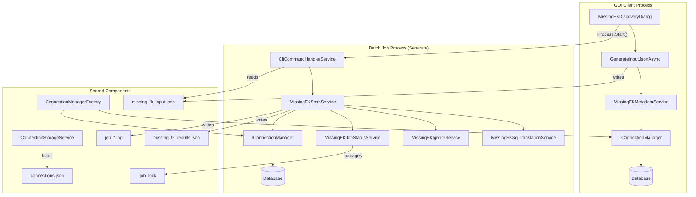
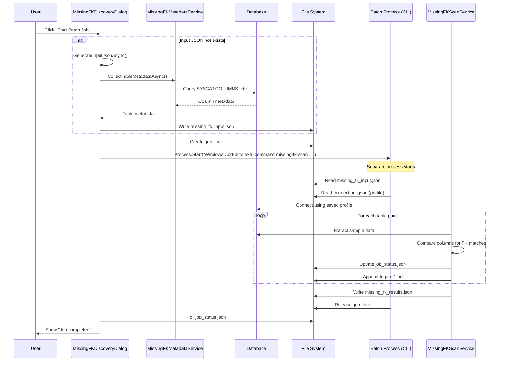
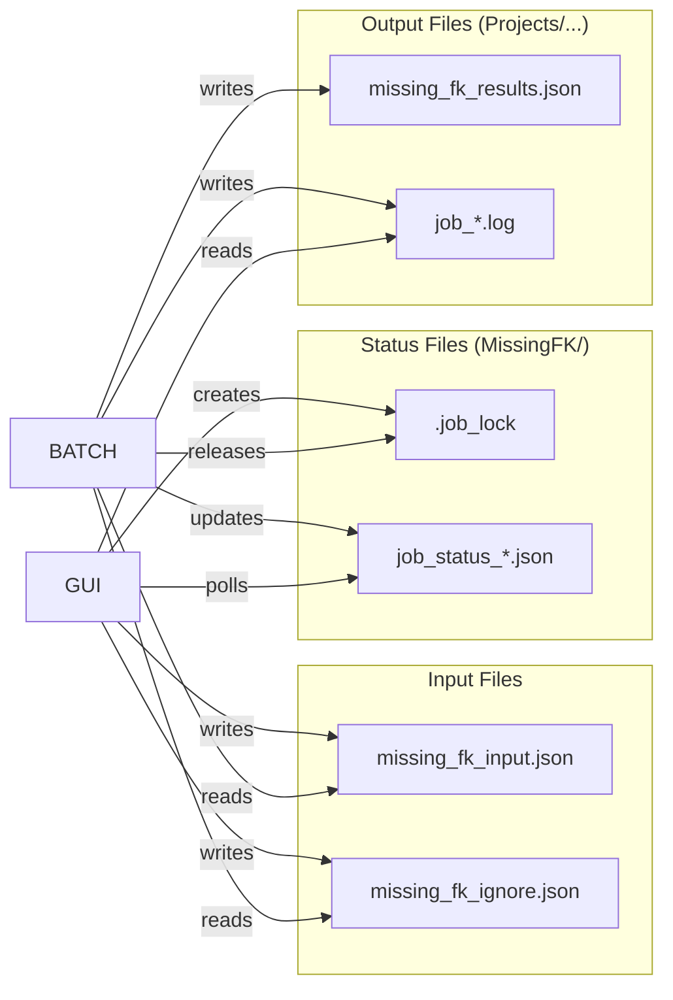
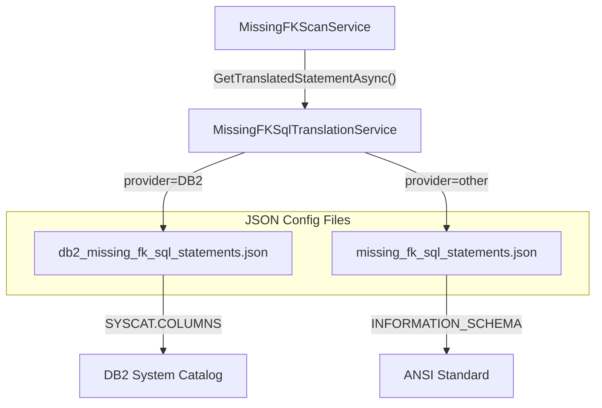

# Missing FK Discovery Batch Job Architecture

## Overview

The Missing FK Discovery batch job **reuses all components from the main client application**. It does NOT have its own database implementation. Instead, it launches a separate process of the same executable with CLI arguments.

## Architecture Diagram



## Process Flow



## Component Reuse

### Shared Between GUI and Batch Job

| Component | Location | Purpose |
|-----------|----------|---------|
| `IConnectionManager` | `Data/IConnectionManager.cs` | Database connection interface |
| `ConnectionManagerFactory` | `Data/ConnectionManagerFactory.cs` | Creates provider-specific connections |
| `DB2ConnectionManager` | `Data/Providers/DB2/` | DB2-specific connection implementation |
| `ConnectionStorageService` | `Services/` | Loads saved connection profiles |
| `MissingFKSqlTranslationService` | `Services/` | Translates SQL for provider |
| `MetadataHandler` | `Services/` | Loads SQL from JSON config files |

### Batch-Job Specific

| Component | Location | Purpose |
|-----------|----------|---------|
| `MissingFKScanService` | `Services/` | Main batch job logic |
| `MissingFKIgnoreService` | `Services/` | Applies ignore rules |
| `MissingFKJobStatusService` | `Services/` | Manages job lock and status files |
| `CliCommandHandlerService` | `Services/` | CLI command routing |

## How It Works

### 1. GUI Prepares the Job

```csharp
// MissingFKDiscoveryDialog.xaml.cs
private async Task<(bool, string?)> GenerateInputJsonAsync()
{
    // Uses SAME IConnectionManager as GUI
    var tablesMetadata = await _metadataService.CollectTableMetadataAsync(tableRefs);
    
    // Writes input JSON for batch process
    await File.WriteAllTextAsync(inputPath, json);
}
```

### 2. GUI Launches Batch Process

```csharp
// MissingFKDiscoveryDialog.xaml.cs - StartBatchJob_Click
var exePath = Assembly.GetExecutingAssembly().Location; // Same executable!

var args = new List<string>
{
    "-profile", _connectionProfile,        // Use saved connection
    "-command", "missing-fk-scan",         // CLI command
    "-input", inputPath,                   // Input JSON path
    "-out", _outputFolder                  // Output folder
};

Process.Start(new ProcessStartInfo
{
    FileName = exePath,
    Arguments = string.Join(" ", args),
    CreateNoWindow = true
});
```

### 3. Batch Process Executes

```csharp
// CliCommandHandlerService.cs
case "missing-fk-scan":
    // Load input JSON
    var inputModel = JsonSerializer.Deserialize<MissingFKInputModel>(inputJson);
    
    // Create SAME services used by GUI
    var scanService = new MissingFKScanService(
        sqlTranslationService,    // Same as GUI uses
        ignoreService,
        jobStatusService,
        connectionManager,        // Same IConnectionManager interface
        outputFolder,
        inputModel.JobId,
        inputModel
    );
    
    // Execute scan
    var results = await scanService.ExecuteAsync();
```

### 4. Database Access

The batch job creates its own `IConnectionManager` using the same factory:

```csharp
// ConnectionStorageService loads the profile
var profile = connectionStorage.GetConnectionByName(profileName);

// ConnectionManagerFactory creates the connection
var connectionManager = ConnectionManagerFactory.CreateConnectionManager(profile);

// Same DB2ConnectionManager as GUI!
await connectionManager.ConnectAsync();
```

## File Communication



## Why This Architecture?

### Benefits

1. **Code Reuse**: No duplicate database code - same `DB2ConnectionManager` handles all queries
2. **Provider Agnostic**: When PostgreSQL support is added, batch job works automatically
3. **Maintainability**: Fix a bug once, it's fixed for both GUI and batch
4. **Testability**: CLI can be tested independently
5. **Long-Running Jobs**: Batch process can run while GUI closes

### Trade-offs

1. **Process Overhead**: Starts new process (but acceptable for long jobs)
2. **File-Based IPC**: Uses JSON files instead of in-memory communication
3. **Profile Dependency**: Must have saved connection profile

## SQL Provider Abstraction

The batch job uses the same SQL translation system:



## Summary

**The batch job is NOT a separate implementation.** It is:

- The same `WindowsDb2Editor.exe` executable
- Running with CLI arguments (`-command missing-fk-scan`)
- Using the same `IConnectionManager`, `DB2ConnectionManager`, and all services
- Communicating via JSON files (input, status, results)
- Managed by lock files to prevent concurrent jobs

This ensures 100% code reuse and consistency between GUI and batch operations.
