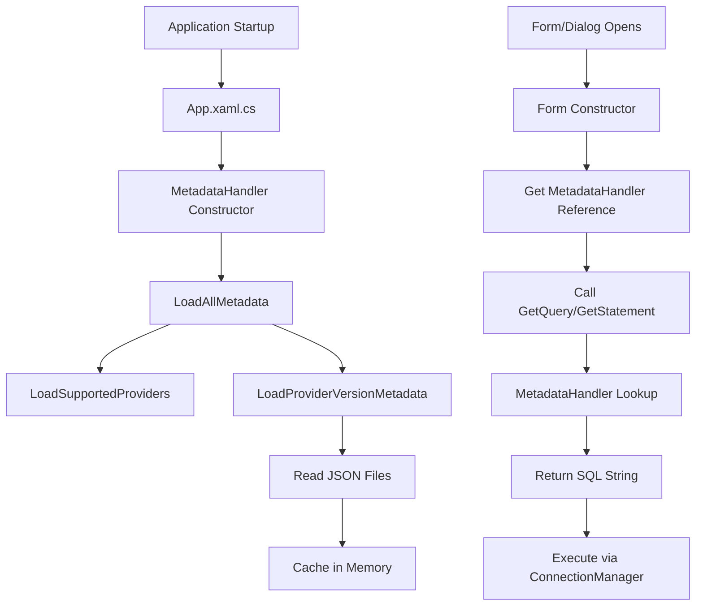
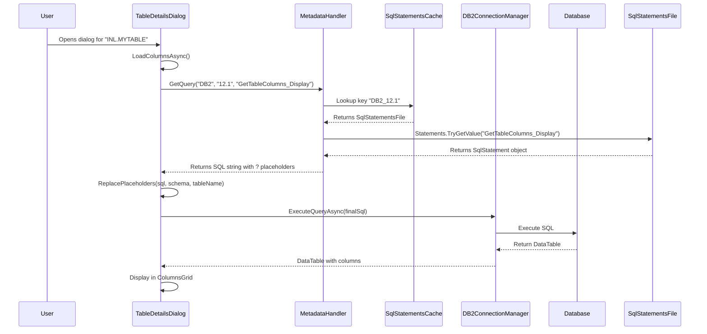
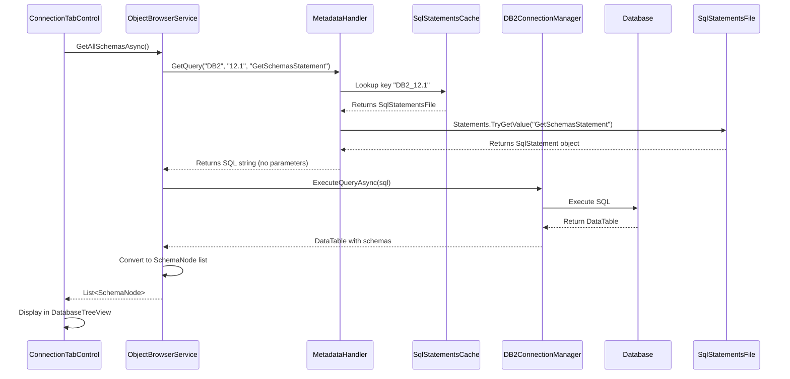

# SQL Statement Retrieval Flow - How Forms Get SQL

## Overview

All SQL statements in WindowsDb2Editor are stored in JSON configuration files and retrieved through a centralized `MetadataHandler` service. This document explains the flow using **2 examples** with visualizations.

---

## Architecture Flow



---

## Example 1: TableDetailsDialog Loading Columns

### Flow Diagram



### Component Names

1. **TableDetailsDialog** - The form requesting SQL
2. **MetadataHandler** - Central service managing SQL statements
3. **SqlStatementsCache** - In-memory dictionary cache
4. **SqlStatementsFile** - Deserialized JSON structure
5. **DB2ConnectionManager** - Executes the SQL query
6. **ConfigFiles/db2_12.1_sql_statements.json** - Source JSON file

### Data Flow

```
TableDetailsDialog
    ↓ (calls)
MetadataHandler.GetQuery("DB2", "12.1", "GetTableColumns_Display")
    ↓ (looks up)
Cache Key: "DB2_12.1"
    ↓ (retrieves)
SqlStatementsFile.Statements["GetTableColumns_Display"]
    ↓ (returns)
SQL String: "SELECT TRIM(COLNAME) FROM SYSCAT.COLUMNS WHERE TABSCHEMA = ? AND TABNAME = ?"
    ↓ (replaces placeholders)
Final SQL: "SELECT TRIM(COLNAME) FROM SYSCAT.COLUMNS WHERE TABSCHEMA = 'INL' AND TABNAME = 'MYTABLE'"
    ↓ (executes)
DB2ConnectionManager.ExecuteQueryAsync()
    ↓ (returns)
DataTable → Displayed in ColumnsGrid
```

---

## Example 2: ObjectBrowserService Loading Schemas

### Flow Diagram



### Component Names

1. **ConnectionTabControl** - UI control requesting data
2. **ObjectBrowserService** - Service layer requesting SQL
3. **MetadataHandler** - Central service managing SQL statements
4. **SqlStatementsCache** - In-memory dictionary cache
5. **SqlStatementsFile** - Deserialized JSON structure
6. **DB2ConnectionManager** - Executes the SQL query
7. **ConfigFiles/db2_12.1_sql_statements.json** - Source JSON file

### Data Flow

```
ConnectionTabControl
    ↓ (calls)
ObjectBrowserService.GetAllSchemasAsync()
    ↓ (calls)
MetadataHandler.GetQuery("DB2", "12.1", "GetSchemasStatement")
    ↓ (looks up)
Cache Key: "DB2_12.1"
    ↓ (retrieves)
SqlStatementsFile.Statements["GetSchemasStatement"]
    ↓ (returns)
SQL String: "SELECT TRIM(SCHEMANAME) AS SCHEMANAME, ... FROM SYSCAT.SCHEMATA ORDER BY SCHEMANAME"
    ↓ (no parameters needed - executes directly)
DB2ConnectionManager.ExecuteQueryAsync(sql)
    ↓ (returns)
DataTable → Converted to SchemaNode → Displayed in DatabaseTreeView
```

---

## Key Components Summary

### Initialization (App Startup)

1. **App.xaml.cs** - Creates `MetadataHandler` instance
2. **MetadataHandler** - Loads all JSON files at startup
3. **LoadAllMetadata** - Scans `supported_providers.json` and loads SQL files
4. **SqlStatementsCache** - Stores loaded SQL statements in memory

### Runtime (Form Requests)

1. **Form/Dialog** - Needs SQL statement
2. **MetadataHandler** - Provides `GetQuery()` or `GetStatement()` methods
3. **SqlStatementsCache** - Fast in-memory lookup
4. **SqlStatementsFile** - JSON structure containing statements
5. **DB2ConnectionManager** - Executes the retrieved SQL

### File Structure

```
ConfigFiles/
├── supported_providers.json          (defines providers and versions)
└── db2_12.1_sql_statements.json      (contains all SQL statements)
```

---

## Benefits of This Architecture

1. **Provider-Agnostic** - Add PostgreSQL by creating `postgresql_16.0_sql_statements.json`
2. **Version-Specific** - Different SQL for DB2 11.5 vs 12.1
3. **No Recompilation** - Update SQL by editing JSON files
4. **Centralized** - All SQL in one place, easy to maintain
5. **Cached** - Fast in-memory lookups, no file I/O at runtime
