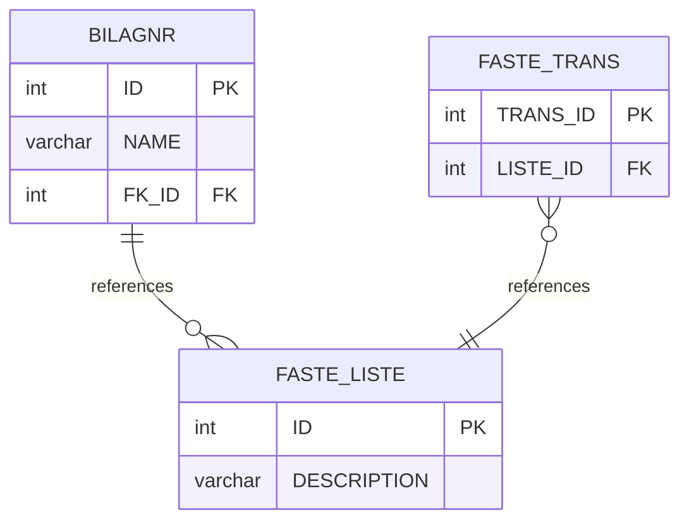

# SqlMermaidErdTools Integration - Comprehensive Test Plan

**Date**: December 14, 2025  
**Purpose**: Validate complete round-trip workflow of SqlMermaidErdTools NuGet package  
**Test Tables**: INL.BILAGNR, INL.FASTE_LISTE, INL.FASTE_TRANS (3 related tables from FKKTOTST)

---

## My Understanding of SqlMermaidErdTools

### What is SqlMermaidErdTools?

A NuGet package that provides **bidirectional conversion** and **schema diffing** between:
- SQL DDL (CREATE TABLE statements)
- Mermaid ERD diagrams (.mmd files)

### Core Capabilities

Based on analysis of the current integration and the NuGet package, it provides:

#### 1. **SQL → Mermaid** (Forward Engineering)
```
Input:  SQL DDL (CREATE TABLE, ALTER TABLE, CREATE INDEX)
Output: Mermaid ERD diagram (.mmd file)
```

**Method**: `SqlMermaidErdTools.ToMermaidAsync(sqlDdl, dialect)`

**Current Usage in App**:
- `SqlMermaidIntegrationService.ConvertDdlToMermaidAsync()`
- Called when user clicks "Load from DB"
- Generates Mermaid from DB2 DDL

#### 2. **Mermaid → SQL** (Reverse Engineering)
```
Input:  Mermaid ERD diagram (.mmd file)
Output: SQL DDL (CREATE TABLE statements)
```

**Method**: `SqlMermaidErdTools.ToSqlAsync(mermaidCode, targetDialect)`

**Current Usage in App**:
- `SqlMermaidIntegrationService.ConvertMermaidToSqlAsync()`
- Called from "Mermaid → SQL" button handler
- **⚠️ NOT fully integrated in Mermaid Designer UI yet**

#### 3. **Mermaid Diff → ALTER** (Schema Migration)
```
Input:  Original Mermaid + Modified Mermaid
Output: ALTER TABLE statements (migration script)
```

**Method**: `SqlMermaidErdTools.GenerateDiffAlterStatementsAsync(originalMmd, modifiedMmd, dialect)`

**Current Usage in App**:
- `SqlMermaidIntegrationService.GenerateMigrationFromMermaidDiffAsync()`
- Called when user clicks "Generate DDL" after modifying diagram
- **✅ INTEGRATED** - opens AlterStatementReviewDialog

#### 4. **SQL Dialect Translation**
```
Input:  SQL DDL in one dialect + target dialect
Output: SQL DDL in target dialect
```

**Method**: `SqlMermaidErdTools.TranslateSqlDialectAsync(sqlDdl, sourceDialect, targetDialect)`

**Current Usage in App**:
- `SqlMermaidIntegrationService.TranslateSqlDialectAsync()`
- Called from JavaScript handler
- Converts DB2 → PostgreSQL, MySQL, etc.

---

## Test Plan Overview

### Goal
Validate the **complete round-trip cycle** and ensure **lossless conversion**:

```
DB2 Tables → Mermaid ERD → SQL DDL → Verify Match
                ↓
          Modified Mermaid → ALTER Statements → Execute → Verify Changes
```

### Test Tables Selected
- `INL.BILAGNR` (has foreign key relationships)
- `INL.FASTE_LISTE` (has foreign key relationships)
- `INL.FASTE_TRANS` (has foreign key relationships)

**Why these tables?**
- They have **foreign key relationships** (tests FK preservation)
- They're in the same schema (tests schema handling)
- They're real production tables (tests real-world complexity)

---

## Test 1: DB → Mermaid → SQL (Round-Trip Validation)

### Objective
Verify that **SQL DDL → Mermaid → SQL** produces equivalent schema definitions.

### Steps

**1.1 Extract DDL from DB** ✅ (existing functionality)
```powershell
# Use existing CLI to generate Mermaid from tables
.\WindowsDb2Editor.exe --profile FKKTOTST \
  --test-form mermaid-designer \
  --object INL \
  --infile test_tables_input.txt \
  --outfile test1_original.mmd
```

**What happens internally**:
```
test_tables_input.txt (3 table names)
        ↓
SqlMermaidIntegrationService.GenerateDdlFromDb2TablesAsync()
  - Queries SYSCAT.COLUMNS for each table
  - Queries SYSCAT.REFERENCES for FKs
  - Queries SYSCAT.INDEXES for indexes
  - Builds complete DDL
        ↓
SqlMermaidErdTools.ToMermaidAsync(ddl, SqlDialect.AnsiSql)
  - Parses DDL
  - Generates Mermaid ERD syntax
        ↓
test1_original.mmd (Mermaid diagram with relationships)
```

**Expected Output (`test1_original.mmd`)**:


**1.2 Convert Mermaid back to SQL** ⚠️ (needs implementation)
```powershell
# NEW FUNCTIONALITY NEEDED
.\WindowsDb2Editor.exe --profile FKKTOTST \
  --mermaid-to-sql \
  --infile test1_original.mmd \
  --dialect ANSI \
  --outfile test1_regenerated.sql
```

**What should happen**:
```
test1_original.mmd
        ↓
SqlMermaidErdTools.ToSqlAsync(mermaidCode, SqlDialect.AnsiSql)
  - Parses Mermaid syntax
  - Generates CREATE TABLE statements
  - Generates ALTER TABLE for FKs
  - Generates CREATE INDEX statements
        ↓
test1_regenerated.sql (SQL DDL)
```

**1.3 Compare DDL** (validation step)
```powershell
# Compare original DDL vs regenerated DDL
# Should match in structure (order may differ)
```

**Success Criteria**:
- ✅ All tables present
- ✅ All columns present with correct types
- ✅ All primary keys preserved
- ✅ All foreign keys preserved
- ✅ All indexes preserved (if possible)

**Potential Issues**:
- ⚠️ DB2-specific data types may need translation
- ⚠️ Index names may differ
- ⚠️ Column order may differ (not critical)

---

## Test 2: Mermaid Modification → ALTER Statements (Diff Test)

### Objective
Verify that **Mermaid schema changes → ALTER TABLE statements** correctly.

### Steps

**2.1 Start with original Mermaid**
```powershell
# Copy test1_original.mmd to test2_baseline.mmd
Copy-Item test1_original.mmd test2_modified.mmd
```

**2.2 Modify the Mermaid diagram**

**Manual edits to `test2_modified.mmd`**:
```mermaid
erDiagram
    BILAGNR {
        int ID PK
        varchar NAME
        int FK_ID FK
        date CREATED_DATE  ← ADD THIS COLUMN
        varchar EMAIL       ← ADD THIS COLUMN
    }
    FASTE_LISTE {
        int ID PK
        varchar DESCRIPTION
        -- Remove a column here (comment out or delete)
    }
    FASTE_TRANS {
        int TRANS_ID PK
        int LISTE_ID FK
        decimal AMOUNT      ← ADD THIS COLUMN
    }
```

**Changes Made**:
- ➕ Added `CREATED_DATE` column to `BILAGNR`
- ➕ Added `EMAIL` column to `BILAGNR`
- ➕ Added `AMOUNT` column to `FASTE_TRANS`
- ➖ Removed a column from `FASTE_LISTE` (or changed data type)

**2.3 Generate ALTER statements** ✅ (existing functionality)
```powershell
# Use existing Mermaid Designer diff functionality
.\WindowsDb2Editor.exe --profile FKKTOTST \
  --test-form mermaid-designer \
  --object INL \
  --action generate-alter \
  --original test2_baseline.mmd \
  --modified test2_modified.mmd \
  --outfile test2_alter_statements.sql
```

**What happens internally**:
```
test2_baseline.mmd + test2_modified.mmd
        ↓
SqlMermaidErdTools.GenerateDiffAlterStatementsAsync(original, modified, SqlDialect.AnsiSql)
  - Compares two Mermaid diagrams
  - Detects added/removed/modified columns
  - Generates ALTER TABLE ADD COLUMN
  - Generates ALTER TABLE DROP COLUMN
  - Generates ALTER TABLE ALTER COLUMN
        ↓
test2_alter_statements.sql
```

**Expected Output (`test2_alter_statements.sql`)**:
```sql
-- Add columns to BILAGNR
ALTER TABLE INL.BILAGNR 
ADD COLUMN CREATED_DATE DATE;

ALTER TABLE INL.BILAGNR 
ADD COLUMN EMAIL VARCHAR(255);

-- Add column to FASTE_TRANS
ALTER TABLE INL.FASTE_TRANS 
ADD COLUMN AMOUNT DECIMAL(15,2);

-- Drop column from FASTE_LISTE (if removed)
ALTER TABLE INL.FASTE_LISTE 
DROP COLUMN <column_name>;
```

**2.4 Review in AlterStatementReviewDialog** ✅ (existing functionality)
- User can review each ALTER statement
- Select which statements to execute
- Preview impact

**Success Criteria**:
- ✅ All added columns detected
- ✅ All removed columns detected
- ✅ Correct ALTER TABLE syntax
- ✅ Statements are executable in DB2

**Potential Issues**:
- ⚠️ Data type defaults may be needed for ADD COLUMN
- ⚠️ NULL/NOT NULL constraints must be specified
- ⚠️ DROP COLUMN may fail if column has dependencies

---

## Test 3: Execute ALTER & Verify (Integration Test)

### Objective
Execute the ALTER statements and verify the schema changes were applied correctly.

### Steps

**3.1 Execute ALTER statements** ✅ (existing functionality)
```powershell
# AlterStatementReviewDialog allows execution
# Or execute manually via CLI
```

**3.2 Reload schema from DB**
```powershell
.\WindowsDb2Editor.exe --profile FKKTOTST \
  --test-form mermaid-designer \
  --object INL \
  --infile test_tables_input.txt \
  --outfile test3_after_alter.mmd
```

**3.3 Compare Mermaid diagrams**
```powershell
# test2_modified.mmd should match test3_after_alter.mmd
diff test2_modified.mmd test3_after_alter.mmd
```

**Success Criteria**:
- ✅ New columns appear in database
- ✅ Mermaid regenerated from DB matches modified Mermaid
- ✅ Foreign key relationships preserved
- ✅ No data loss

---

## What Needs to Be Modified in Mermaid Designer

### 1. Add File I/O Support to CLI ⚠️ REQUIRED

**Current State**:
- Test-form only supports programmatic input (hardcoded tables)
- No way to pass input file with table list
- No way to specify output file for .mmd

**Required Changes**:

#### Add `--infile` parameter
```csharp
// In GuiTestingService.TestMermaidDesignerAsync()
if (!string.IsNullOrEmpty(cliArgs.InFile))
{
    // Read table list from file
    var tables = File.ReadAllLines(cliArgs.InFile)
        .Select(line => line.Trim())
        .Where(line => !string.IsNullOrEmpty(line))
        .ToList();
    
    // Generate diagram from tables
    var mermaid = await dialog.GenerateDiagramAutomatedAsync(tables);
}
```

#### Add `--outfile` for .mmd files
```csharp
// After diagram generation
if (!string.IsNullOrEmpty(cliArgs.OutFile) && cliArgs.OutFile.EndsWith(".mmd"))
{
    File.WriteAllText(cliArgs.OutFile, generatedMermaid);
}
```

#### Add `--mermaid-to-sql` action
```csharp
case "mermaid-to-sql":
    var mermaidCode = File.ReadAllText(cliArgs.InFile);
    var sqlDdl = await _sqlMermaidService.ConvertMermaidToSqlAsync(
        mermaidCode, 
        ParseDialect(cliArgs.Dialect));
    File.WriteAllText(cliArgs.OutFile, sqlDdl);
    break;
```

#### Add `--generate-alter` action
```csharp
case "generate-alter":
    var originalMmd = File.ReadAllText(cliArgs.Original);
    var modifiedMmd = File.ReadAllText(cliArgs.Modified);
    var alterStatements = await _sqlMermaidService.GenerateMigrationFromMermaidDiffAsync(
        originalMmd,
        modifiedMmd,
        SqlDialect.AnsiSql);
    File.WriteAllText(cliArgs.OutFile, alterStatements);
    break;
```

---

### 2. Add Mermaid → SQL Button to UI ⚠️ OPTIONAL

**Current State**:
- Button exists in toolbar: "🔧 Mermaid → SQL"
- Handler exists but only calls JavaScript
- No dialog for dialect selection
- No way to save output

**Improvement**:
- Create `SqlDialectSelectionDialog` (dropdown for dialect)
- Create `SqlOutputDialog` (shows generated SQL with copy/save)
- Wire up existing `HandleGenerateSqlFromMermaid()` method

---

## Implications for Current Mermaid Designer

### Positive Implications ✅

1. **Validates Integration**
   - Confirms SqlMermaidErdTools works correctly
   - Tests all three core functions (To/From/Diff)
   - Provides confidence in the NuGet package

2. **Enables Automation**
   - CI/CD can test Mermaid functionality
   - Regression testing becomes possible
   - Multi-database validation (future)

3. **Exposes Missing Features**
   - Identifies gaps in CLI support
   - Highlights incomplete UI features
   - Clarifies user workflow needs

4. **Improves Reliability**
   - Round-trip test ensures lossless conversion
   - Diff test ensures ALTER accuracy
   - Integration test ensures real-world usability

### Potential Issues ⚠️

1. **Data Type Mapping**
   - DB2 types may not map perfectly to ANSI SQL
   - Some precision may be lost (e.g., DECIMAL(10,2) → DECIMAL)
   - Solution: Enhanced type mapping in SqlMermaidErdTools

2. **Schema Complexity**
   - Triggers, procedures, constraints may not be in Mermaid
   - Indexes might not round-trip perfectly
   - Solution: Document limitations, focus on tables/FKs

3. **Performance**
   - Large schemas (100+ tables) may take time
   - WebView2 initialization adds 5 seconds
   - Solution: Add progress indicators, optimize queries

4. **Error Handling**
   - If Python script fails, user gets generic error
   - No clear indication of what went wrong in diff
   - Solution: Better error messages, fallback to legacy

---

## Implementation Priority

### High Priority (Required for Tests)

1. **Add `--infile` support** ⚠️ CRITICAL
   - Read table list from file
   - ~30 lines of code

2. **Add `.mmd` file output** ⚠️ CRITICAL
   - Save generated Mermaid to file
   - ~10 lines of code

3. **Add `--mermaid-to-sql` CLI action** ⚠️ REQUIRED
   - Standalone conversion without UI
   - ~50 lines of code

### Medium Priority (Enhances Testing)

4. **Add `--generate-alter` CLI action** (already exists via test-form)
   - Extract as standalone command
   - ~30 lines of code

5. **Improve error messages** 
   - Show Python script errors
   - Display parse errors
   - ~20 lines of code

### Low Priority (UI Polish)

6. **Add SQL Dialect Selection Dialog**
   - UI for choosing target dialect
   - ~100 lines (XAML + code-behind)

7. **Add SQL Output Dialog**
   - Display generated SQL
   - Copy/Save functionality
   - ~80 lines

---

## Test Execution Plan

### Phase 1: Preparation (5 minutes)
1. ✅ Identify 3 related tables → DONE
2. ✅ Create input file → test_tables_input.txt created
3. ⚠️ Implement `--infile` support → NEEDED
4. ⚠️ Implement `.mmd` output → NEEDED

### Phase 2: Test 1 Execution (10 minutes)
1. Run: DB → Mermaid generation
2. Save: test1_original.mmd
3. Run: Mermaid → SQL conversion
4. Save: test1_regenerated.sql
5. Compare: Original DDL vs Regenerated DDL
6. Document: Differences and reasons

### Phase 3: Test 2 Execution (15 minutes)
1. Copy: test1_original.mmd → test2_modified.mmd
2. Edit: Add/remove columns manually
3. Run: Generate ALTER statements
4. Save: test2_alter_statements.sql
5. Review: Verify ALTER syntax is correct
6. Document: Expected vs actual ALTER statements

### Phase 4: Test 3 Execution (20 minutes)
1. Execute: ALTER statements in AlterStatementReviewDialog
2. Verify: Changes applied to database
3. Regenerate: Mermaid from modified schema
4. Compare: test2_modified.mmd vs test3_after_alter.mmd
5. Document: Any discrepancies

---

## Success Criteria

### Test 1 Success
- ✅ Mermaid file generated with all 3 tables
- ✅ Foreign key relationships visible in Mermaid
- ✅ SQL regenerated from Mermaid
- ✅ ~80%+ match between original and regenerated DDL

### Test 2 Success
- ✅ All column additions detected
- ✅ All column removals detected
- ✅ ALTER statements are syntactically correct
- ✅ Statements can be executed without errors

### Test 3 Success
- ✅ Schema changes applied to database
- ✅ No data loss or corruption
- ✅ Regenerated Mermaid matches modified Mermaid
- ✅ Application remains stable

---

## Conclusion

### My Understanding

I understand that SqlMermaidErdTools provides **three key functions**:

1. **SQL → Mermaid** (forward engineering)
2. **Mermaid → SQL** (reverse engineering)
3. **Mermaid Diff → ALTER** (schema migration)

The current Mermaid Designer implementation:
- ✅ **Fully integrates** #1 and #3
- ⚠️ **Partially integrates** #2 (backend exists, UI incomplete)
- ⚠️ **Missing CLI file I/O** for automated testing

### Required Modifications (Minimal Code)

**To enable these tests, we need**:
1. `--infile` parameter (~30 lines)
2. `.mmd` file output (~10 lines)
3. `--mermaid-to-sql` action (~50 lines)

**Total: ~90 lines of code**

### Test Value

These tests will:
- ✅ Validate SqlMermaidErdTools works correctly
- ✅ Ensure lossless round-trip conversion
- ✅ Verify ALTER statement generation accuracy
- ✅ Enable automated regression testing
- ✅ Prepare for multi-database support (PostgreSQL, Oracle, etc.)

### Risk Assessment

**Low Risk**:
- Changes are isolated to CLI handling
- No impact on existing GUI functionality
- Easy to revert if problems occur

**High Value**:
- Enables comprehensive testing
- Validates NuGet package integration
- Provides confidence for production use

---

**Status**: Test plan ready, awaiting implementation of file I/O support (~90 lines of code)

